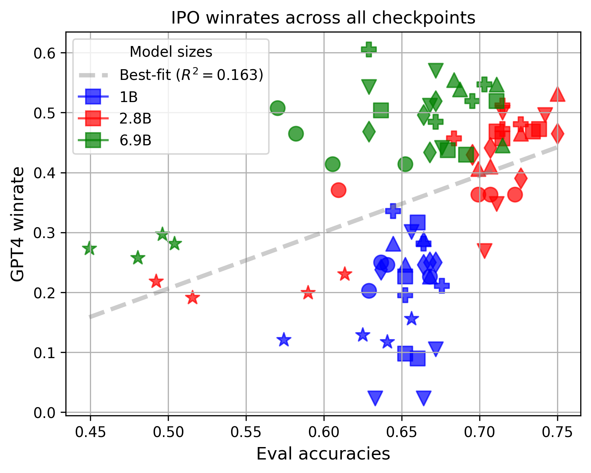
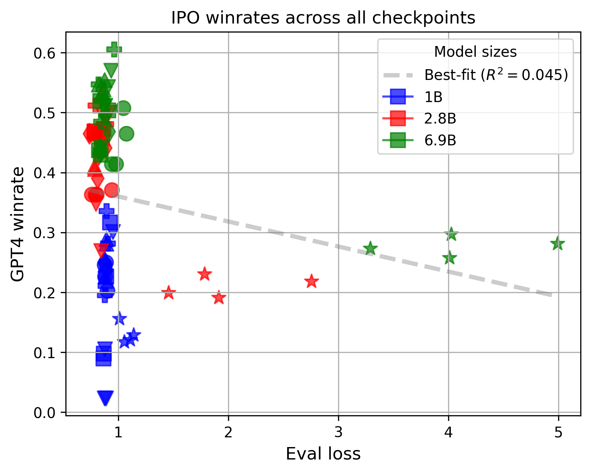
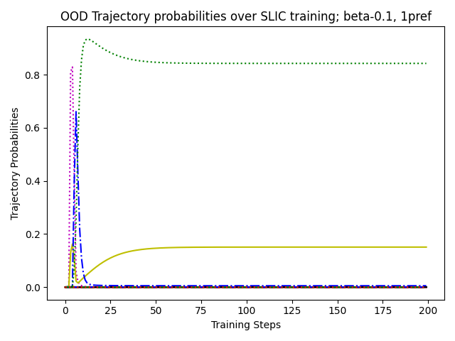
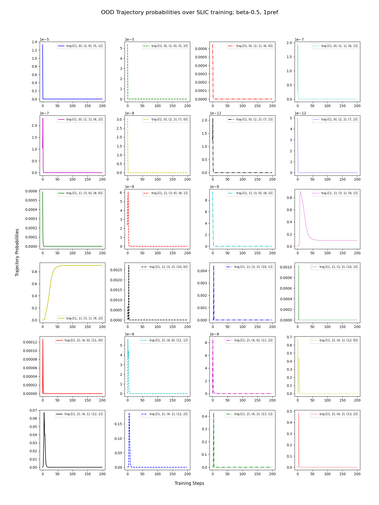

# 直接对齐算法中奖励模型过度优化的规模效应研究

发布时间：2024年06月04日

`Agent

这篇论文主要讨论了从人类反馈中学习的强化学习（RLHF）在大型语言模型（LLMs）中的应用，特别是关注了直接对齐算法（DDAs）在避免奖励建模阶段的同时，如何处理奖励过度优化或破解的问题。这些问题涉及到代理（Agent）如何通过强化学习算法优化其行为，以更好地符合人类偏好。因此，这篇论文更符合Agent分类，因为它主要探讨了代理如何通过学习算法来优化其行为，以达到更好的性能。` `人工智能` `机器学习`

> Scaling Laws for Reward Model Overoptimization in Direct Alignment Algorithms

# 摘要

> 从人类反馈中学习的强化学习（RLHF）对大型语言模型（LLMs）的成功至关重要，但其过程复杂且易碎。在传统RLHF框架中，首先训练奖励模型以体现人类偏好，随后在线强化学习算法利用此模型优化LLM。然而，这种方法常导致奖励过度优化或奖励破解，即虽然代理奖励模型显示性能提升，但实际质量却停滞不前甚至下降。直接对齐算法（DDAs）如直接偏好优化作为替代方案出现，避免了奖励建模阶段。尽管DDAs不依赖单独的代理奖励模型，它们仍易受过度优化影响。尽管DDAs中奖励破解现象定义不明，我们仍观察到类似趋势：在较高KL预算下，DAA算法与经典RLHF方法一样，出现性能退化。尤其值得注意的是，DAA方法不仅在广泛KL预算下退化，而且往往在数据集单个周期内就已显现退化。本研究通过大量实验，明确了DDAs中奖励过度优化或破解问题，并探讨了其在不同目标、训练制度和模型规模下的影响。

> Reinforcement Learning from Human Feedback (RLHF) has been crucial to the recent success of Large Language Models (LLMs), however, it is often a complex and brittle process. In the classical RLHF framework, a reward model is first trained to represent human preferences, which is in turn used by an online reinforcement learning (RL) algorithm to optimize the LLM. A prominent issue with such methods is \emph{reward over-optimization} or \emph{reward hacking}, where performance as measured by the learned proxy reward model increases, but true quality plateaus or even deteriorates. Direct Alignment Algorithms (DDAs) like Direct Preference Optimization have emerged as alternatives to the classical RLHF pipeline by circumventing the reward modeling phase. However, although DAAs do not use a separate proxy reward model, they still commonly deteriorate from over-optimization. While the so-called reward hacking phenomenon is not well-defined for DAAs, we still uncover similar trends: at higher KL budgets, DAA algorithms exhibit similar degradation patterns to their classic RLHF counterparts. In particular, we find that DAA methods deteriorate not only across a wide range of KL budgets but also often before even a single epoch of the dataset is completed. Through extensive empirical experimentation, this work formulates and formalizes the reward over-optimization or hacking problem for DAAs and explores its consequences across objectives, training regimes, and model scales.

[Arxiv](https://arxiv.org/abs/2406.02900)