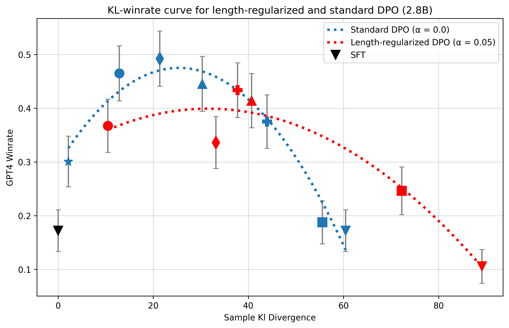
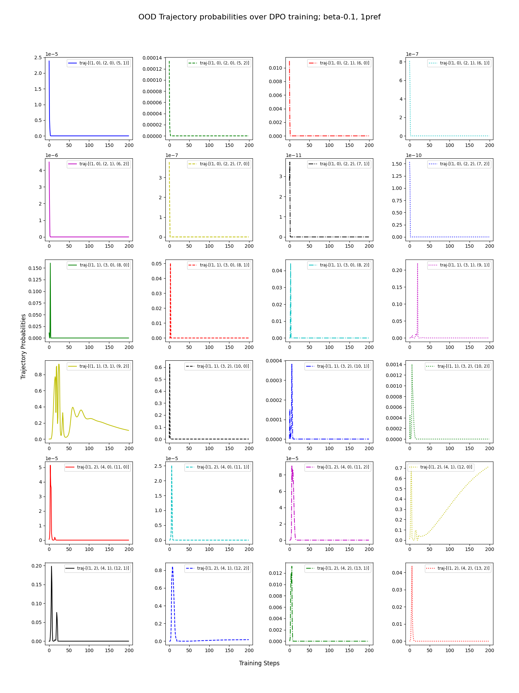

# 直接对齐算法中奖励模型过度优化的规模效应

发布时间：2024年06月04日

`LLM理论

这篇论文主要探讨了大型语言模型（LLMs）在从人类反馈中学习强化学习（RLHF）过程中的问题，特别是直接对齐算法（DDAs）中的奖励过度优化或破解问题。这些问题涉及到模型训练的理论层面，因此属于LLM理论分类。论文通过实验研究了不同训练目标、制度和模型规模下的影响，这进一步强调了其理论性质。` `人工智能` `机器学习`

> Scaling Laws for Reward Model Overoptimization in Direct Alignment Algorithms

# 摘要

> 从人类反馈中学习强化学习（RLHF）对大型语言模型（LLMs）的成功至关重要，但这一过程复杂且易碎。在传统RLHF框架中，首先训练奖励模型以体现人类偏好，随后在线强化学习算法利用此模型优化LLM。然而，这种方法常遭遇奖励过度优化或破解问题，即表面性能提升，实则质量停滞甚至下降。直接对齐算法（DDAs）如直接偏好优化作为替代方案出现，避免了奖励建模阶段。尽管DDAs不依赖单独的代理奖励模型，它们仍易受过度优化影响。我们发现，在更高的KL预算下，DAA算法与经典RLHF方法一样，表现出性能退化，甚至在数据集的一个周期内就出现退化。通过大量实验，本研究明确了DDAs中的奖励过度优化或破解问题，并探讨了其在不同训练目标、制度和模型规模下的影响。

> Reinforcement Learning from Human Feedback (RLHF) has been crucial to the recent success of Large Language Models (LLMs), however, it is often a complex and brittle process. In the classical RLHF framework, a reward model is first trained to represent human preferences, which is in turn used by an online reinforcement learning (RL) algorithm to optimize the LLM. A prominent issue with such methods is \emph{reward over-optimization} or \emph{reward hacking}, where performance as measured by the learned proxy reward model increases, but true quality plateaus or even deteriorates. Direct Alignment Algorithms (DDAs) like Direct Preference Optimization have emerged as alternatives to the classical RLHF pipeline by circumventing the reward modeling phase. However, although DAAs do not use a separate proxy reward model, they still commonly deteriorate from over-optimization. While the so-called reward hacking phenomenon is not well-defined for DAAs, we still uncover similar trends: at higher KL budgets, DAA algorithms exhibit similar degradation patterns to their classic RLHF counterparts. In particular, we find that DAA methods deteriorate not only across a wide range of KL budgets but also often before even a single epoch of the dataset is completed. Through extensive empirical experimentation, this work formulates and formalizes the reward over-optimization or hacking problem for DAAs and explores its consequences across objectives, training regimes, and model scales.

[Arxiv](https://arxiv.org/abs/2406.02900)