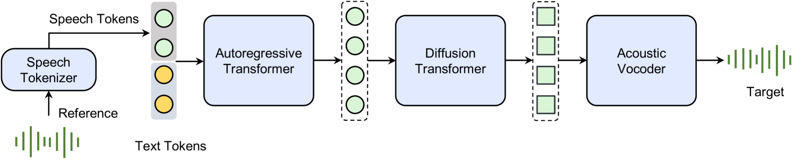
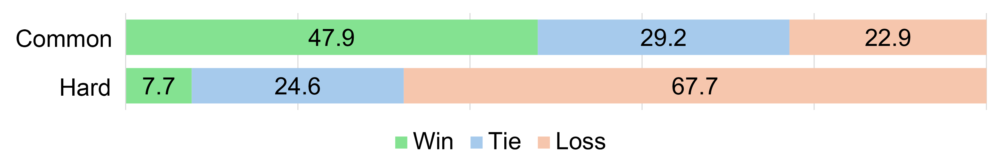
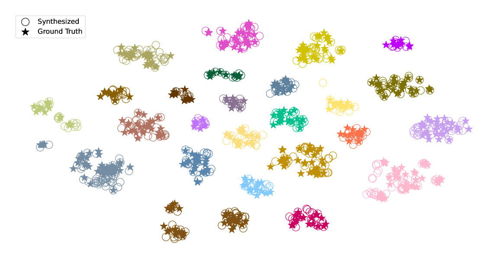
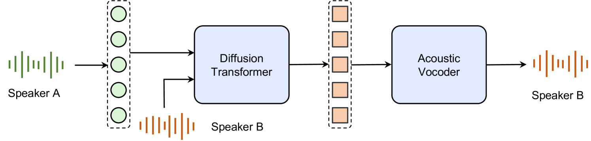
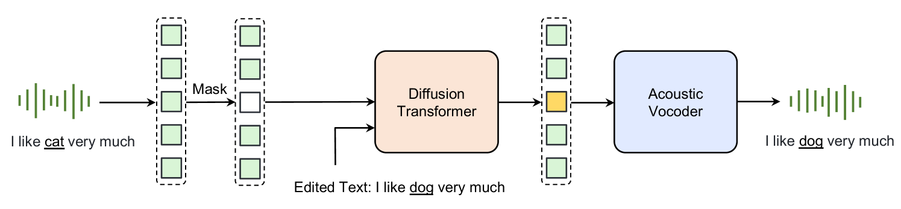
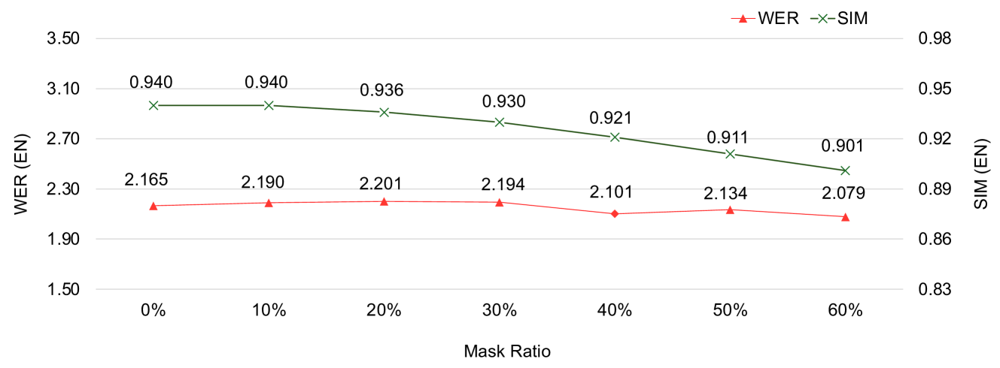
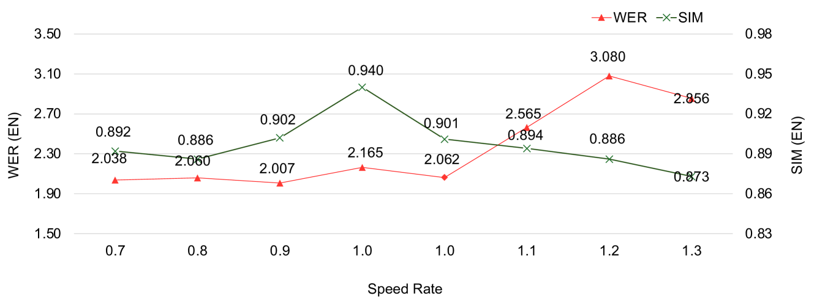

# Seed-TTS：一系列既高质量又多功能的语音生成模型，旨在满足各种语音合成需求。

发布时间：2024年06月04日

`LLM应用

理由：这篇论文介绍了Seed-TTS系列，这是一套大型自回归文本转语音模型，专注于语音生成的应用。论文中提到的技术如语音分解的自蒸馏技术和强化学习策略，以及非自回归变体$\text{Seed-TTS}_\text{DiT}$，都是为了提高语音生成的质量和控制能力。这些内容直接关联到大型语言模型（LLM）在实际应用中的使用，特别是在语音合成领域，因此属于LLM应用分类。` `语音合成` `人工智能`

> Seed-TTS: A Family of High-Quality Versatile Speech Generation Models

# 摘要

> 我们推出了Seed-TTS系列，这是一套能够生成几乎与真人语音无异的大型自回归文本转语音模型。作为语音生成的基础模型，Seed-TTS在语音上下文学习方面表现卓越，无论是在客观还是主观评价中，其说话者相似度和语音自然度均与真人语音媲美。经过微调，我们在这些评价指标上获得了更高的主观评分。Seed-TTS对语音的各种属性（如情感）拥有出色的控制力，能够为现实世界中的说话者创造出丰富多变、表现力强的语音。此外，我们还提出了一种语音分解的自蒸馏技术，以及一种强化学习策略，以增强模型的鲁棒性、说话者相似度和控制能力。我们还介绍了一个名为$\text{Seed-TTS}_\text{DiT}$的非自回归（NAR）变体，它采用全扩散架构，与以往的NAR基TTS系统不同，它无需依赖预估的音素时长，而是通过端到端处理实现语音生成。我们证实了这一变体与基于语言模型的变体性能相当，并展示了其在语音编辑中的高效性。欢迎读者访问\url{https://bytedancespeech.github.io/seedtts_tech_report}体验演示。

> We introduce Seed-TTS, a family of large-scale autoregressive text-to-speech (TTS) models capable of generating speech that is virtually indistinguishable from human speech. Seed-TTS serves as a foundation model for speech generation and excels in speech in-context learning, achieving performance in speaker similarity and naturalness that matches ground truth human speech in both objective and subjective evaluations. With fine-tuning, we achieve even higher subjective scores across these metrics. Seed-TTS offers superior controllability over various speech attributes such as emotion and is capable of generating highly expressive and diverse speech for speakers in the wild. Furthermore, we propose a self-distillation method for speech factorization, as well as a reinforcement learning approach to enhance model robustness, speaker similarity, and controllability. We additionally present a non-autoregressive (NAR) variant of the Seed-TTS model, named $\text{Seed-TTS}_\text{DiT}$, which utilizes a fully diffusion-based architecture. Unlike previous NAR-based TTS systems, $\text{Seed-TTS}_\text{DiT}$ does not depend on pre-estimated phoneme durations and performs speech generation through end-to-end processing. We demonstrate that this variant achieves comparable performance to the language model-based variant and showcase its effectiveness in speech editing. We encourage readers to listen to demos at \url{https://bytedancespeech.github.io/seedtts_tech_report}.

[Arxiv](https://arxiv.org/abs/2406.02430)