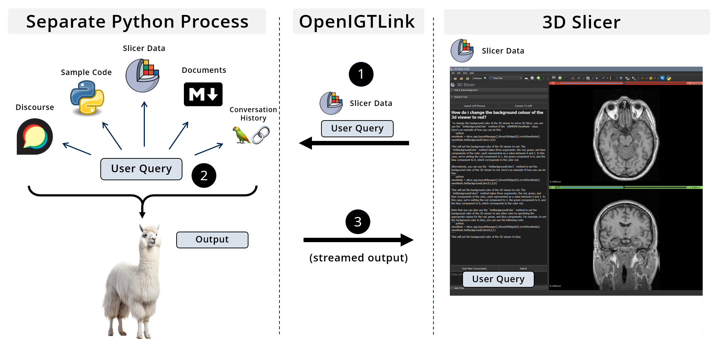
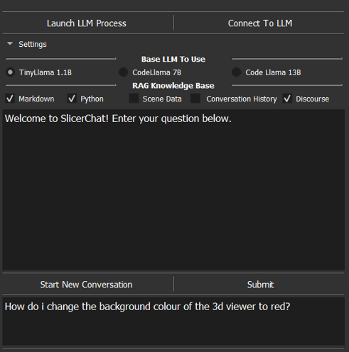
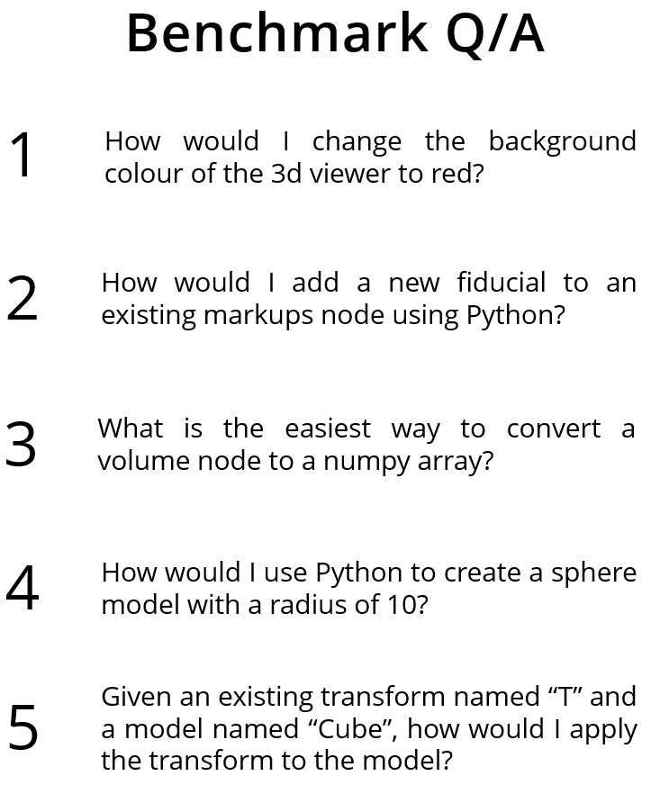
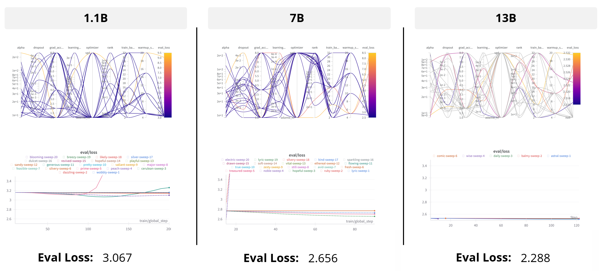
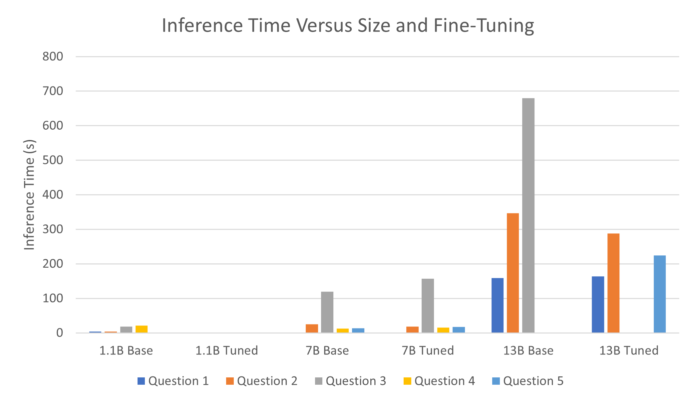
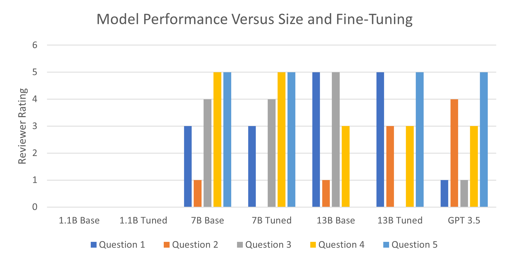
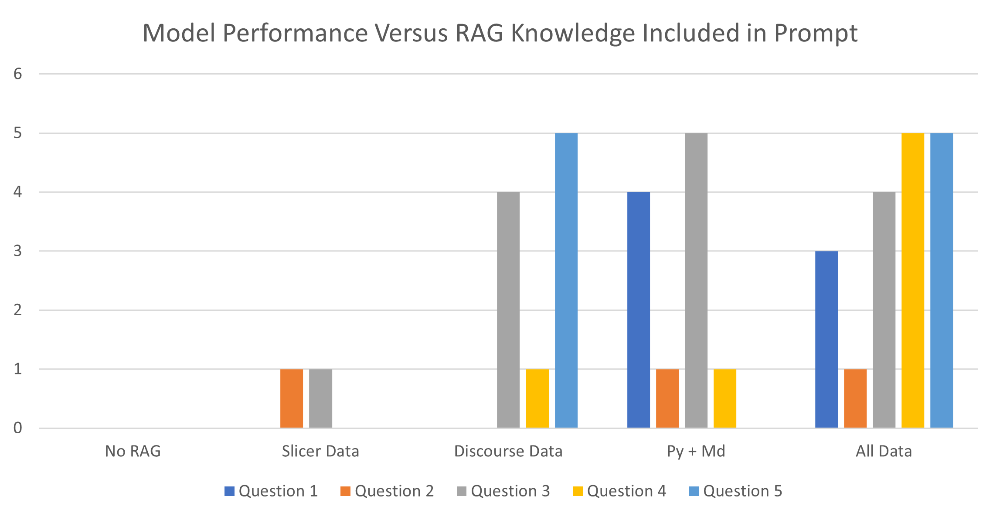

# SlicerChat：打造 3D Slicer 的本地聊天助手

发布时间：2024年06月04日

`LLM应用` `软件开发`

> SlicerChat: Building a Local Chatbot for 3D Slicer

# 摘要

> 3D Slicer 虽强大，但新手上路不易。ChatGPT 等生成式 AI 应用虽能通过自然语言连接文档，但 LLM 对 3D Slicer 文档的接触有限，导致幻觉频发。本项目旨在打造 SlicerChat 聊天机器人，专为 3D Slicer 问题而生，且能在本地运行。我们探索了微调、模型大小及提示中领域知识对答案质量和速度的影响。基于 Code-Llama Instruct 架构，我们构建了 SlicerChat 原型，微调了 1.1B、7B 和 13B 模型，并整合了 3D Slicer 文档。测试表明，微调无助于提升性能或速度，而大模型虽表现更佳，但速度下降。添加 Python 代码和 Markdown 文档至提示中，显著提升了模型性能，而 3D Slicer 场景数据和 Discourse 问题也有所助益。本项目揭示了将高质量本地聊天机器人融入 3D Slicer 的潜力，助力新老用户更高效地驾驭软件。

> 3D Slicer is a powerful platform for 3D data visualization and analysis, but has a significant learning curve for new users. Generative AI applications, such as ChatGPT, have emerged as a potential method of bridging the gap between various sources of documentation using natural language. The limited exposure of LLM services to 3D Slicer documentation, however, means that ChatGPT and related services tend to suffer from significant hallucination. The objective of this project is to build a chatbot architecture, called SlicerChat, that is optimized to answer 3D Slicer related questions and able to run locally using an open-source model. The core research questions explored in this work revolve around the answer quality and speed differences due to fine-tuning, model size, and the type of domain knowledge included in the prompt. A prototype SlicerChat system was built as a custom extension in 3D Slicer based on the Code-Llama Instruct architecture. Models of size 1.1B, 7B and 13B were fine-tuned using Low rank Adaptation, and various sources of 3D Slicer documentation were compiled for use in a Retrieval Augmented Generation paradigm. Testing combinations of fine-tuning and model sizes on a benchmark dataset of five 3D Slicer questions revealed that fine-tuning had no impact on model performance or speed compared to the base architecture, and that larger models performed better with a significant speed decrease. Experiments with adding 3D Slicer documentation to the prompt showed that Python sample code and Markdown documentation were the most useful information to include, but that adding 3D Slicer scene data and questions taken from Discourse also improved model performance. In conclusion, this project shows the potential for integrating a high quality, local chatbot directly into 3D Slicer to help new users and experienced developers alike to more efficiently use the software.

[Arxiv](https://arxiv.org/abs/2407.11987)