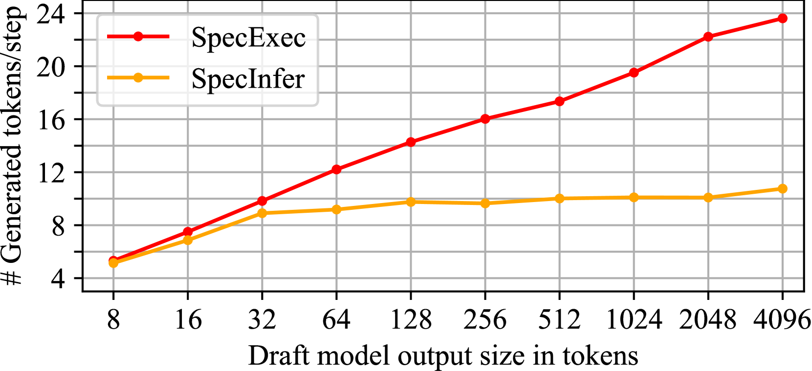
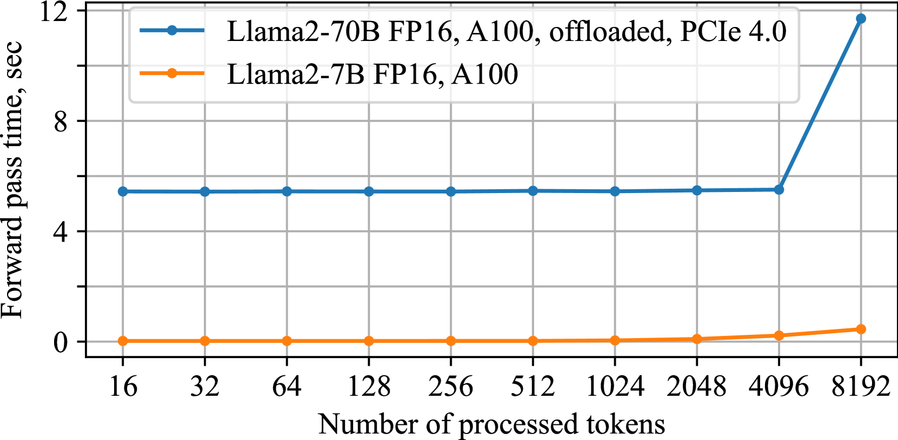
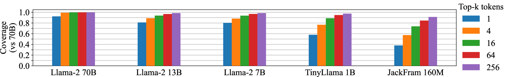
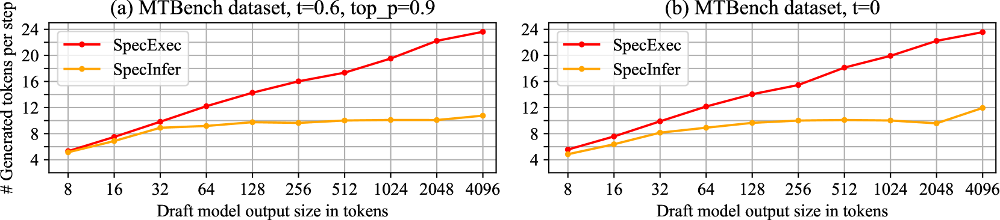
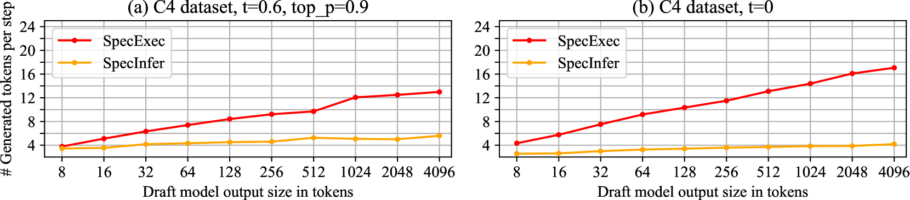
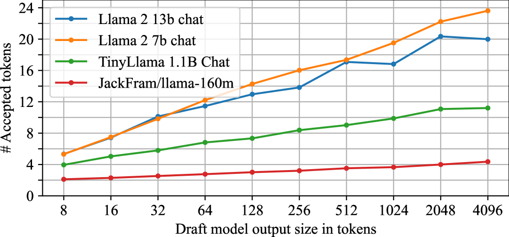
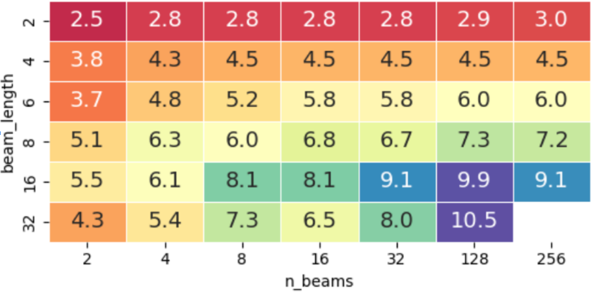
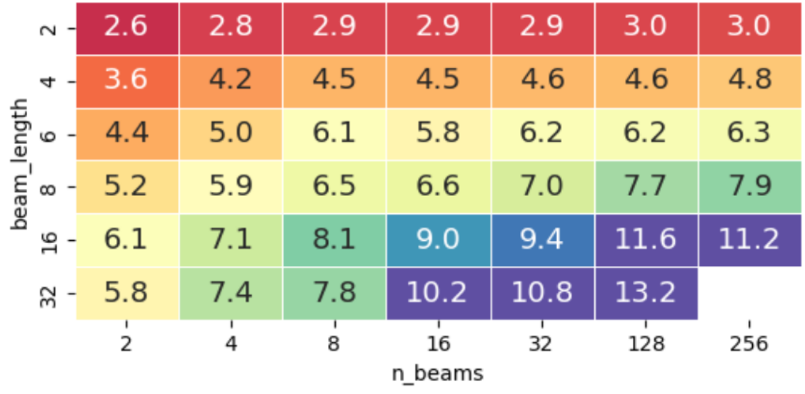
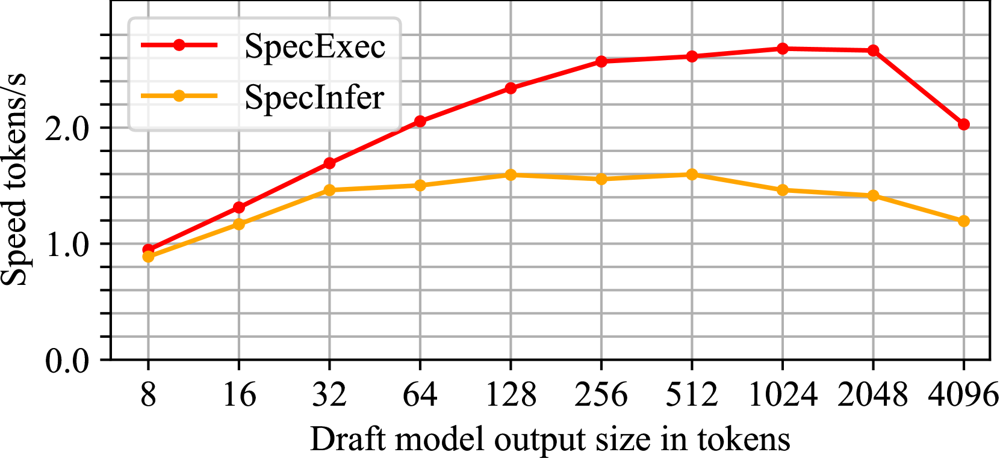

# SpecExec：消费设备上交互式LLM推理的大规模并行推测解码技术

发布时间：2024年06月04日

`LLM应用

这篇论文主要探讨了在普通消费者设备上高效运行大型语言模型（LLM）的方法，特别是通过提出一种名为SpecExec的并行解码技术来提升推理速度。这种方法特别适用于消费者GPU，这些GPU由于硬件限制无法直接处理超过50亿参数的模型。SpecExec利用了现代LLM中令牌概率的高度集中和模型输出概率的高度一致性，通过构建“缓存”树来加速解码过程。因此，这篇论文的内容更偏向于LLM的实际应用，即如何在资源受限的环境中优化LLM的运行效率。` `消费者设备` `人工智能推理`

> SpecExec: Massively Parallel Speculative Decoding for Interactive LLM Inference on Consumer Devices

# 摘要

> 随着大型语言模型的普及，如何高效运行它们成为关键。近期研究通过推测性解码大幅提升了LLM推理速度，但这些方法多针对高端数据中心硬件设计。本研究反其道而行之，探讨在普通消费者设备上运行LLM的速度极限。由于消费者GPU无法承载超过50亿参数的模型，需将模型参数卸载至RAM或SSD。在此情况下，推理引擎能同时处理大量令牌，非常适合推测性解码。我们提出SpecExec（推测性执行），一种并行解码技术，能在每次迭代中为常见LLM生成多达20个令牌。SpecExec利用现代LLM中令牌概率的高度集中和模型输出概率的高度一致性，从草稿模型中选取最可能的令牌延续，构建目标模型的“缓存”树，并通过一次验证确保准确性。实验表明，使用SpecExec，我们能在消费者GPU上以4-6个令牌/秒的速度进行50亿参数以上的LLM推理，采用4位量化；或以2-3个令牌/秒的速度，采用16位权重。

> As large language models gain widespread adoption, running them efficiently becomes crucial. Recent works on LLM inference use speculative decoding to achieve extreme speedups. However, most of these works implicitly design their algorithms for high-end datacenter hardware. In this work, we ask the opposite question: how fast can we run LLMs on consumer machines? Consumer GPUs can no longer fit the largest available models (50B+ parameters) and must offload them to RAM or SSD. When running with offloaded parameters, the inference engine can process batches of hundreds or thousands of tokens at the same time as just one token, making it a natural fit for speculative decoding. We propose SpecExec (Speculative Execution), a simple parallel decoding method that can generate up to 20 tokens per target model iteration for popular LLM families. It utilizes the high spikiness of the token probabilities distribution in modern LLMs and a high degree of alignment between model output probabilities. SpecExec takes the most probable tokens continuation from the draft model to build a "cache" tree for the target model, which then gets validated in a single pass. Using SpecExec, we demonstrate inference of 50B+ parameter LLMs on consumer GPUs with RAM offloading at 4-6 tokens per second with 4-bit quantization or 2-3 tokens per second with 16-bit weights.

[Arxiv](https://arxiv.org/abs/2406.02532)