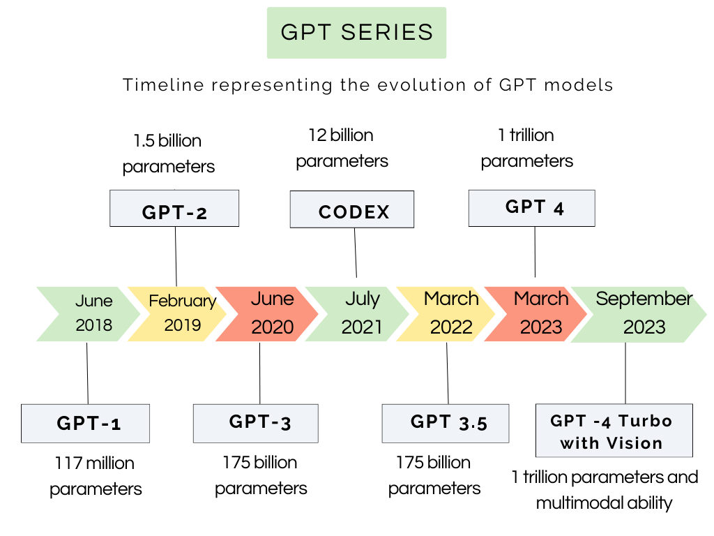
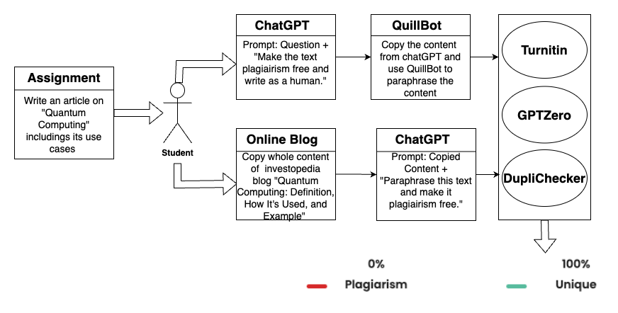
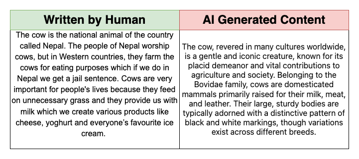
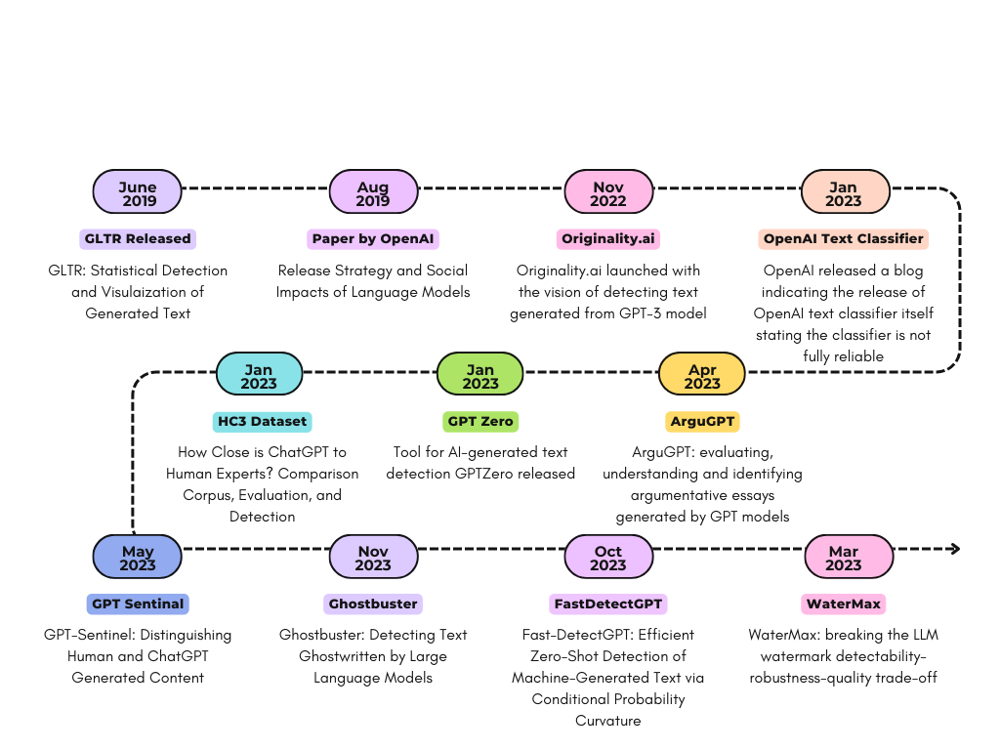

# 大型语言模型中的抄袭检测调查：探讨 ChatGPT 与 Gemini 对学术诚信的冲击

发布时间：2024年06月04日

`LLM应用` `学术研究`

> Survey on Plagiarism Detection in Large Language Models: The Impact of ChatGPT and Gemini on Academic Integrity

# 摘要

> ChatGPT和Gemini等大型语言模型的兴起，为学术界带来了新挑战。学生借助这些模型轻松完成学业，而教育者却难以识别AI生成的内容，导致学术不端行为激增。随着AI工具的进步，检测这些内容愈发困难，教育者正努力调整评估策略。  本研究首先揭示了LLMs如何加剧学术不诚实，随后详细探讨了学术抄袭的最新应对措施。通过调查抄袭检测的相关数据集、算法、工具及规避策略，本研究聚焦于LLMs和AIGC检测对这一领域的影响，旨在找出解决方案的不足。最后，基于AI工具和教育方法，提出长期解决方案，以应对不断变化的学术抄袭问题。

> The rise of Large Language Models (LLMs) such as ChatGPT and Gemini has posed new challenges for the academic community. With the help of these models, students can easily complete their assignments and exams, while educators struggle to detect AI-generated content. This has led to a surge in academic misconduct, as students present work generated by LLMs as their own, without putting in the effort required for learning. As AI tools become more advanced and produce increasingly human-like text, detecting such content becomes more challenging. This development has significantly impacted the academic world, where many educators are finding it difficult to adapt their assessment methods to this challenge.
  This research first demonstrates how LLMs have increased academic dishonesty, and then reviews state-of-the-art solutions for academic plagiarism in detail. A survey of datasets, algorithms, tools, and evasion strategies for plagiarism detection has been conducted, focusing on how LLMs and AI-generated content (AIGC) detection have affected this area. The survey aims to identify the gaps in existing solutions. Lastly, potential long-term solutions are presented to address the issue of academic plagiarism using LLMs based on AI tools and educational approaches in an ever-changing world.

[Arxiv](https://arxiv.org/abs/2407.13105)