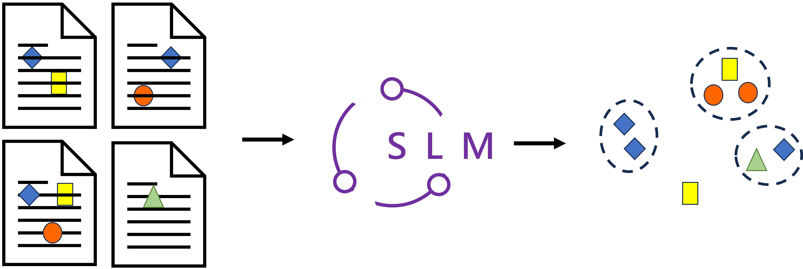
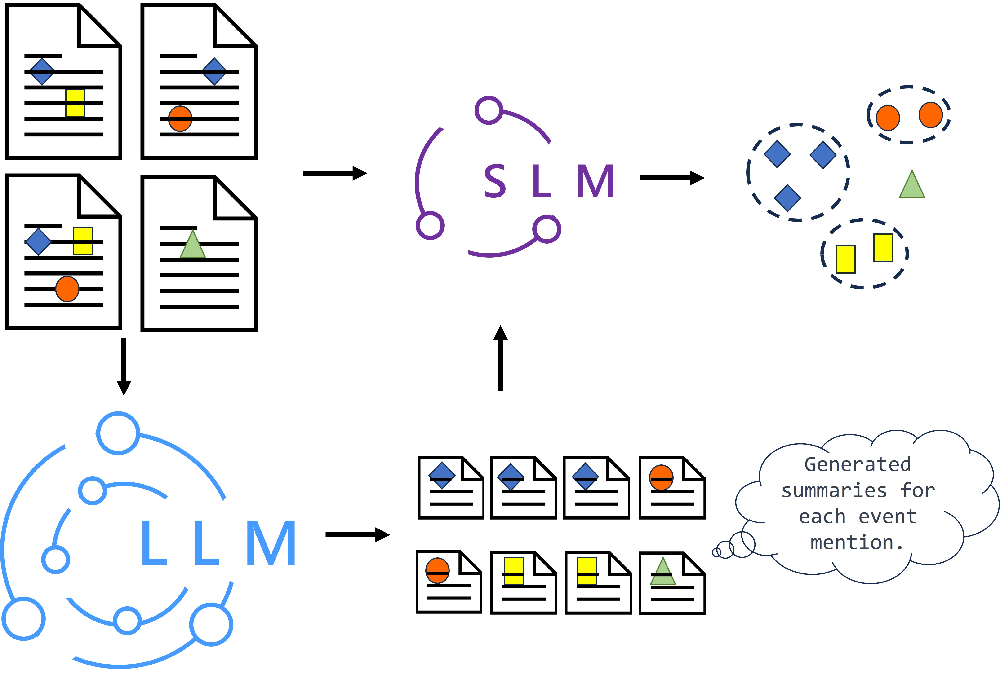
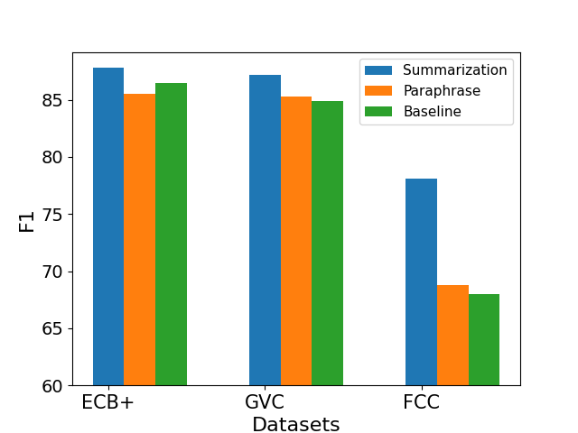
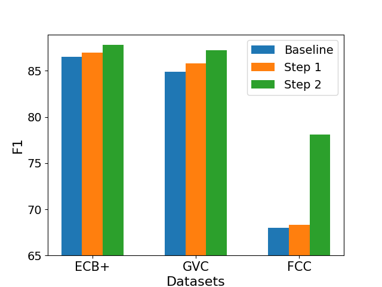
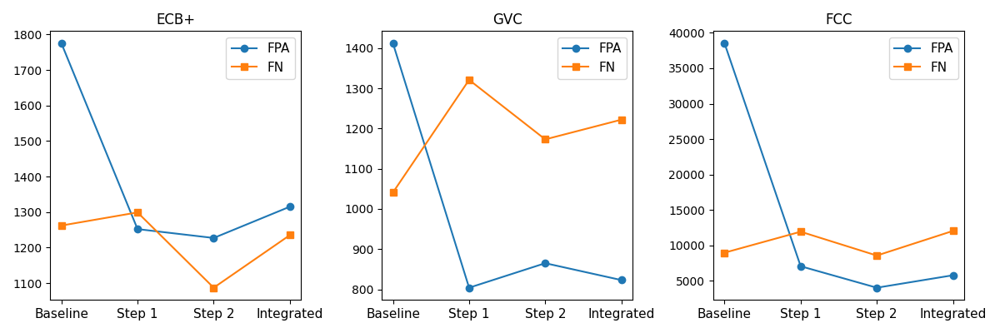
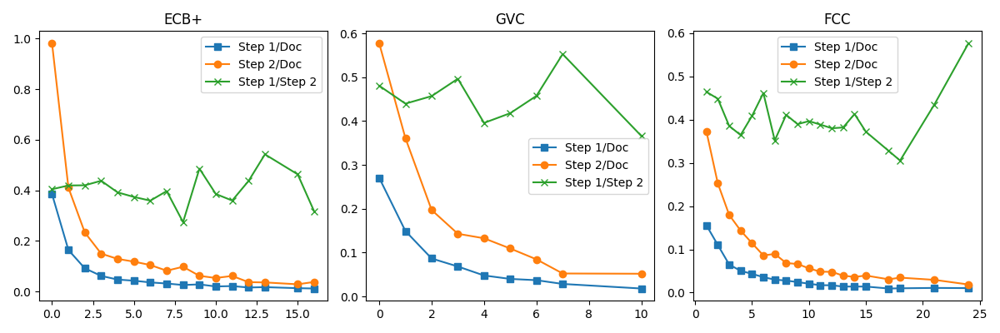
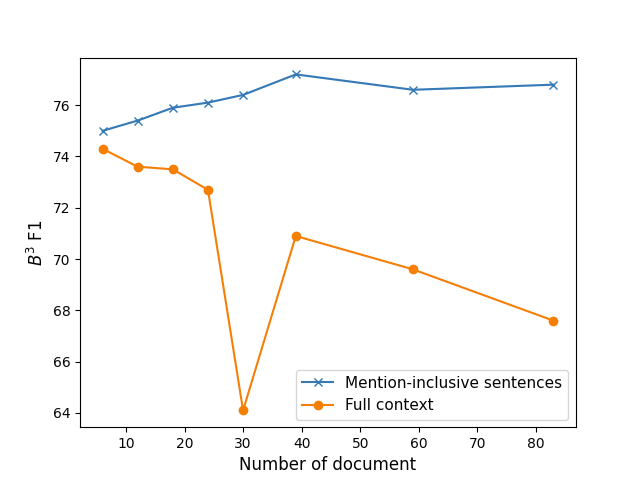

# 协同事件理解：借助大型语言模型，探索跨文档事件共指消解的协作之道

发布时间：2024年06月04日

`RAG

理由：这篇论文主要探讨了如何结合大型语言模型（LLMs）和小型语言模型（SLMs）来优化跨文档事件共指消解（CDECR）任务。文中提出的协作策略涉及使用LLM来概述事件，然后使用SLM进行深入微调以优化事件表示。这种方法与RAG（Retrieval-Augmented Generation）框架的理念相似，即结合检索和生成来提高模型的性能和适应性。因此，这篇论文更适合归类于RAG，因为它涉及了模型的组合使用和任务特定的优化策略。` `信息抽取`

> Synergetic Event Understanding: A Collaborative Approach to Cross-Document Event Coreference Resolution with Large Language Models

# 摘要

> 跨文档事件共指消解（CDECR）旨在聚合多文档中提及同一现实事件的描述。现有技术多依赖BERT等小型语言模型（SLMs）的微调，以协调不同事件提及的上下文。但上下文的复杂多变常导致模型仅捕捉到表面的共现关系。近期，如ChatGPT的大型语言模型（LLMs）虽在上下文理解上表现卓越，却难以精准适配特定的信息抽取（IE）任务。为此，本文提出一种协作策略：首先由LLM通过提示全面概述事件，随后SLM基于此深入微调，优化事件表示。实验证明，此法不仅超越了单一模型的性能，更在多个数据集上创下新纪录，展现了其在复杂场景中的卓越效能。

> Cross-document event coreference resolution (CDECR) involves clustering event mentions across multiple documents that refer to the same real-world events. Existing approaches utilize fine-tuning of small language models (SLMs) like BERT to address the compatibility among the contexts of event mentions. However, due to the complexity and diversity of contexts, these models are prone to learning simple co-occurrences. Recently, large language models (LLMs) like ChatGPT have demonstrated impressive contextual understanding, yet they encounter challenges in adapting to specific information extraction (IE) tasks. In this paper, we propose a collaborative approach for CDECR, leveraging the capabilities of both a universally capable LLM and a task-specific SLM. The collaborative strategy begins with the LLM accurately and comprehensively summarizing events through prompting. Then, the SLM refines its learning of event representations based on these insights during fine-tuning. Experimental results demonstrate that our approach surpasses the performance of both the large and small language models individually, forming a complementary advantage. Across various datasets, our approach achieves state-of-the-art performance, underscoring its effectiveness in diverse scenarios.

[Arxiv](https://arxiv.org/abs/2406.02148)