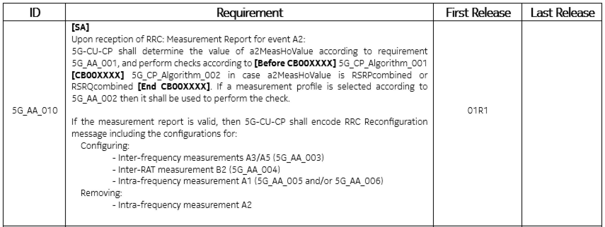
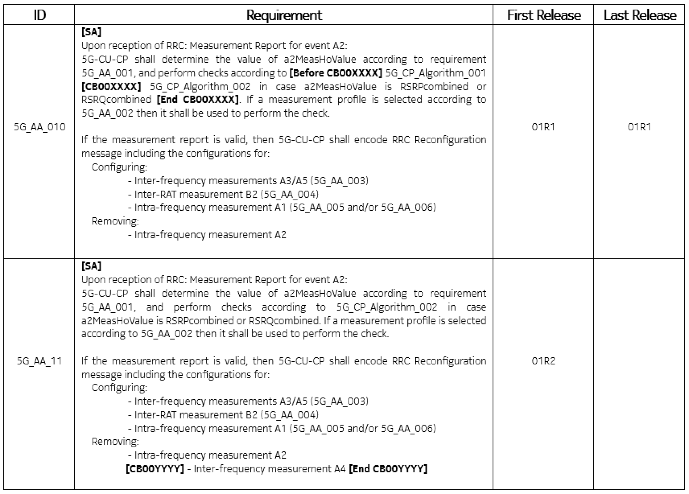
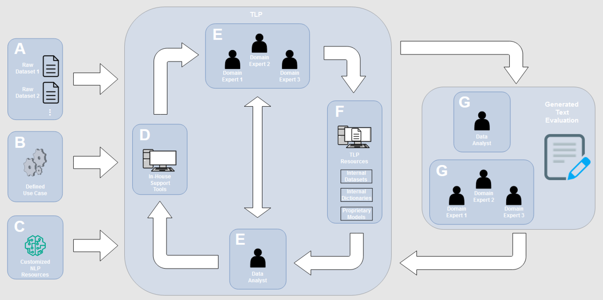

# 电信规范中的技术语言处理

发布时间：2024年06月04日

`LLM应用

这篇论文探讨了大型语言模型（LLMs）在特定领域，即电信工程领域的应用。它特别关注了现有NLP工具在处理电信规范文档时的局限性，并提出了针对该领域的技术语言处理（TLP）新概念。论文强调了特定领域LLMs在帮助规范工程师和加速专家培训方面的潜力。这与LLM的应用场景直接相关，因此归类为LLM应用。` `技术文档处理`

> Technical Language Processing for Telecommunications Specifications

# 摘要

> 大型语言模型（LLMs）的应用场景日益广泛，但即便是最尖端的GTP-4，在无需繁琐预处理的情况下，从技术文档中提取信息也显得力不从心。电信工程领域，拥有大量专业文档，正是特定领域LLMs大显身手的舞台。电信规范的独特格式与结构迥异于日常英语，现成的NLP工具难以胜任。本文揭示了这些工具的局限，并提出了适用于电信领域的技术语言处理（TLP）新概念。同时，我们探讨了特定领域LLMs如何助力规范工程师，强调了它们在加速电信领域专家培训中的巨大潜力。

> Large Language Models (LLMs) are continuously being applied in a more diverse set of contexts. At their current state, however, even state-of-the-art LLMs such as Generative Pre-Trained Transformer 4 (GTP-4) have challenges when extracting information from real-world technical documentation without a heavy preprocessing. One such area with real-world technical documentation is telecommunications engineering, which could greatly benefit from domain-specific LLMs. The unique format and overall structure of telecommunications internal specifications differs greatly from standard English and thus it is evident that the application of out-of-the-box Natural Language Processing (NLP) tools is not a viable option. In this article, we outline the limitations of out-of-the-box NLP tools for processing technical information generated by telecommunications experts, and expand the concept of Technical Language Processing (TLP) to the telecommunication domain. Additionally, we explore the effect of domain-specific LLMs in the work of Specification Engineers, emphasizing the potential benefits of adopting domain-specific LLMs to speed up the training of experts in different telecommunications fields.

[Arxiv](https://arxiv.org/abs/2406.02325)