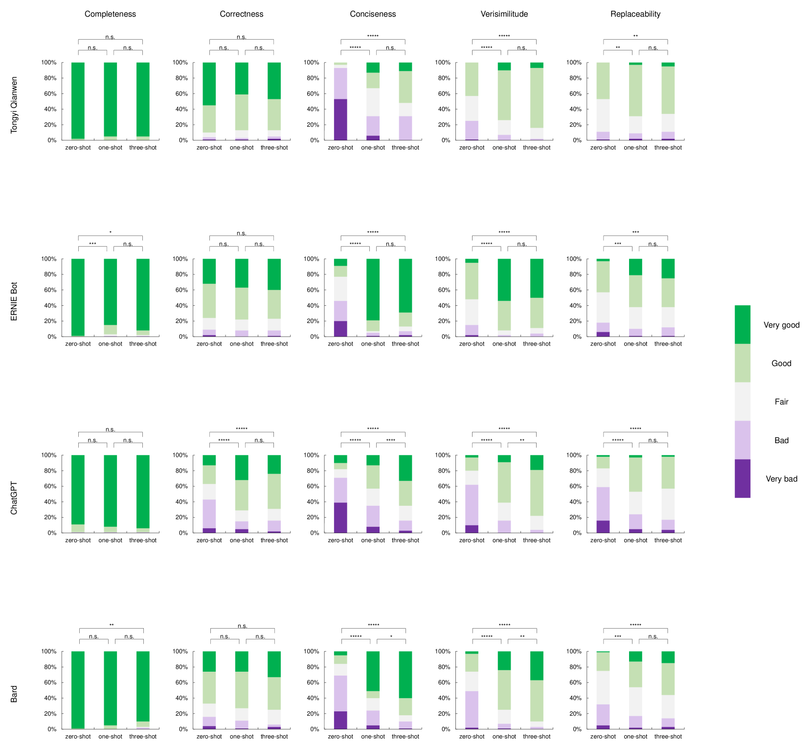

# 大型语言模型在提炼放射学报告核心印象方面的现状

发布时间：2024年06月04日

`LLM应用

这篇论文主要探讨了大型语言模型（LLMs）如ChatGPT在总结放射学报告印象方面的应用能力。研究通过构建零-shot、一-shot和三-shot提示，并结合自动定量评估和人类评估指标，评估了LLMs生成报告印象的质量。虽然LLMs在某些方面表现良好，但仍存在改进空间，且临床医生认为它们不能完全替代放射科医生的专业判断。因此，这篇论文属于LLM应用类别，因为它关注的是LLMs在特定领域的实际应用和效果评估。`

> The current status of large language models in summarizing radiology report impressions

# 摘要

> ChatGPT等大型语言模型（LLMs）在文本生成等自然语言处理任务中表现卓越，但在总结放射学报告印象方面的能力尚待验证。本研究针对八种LLMs，通过从北京大学肿瘤医院收集的CT、PET-CT和超声报告，构建零-shot、一-shot和三-shot提示，以生成报告印象。我们不仅采用了自动定量评估，还引入了五个人类评估指标——完整性、正确性、简洁性、真实性和可替换性，以深入评估生成印象的质量。通过两位胸外科医生和一位放射科医生的专业评估，我们发现尽管LLMs在完整性和正确性上表现不俗，但在简洁性和真实性方面仍有提升空间。尽管少量示例提示能稍加改善，但临床医生仍认为LLMs无法完全替代放射科医生在总结报告印象方面的专业判断。

> Large language models (LLMs) like ChatGPT show excellent capabilities in various natural language processing tasks, especially for text generation. The effectiveness of LLMs in summarizing radiology report impressions remains unclear. In this study, we explore the capability of eight LLMs on the radiology report impression summarization. Three types of radiology reports, i.e., CT, PET-CT, and Ultrasound reports, are collected from Peking University Cancer Hospital and Institute. We use the report findings to construct the zero-shot, one-shot, and three-shot prompts with complete example reports to generate the impressions. Besides the automatic quantitative evaluation metrics, we define five human evaluation metrics, i.e., completeness, correctness, conciseness, verisimilitude, and replaceability, to evaluate the semantics of the generated impressions. Two thoracic surgeons (ZSY and LB) and one radiologist (LQ) compare the generated impressions with the reference impressions and score each impression under the five human evaluation metrics. Experimental results show that there is a gap between the generated impressions and reference impressions. Although the LLMs achieve comparable performance in completeness and correctness, the conciseness and verisimilitude scores are not very high. Using few-shot prompts can improve the LLMs' performance in conciseness and verisimilitude, but the clinicians still think the LLMs can not replace the radiologists in summarizing the radiology impressions.

[Arxiv](https://arxiv.org/abs/2406.02134)