# 是否应该信任你的大型语言模型（LLM）？这是一个值得深思的问题。

发布时间：2024年06月04日

`LLM理论

理由：这篇论文主要探讨了大型语言模型（LLMs）中的不确定性量化问题，特别是认识论和偶然性不确定性的区分，以及如何通过信息论方法来识别模型输出的不可靠性。这些内容涉及LLM的理论分析和方法论探讨，而不是具体的应用、代理行为或检索增强生成（RAG）技术。因此，它更适合归类于LLM理论。` `人工智能`

> To Believe or Not to Believe Your LLM

# 摘要

> 我们深入研究了大型语言模型（LLMs）中的不确定性量化，旨在揭示何时响应中的不确定性显著。我们综合考虑了认识论和偶然性不确定性，前者源自对真实情况的无知，后者则源于答案的固有随机性。我们特别提出了一种信息论方法，能准确识别出认识论不确定性过高时模型输出的不可靠性。这一判断仅依赖于模型在特殊迭代提示下的输出，这种提示基于先前的响应。这种方法能有效识别单个和多个答案中的幻觉现象，与传统的不确定性量化方法（如对数似然阈值）不同，后者在多答案情况下无法识别幻觉。我们的实验证明了这一方法的有效性，并进一步探讨了迭代提示如何增强LLM对特定输出的概率分配，这一发现本身也颇具价值。

> We explore uncertainty quantification in large language models (LLMs), with the goal to identify when uncertainty in responses given a query is large. We simultaneously consider both epistemic and aleatoric uncertainties, where the former comes from the lack of knowledge about the ground truth (such as about facts or the language), and the latter comes from irreducible randomness (such as multiple possible answers). In particular, we derive an information-theoretic metric that allows to reliably detect when only epistemic uncertainty is large, in which case the output of the model is unreliable. This condition can be computed based solely on the output of the model obtained simply by some special iterative prompting based on the previous responses. Such quantification, for instance, allows to detect hallucinations (cases when epistemic uncertainty is high) in both single- and multi-answer responses. This is in contrast to many standard uncertainty quantification strategies (such as thresholding the log-likelihood of a response) where hallucinations in the multi-answer case cannot be detected. We conduct a series of experiments which demonstrate the advantage of our formulation. Further, our investigations shed some light on how the probabilities assigned to a given output by an LLM can be amplified by iterative prompting, which might be of independent interest.

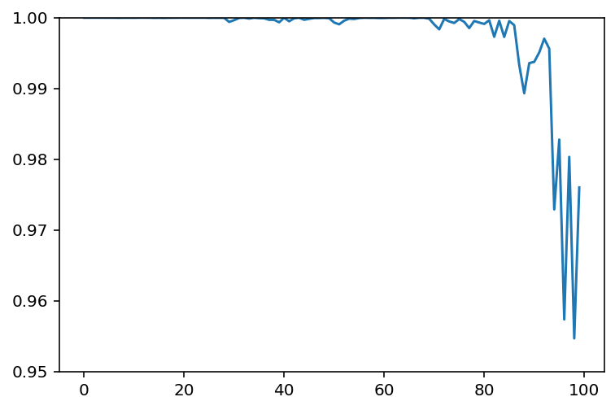

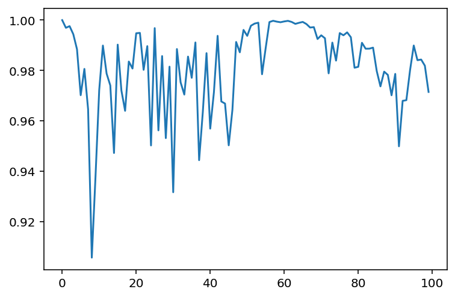

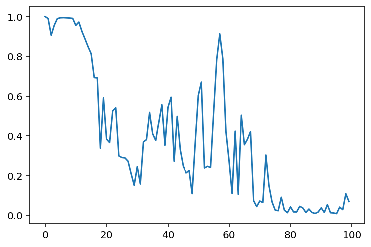

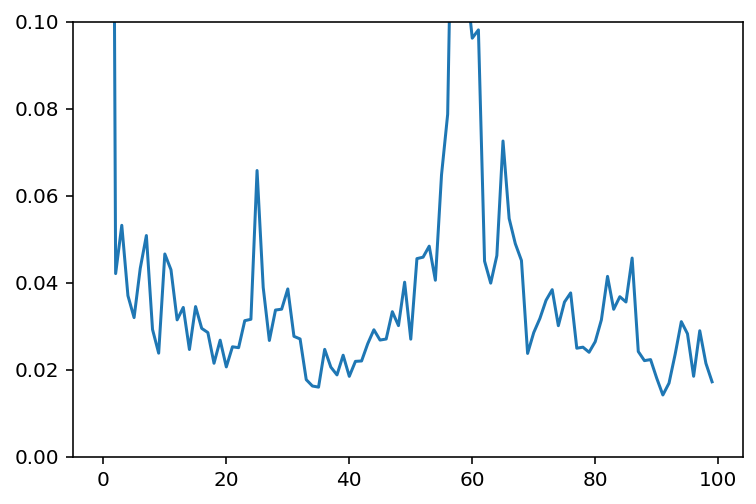

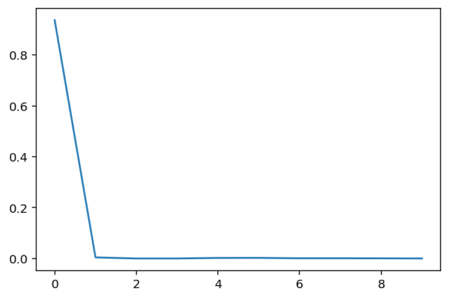

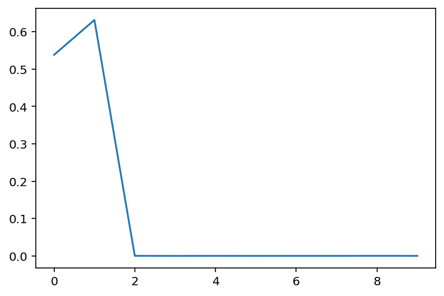

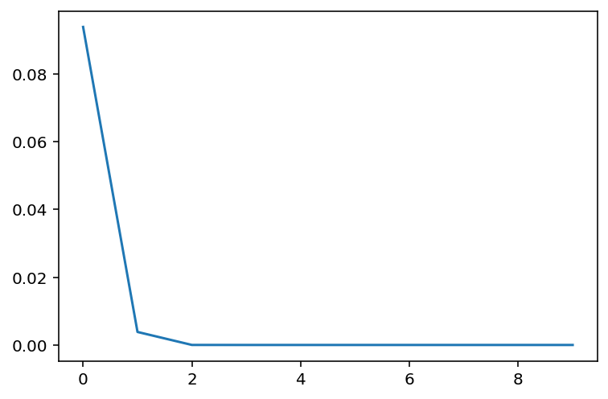

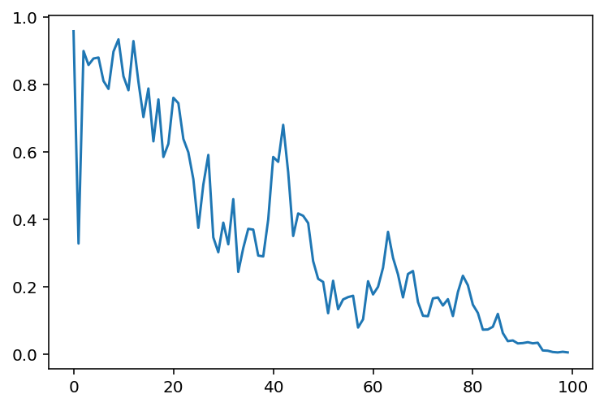

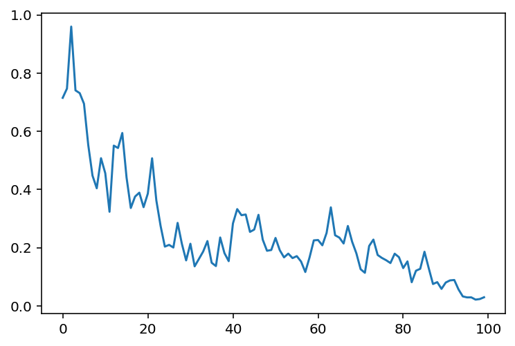

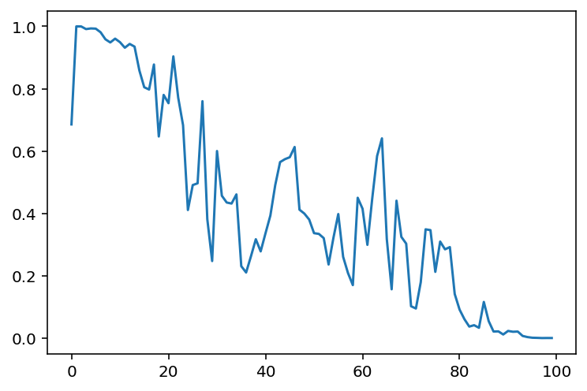

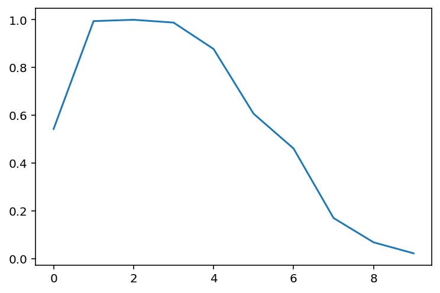

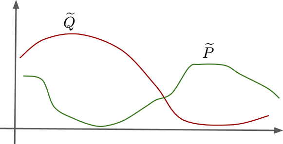

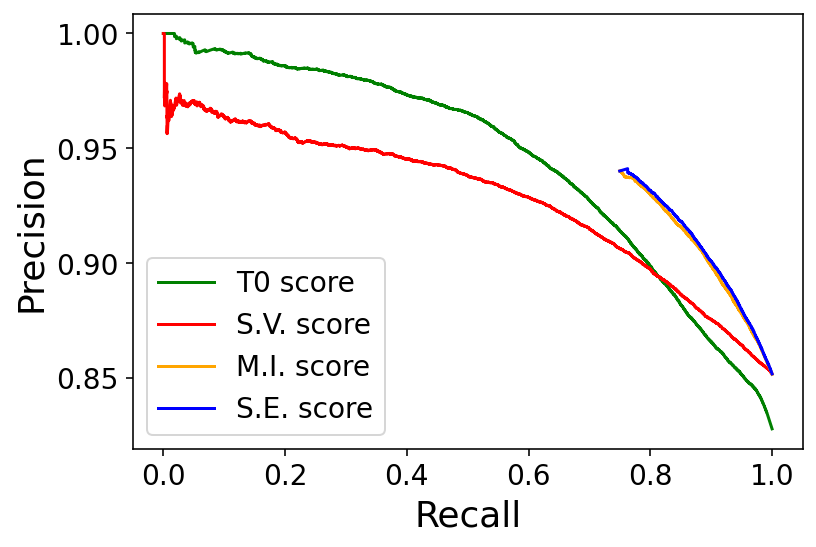

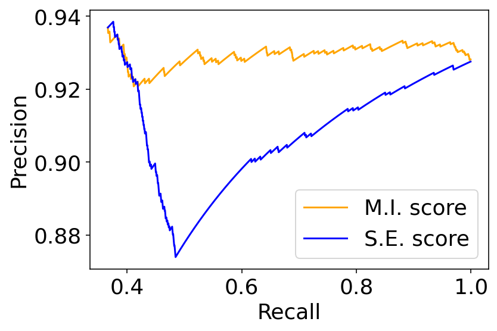

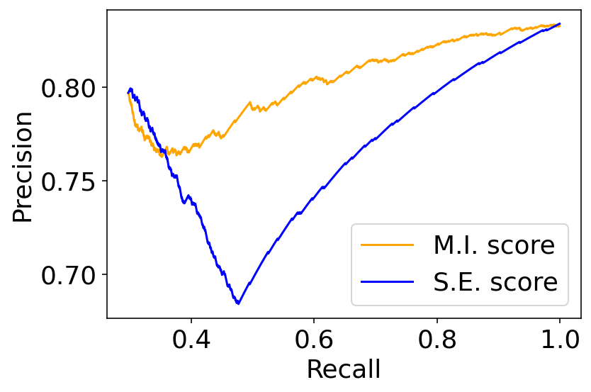

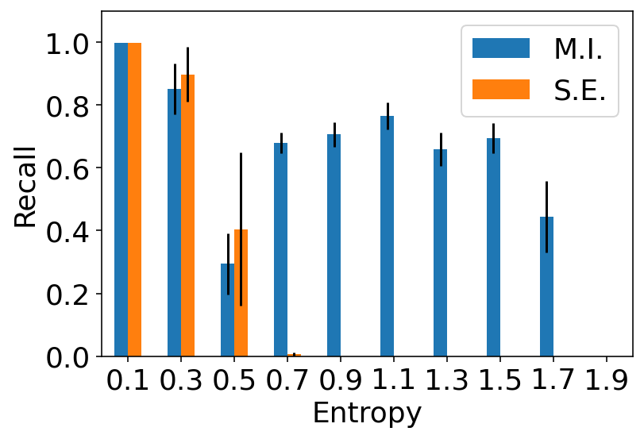

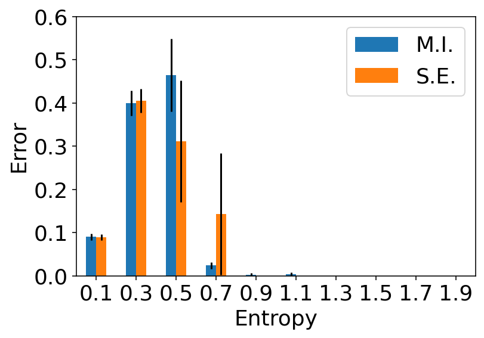

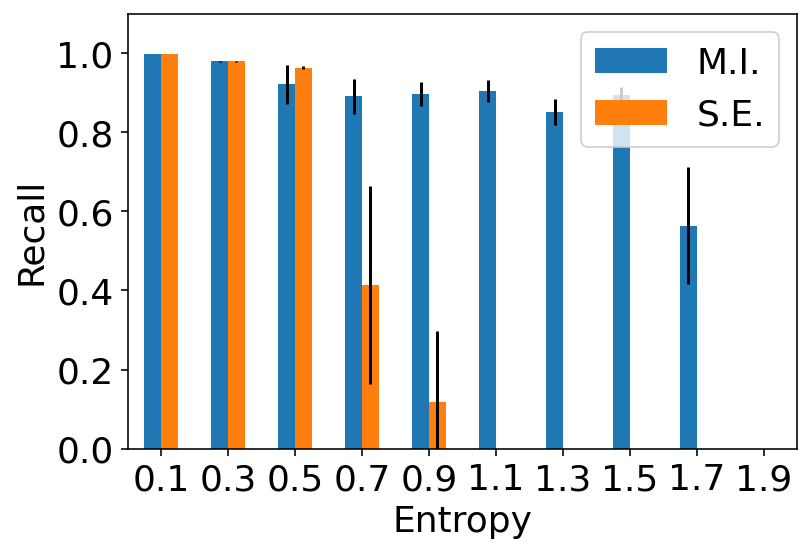

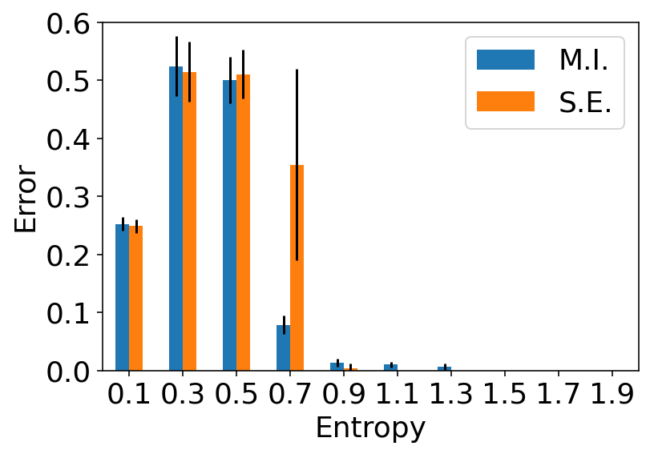

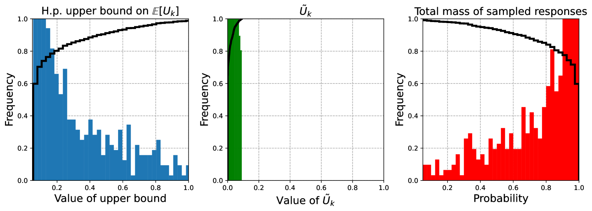

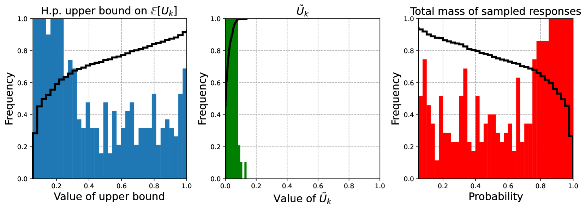

[Arxiv](https://arxiv.org/abs/2406.02543)