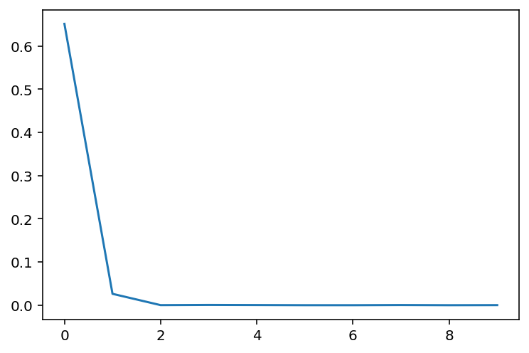
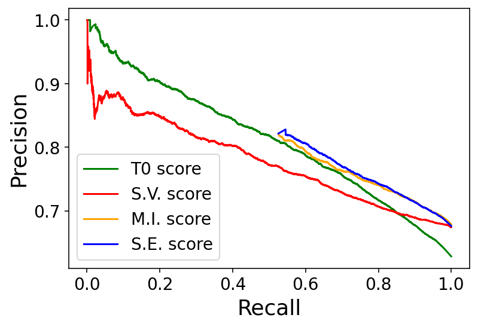

# 是否信任你的大型语言模型（LLM）？这是一个值得深思的问题。

发布时间：2024年06月04日

`LLM理论

这篇论文主要探讨了大型语言模型（LLMs）中的不确定性量化问题，特别是如何识别模型响应中的不确定性。它提出了一种新的信息理论指标，用于区分认识论和偶然性不确定性，并展示了如何通过迭代提示来检测模型输出的不可靠性，即所谓的“幻觉”。这一研究深入分析了LLMs的理论层面，特别是在不确定性量化和模型输出的可靠性评估方面，因此属于LLM理论分类。` `人工智能`

> To Believe or Not to Believe Your LLM

# 摘要

> 我们研究了大型语言模型（LLMs）中的不确定性量化，旨在识别何时响应中的不确定性较大。我们综合考虑了认识论和偶然性不确定性，前者源于对事实或语言等真实情况的知识不足，后者源于答案的不可减少的随机性。我们特别提出了一种信息理论指标，能有效识别仅认识论不确定性高的情况，此时模型输出不可靠。这一条件可通过基于先前响应的迭代提示来计算。此方法能有效检测幻觉，无论是在单答案还是多答案响应中，与传统的不确定性量化策略不同，后者在多答案情况下无法识别幻觉。我们的实验证明了这种方法的优势，并揭示了迭代提示如何增强LLM对特定输出的概率分配，这一发现具有独立的研究价值。

> We explore uncertainty quantification in large language models (LLMs), with the goal to identify when uncertainty in responses given a query is large. We simultaneously consider both epistemic and aleatoric uncertainties, where the former comes from the lack of knowledge about the ground truth (such as about facts or the language), and the latter comes from irreducible randomness (such as multiple possible answers). In particular, we derive an information-theoretic metric that allows to reliably detect when only epistemic uncertainty is large, in which case the output of the model is unreliable. This condition can be computed based solely on the output of the model obtained simply by some special iterative prompting based on the previous responses. Such quantification, for instance, allows to detect hallucinations (cases when epistemic uncertainty is high) in both single- and multi-answer responses. This is in contrast to many standard uncertainty quantification strategies (such as thresholding the log-likelihood of a response) where hallucinations in the multi-answer case cannot be detected. We conduct a series of experiments which demonstrate the advantage of our formulation. Further, our investigations shed some light on how the probabilities assigned to a given output by an LLM can be amplified by iterative prompting, which might be of independent interest.

[Arxiv](https://arxiv.org/abs/2406.02543)