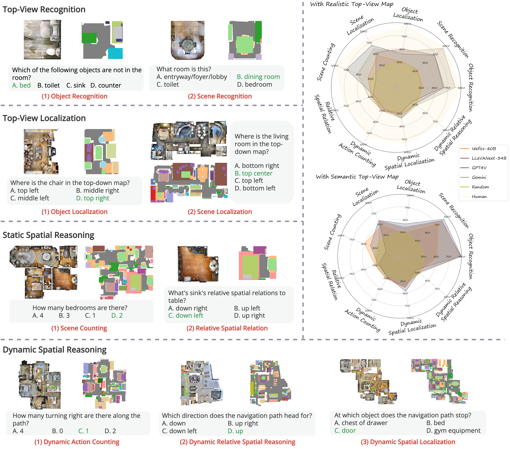
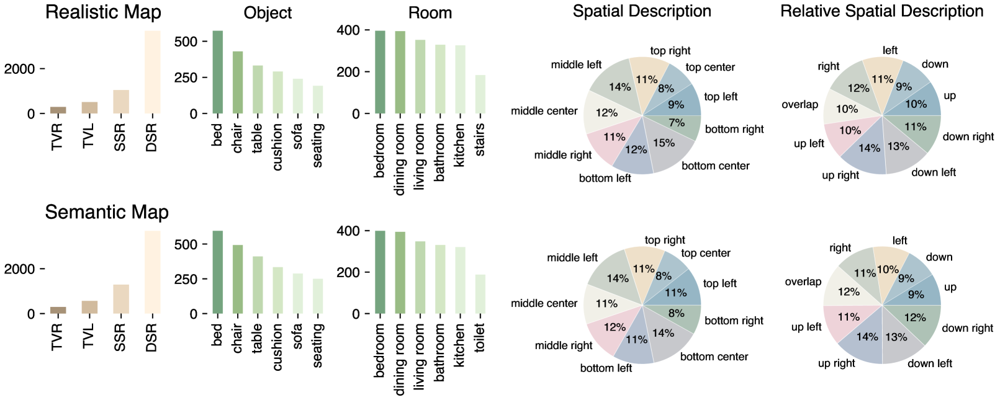
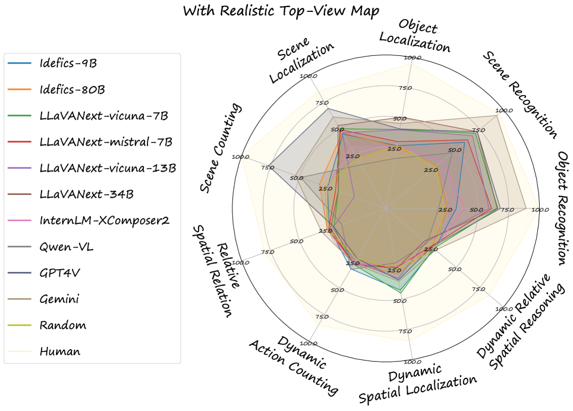
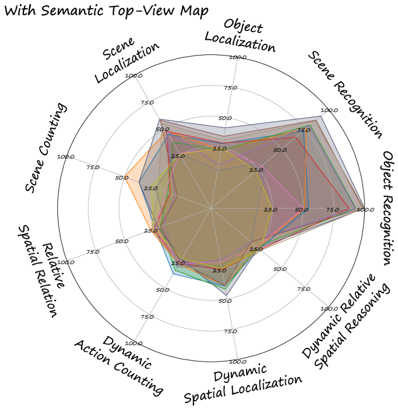
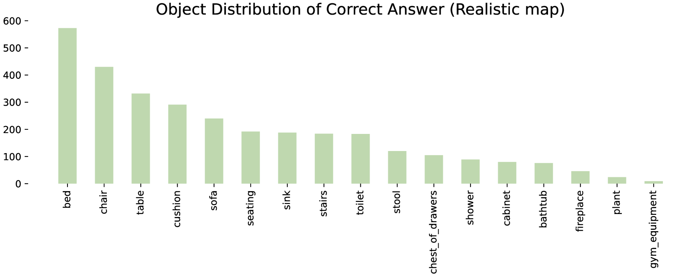
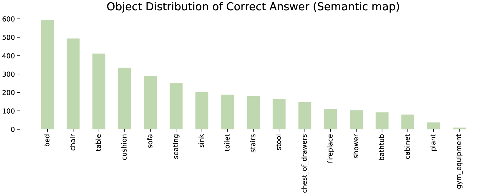
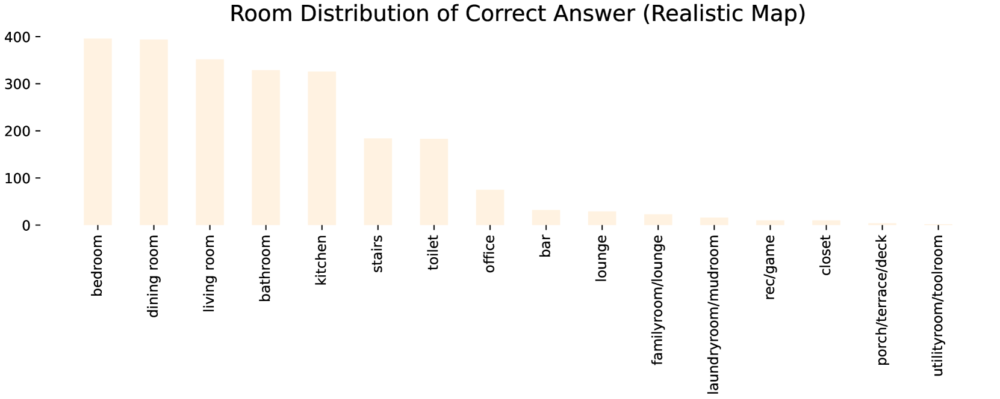
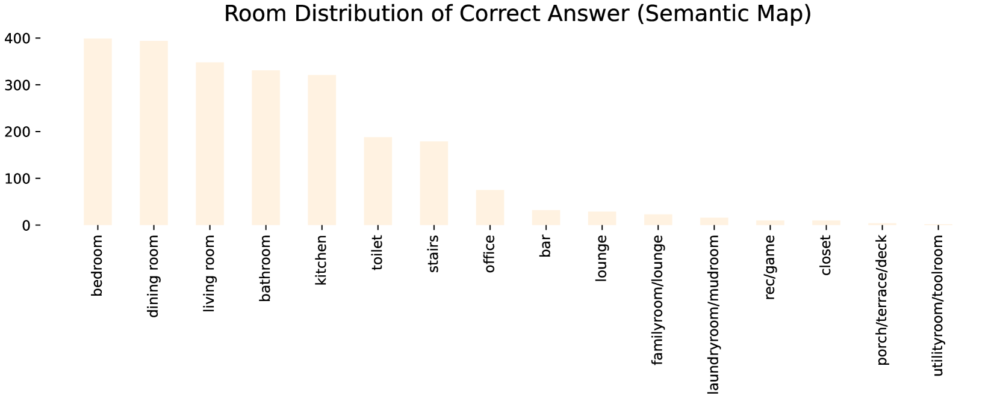

# TopViewRS：视觉-语言模型——顶视图空间推理的智慧之眼

发布时间：2024年06月04日

`LLM应用

这篇论文主要关注大型视觉语言模型（VLMs）在顶视图空间推理能力方面的评估和探索。通过创建TopViewRS数据集并评估多个VLMs在不同空间推理任务上的表现，研究揭示了当前VLMs在空间推理能力上的不足，并强调了提升这一能力的迫切性。因此，这篇论文属于LLM应用分类，因为它专注于实际应用中的模型评估和改进，而不是理论研究或Agent、RAG相关的研究。` `空间推理` `视觉语言模型`

> TopViewRS: Vision-Language Models as Top-View Spatial Reasoners

# 摘要

> 顶视图视角是人类解读地图和进行空间推理的常用方式，对人类及依赖大型视觉语言模型（VLMs）的非人类实体的定位与导航至关重要。尽管如此，现代VLMs的空间推理能力尚未得到充分验证和深入探索。本研究聚焦于VLMs从顶视图理解空间关系的能力，并借此在不同空间推理粒度上进行精确评估，清晰区分了识别特定对象与理解其相对位置等不同能力。我们推出了TopViewRS（空间顶视图推理）数据集，包含11,384道多选题，以真实或语义顶视图地图为视觉输入。通过该数据集，我们评估了VLMs在四个感知与推理任务上的表现，这些任务复杂度各异。对10个代表性开源和闭源VLMs的评估显示，其性能与人类平均水平相比差距超过50%，某些情况下甚至不及随机基准。尽管实验表明，思维链推理能平均提升模型性能5.82%，但VLMs的整体表现仍显不足。我们的研究强调了提升VLMs在顶视图空间推理能力的迫切性，并为实现其在现实世界多模态任务中达到人类水平的表现奠定了研究基础。

> Top-view perspective denotes a typical way in which humans read and reason over different types of maps, and it is vital for localization and navigation of humans as well as of `non-human' agents, such as the ones backed by large Vision-Language Models (VLMs). Nonetheless, spatial reasoning capabilities of modern VLMs remain unattested and underexplored. In this work, we thus study their capability to understand and reason over spatial relations from the top view. The focus on top view also enables controlled evaluations at different granularity of spatial reasoning; we clearly disentangle different abilities (e.g., recognizing particular objects versus understanding their relative positions). We introduce the TopViewRS (Top-View Reasoning in Space) dataset, consisting of 11,384 multiple-choice questions with either realistic or semantic top-view map as visual input. We then use it to study and evaluate VLMs across 4 perception and reasoning tasks with different levels of complexity. Evaluation of 10 representative open- and closed-source VLMs reveals the gap of more than 50% compared to average human performance, and it is even lower than the random baseline in some cases. Although additional experiments show that Chain-of-Thought reasoning can boost model capabilities by 5.82% on average, the overall performance of VLMs remains limited. Our findings underscore the critical need for enhanced model capability in top-view spatial reasoning and set a foundation for further research towards human-level proficiency of VLMs in real-world multimodal tasks.

[Arxiv](https://arxiv.org/abs/2406.02537)