# 探究增强检索的图像描述生成系统的检索鲁棒性

发布时间：2024年06月04日

`RAG

这篇论文主要关注的是图像描述生成领域中的检索增强模型，特别是SmallCap模型的稳健性问题及其改进策略。论文通过分析检索描述对模型性能的影响，并提出了一种新的训练策略来减少模型对常见词汇的依赖，从而提高模型在特定及跨领域任务中的表现。这与RAG（Retrieval-Augmented Generation）模型的概念相符，即通过检索增强来改进生成模型的性能。因此，这篇论文应归类于RAG。` `图像描述生成` `模型训练`

> Understanding Retrieval Robustness for Retrieval-Augmented Image Captioning

# 摘要

> 最近，图像描述生成领域中检索增强模型的进步，强调了检索相关描述对于打造高效、轻量且具备强大领域迁移能力的模型的关键作用。虽然这些模型证明了检索增强的有效性，但实际应用中的检索模型仍未臻完美。检索信息有时会误导模型，损害其性能。本文深入分析了SmallCap这一检索增强图像描述模型的稳健性，发现它对检索描述中频繁出现的词汇极为敏感，且这些词汇常被直接复制到最终描述中。鉴于此，我们提出了一种新的训练策略：从更广泛的集合中随机抽取检索描述，以减少模型对常见词汇的依赖，从而显著提升其在特定及跨领域任务中的表现。

> Recent advancements in retrieval-augmented models for image captioning highlight the significance of retrieving related captions for efficient, lightweight models with strong domain-transfer capabilities. While these models demonstrate the success of retrieval augmentation, retrieval models are still far from perfect in practice. Retrieved information can sometimes mislead the model generation, negatively impacting performance. In this paper, we analyze the robustness of the SmallCap retrieval-augmented captioning model. Our analysis shows that SmallCap is sensitive to tokens that appear in the majority of the retrieved captions, and integrated gradients attribution shows that those tokens are likely copied into the final caption. Given these findings, we propose to train the model by sampling retrieved captions from more diverse sets. This reduces the probability that the model learns to copy majority tokens and improves both in-domain and cross-domain performance effectively.

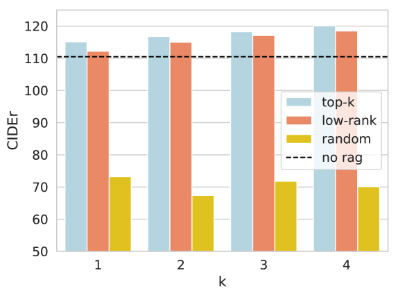

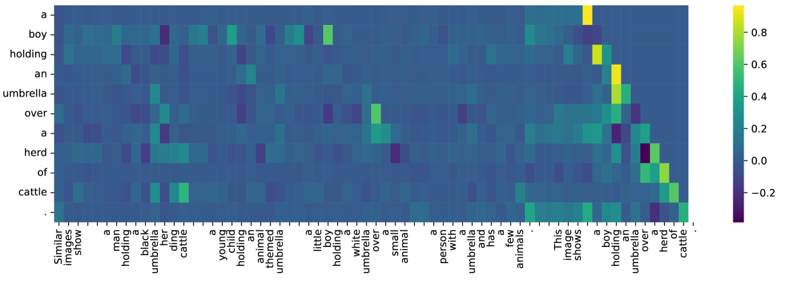

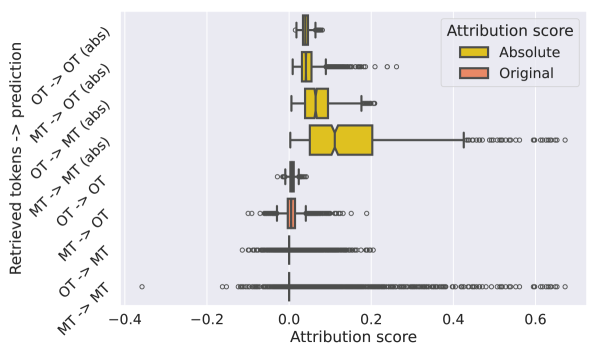

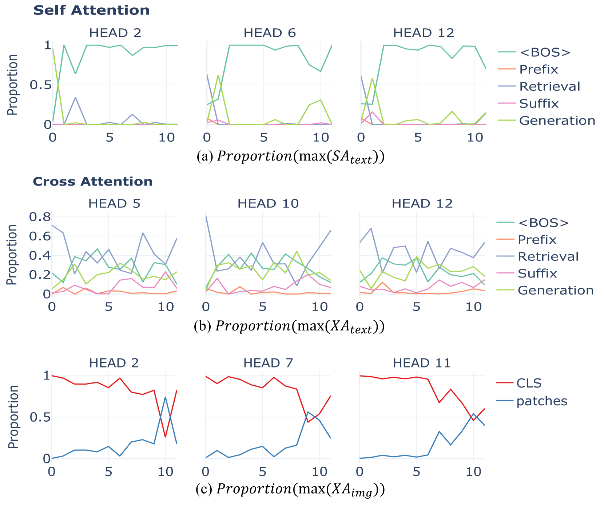

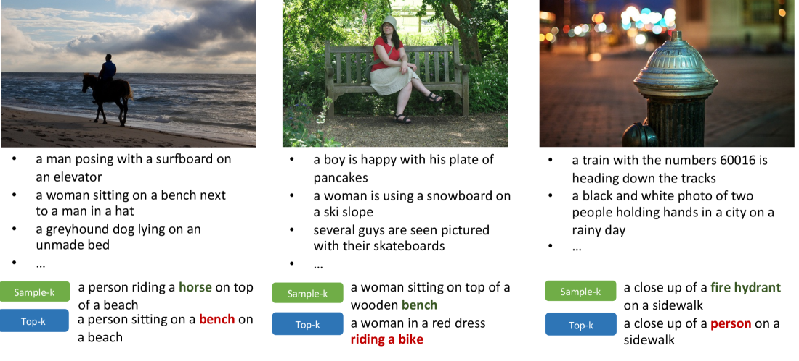

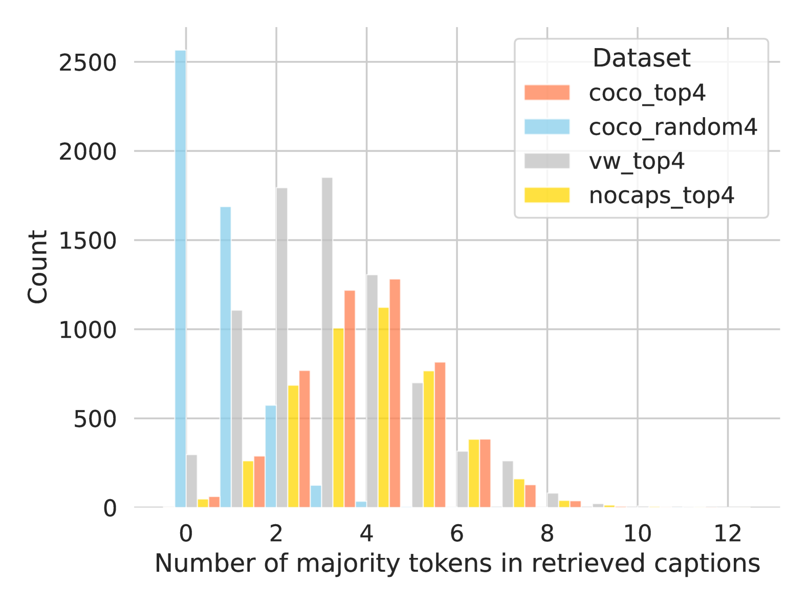

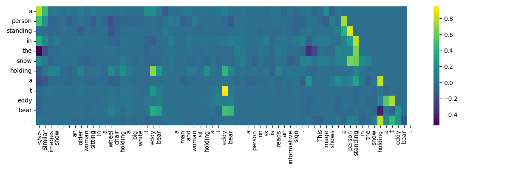

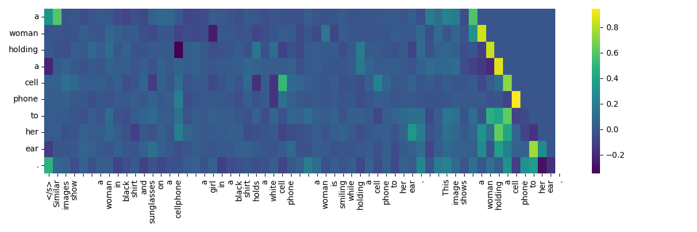

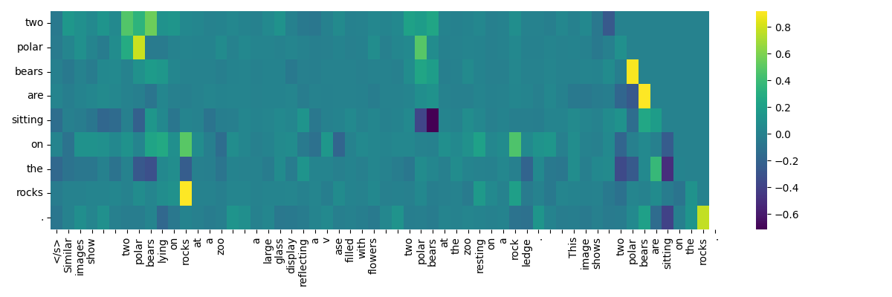

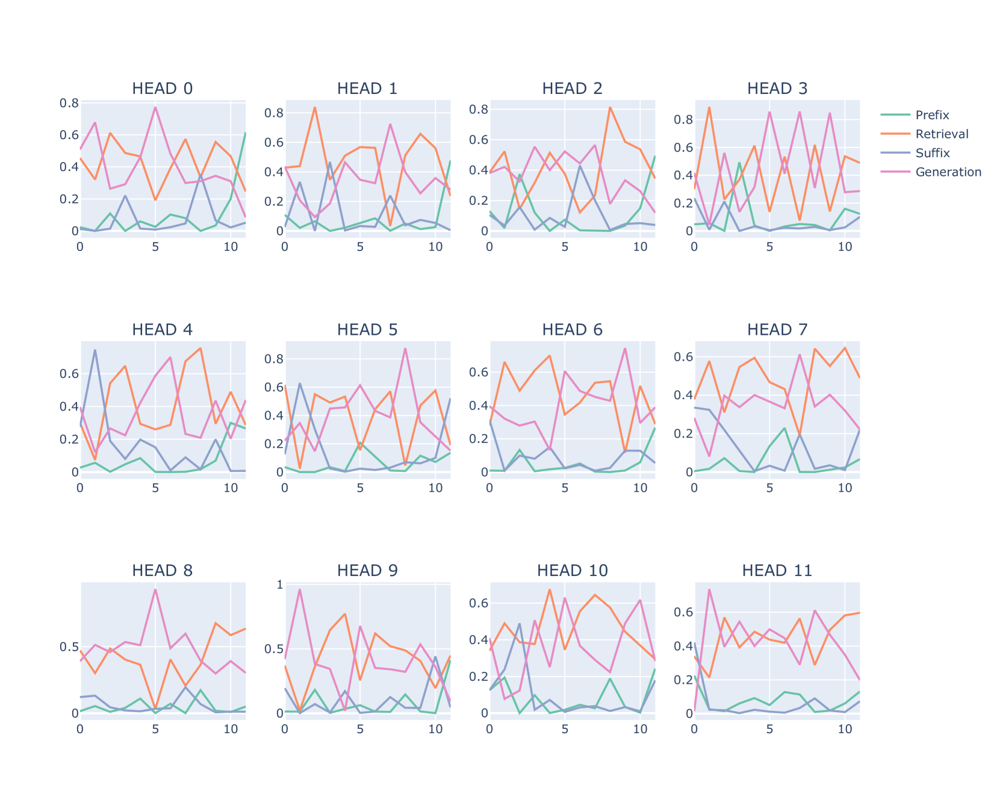

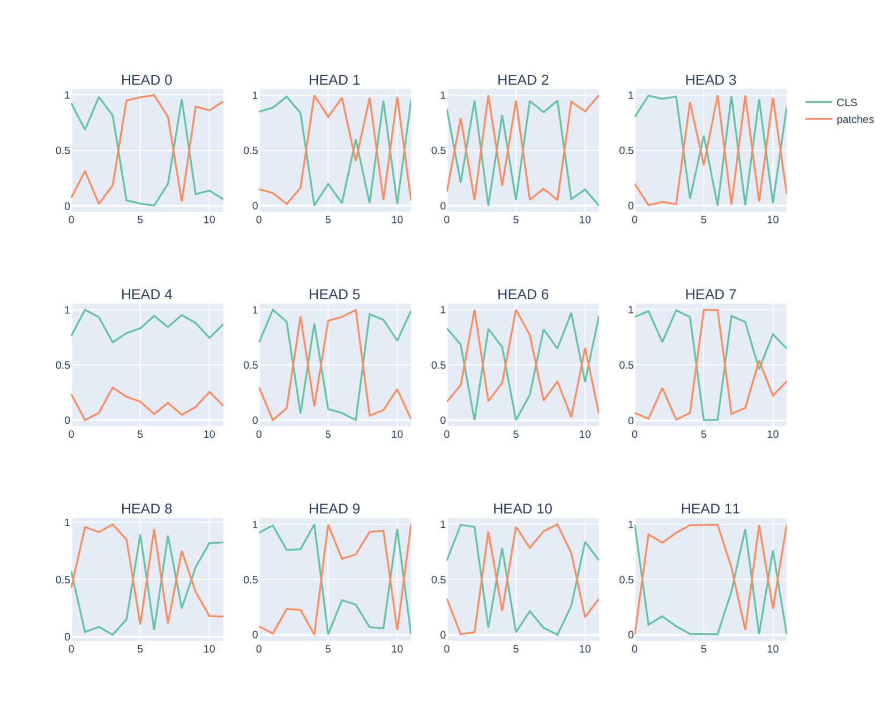

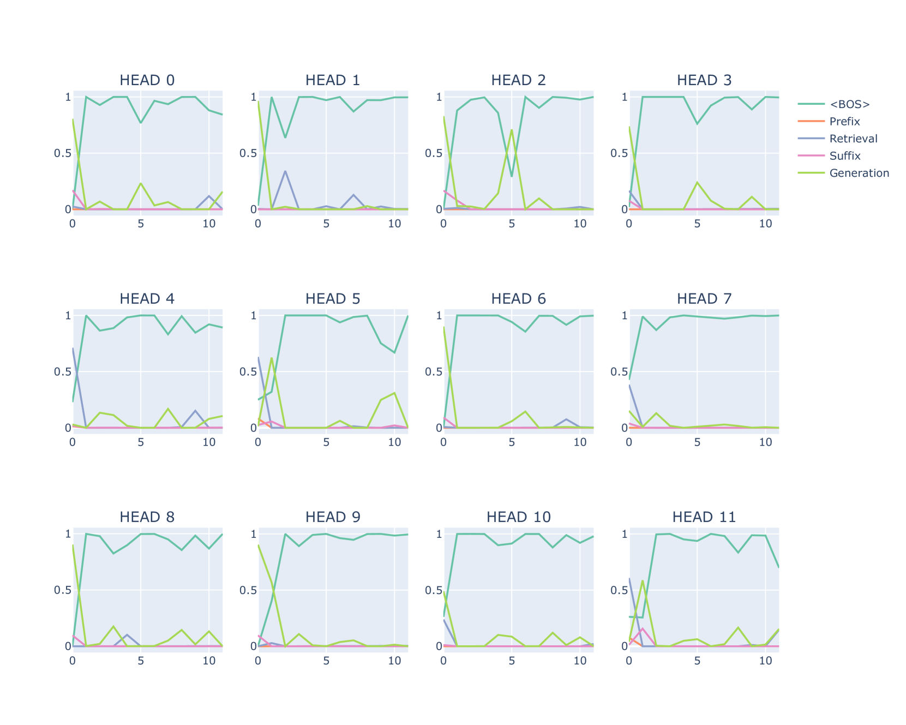

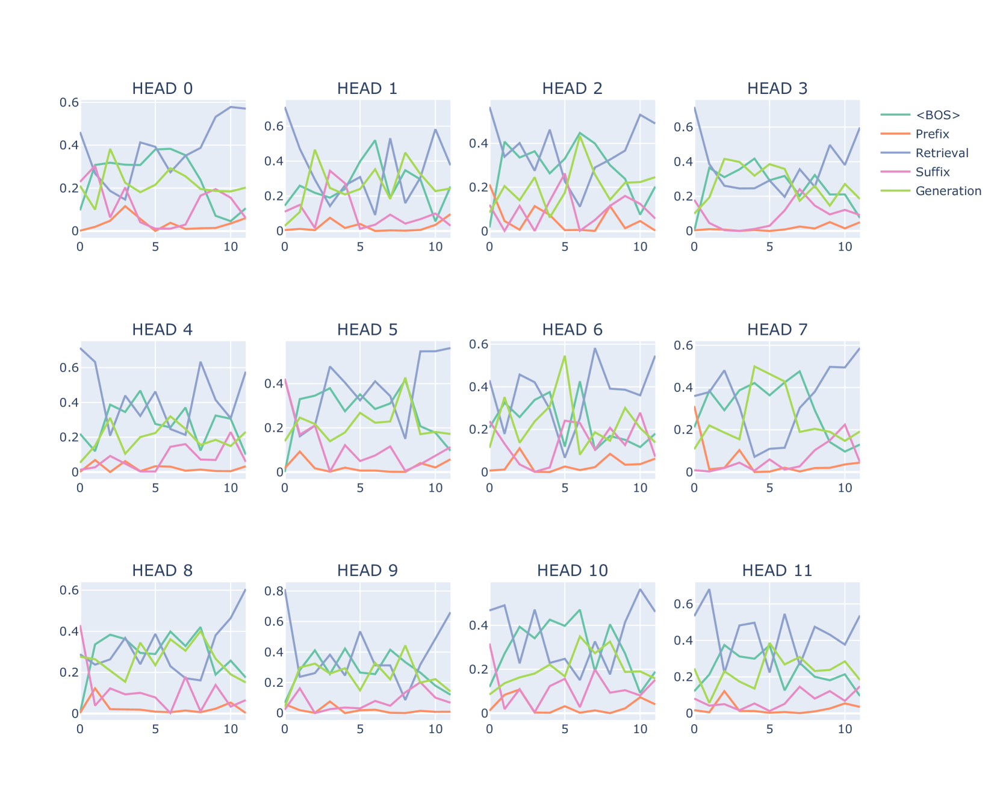

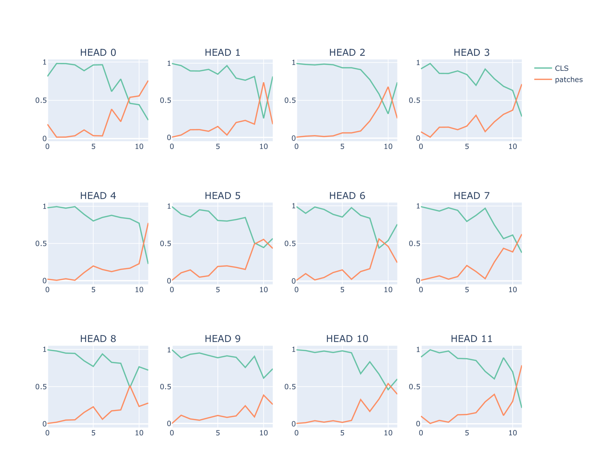

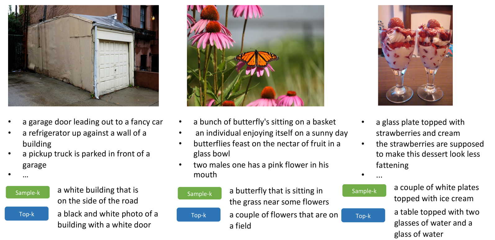

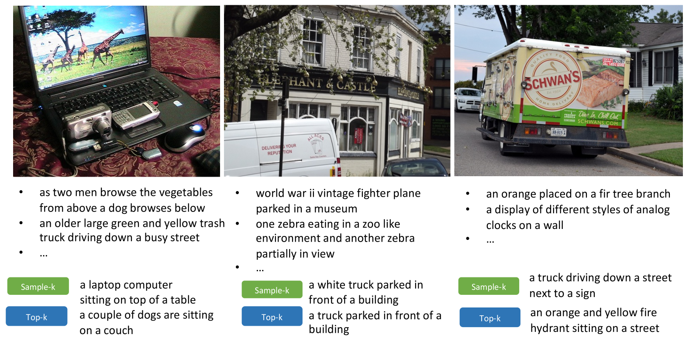

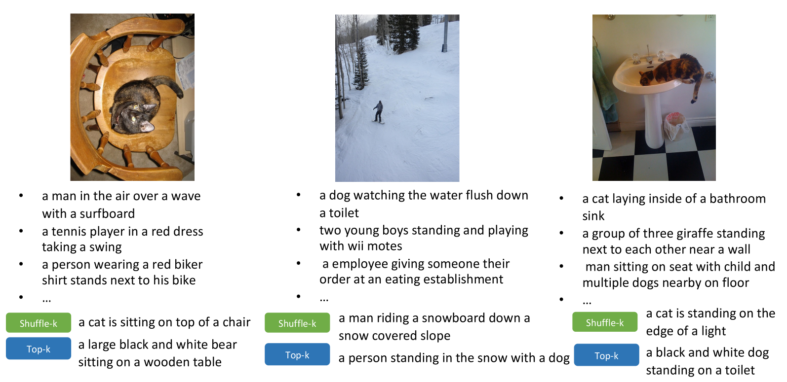

[Arxiv](https://arxiv.org/abs/2406.02265)