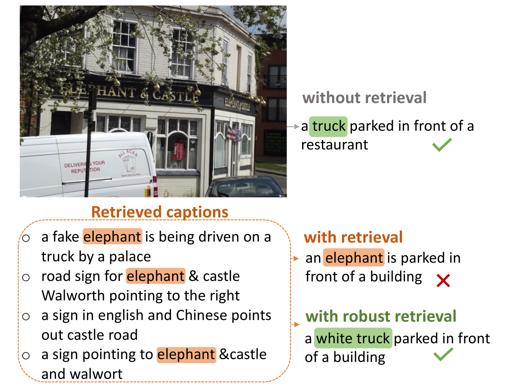

# 探究增强检索的图像描述生成系统的检索鲁棒性

发布时间：2024年06月04日

`RAG

理由：这篇论文主要关注的是图像描述生成的检索增强模型，特别是在检索过程中的问题和改进方法。它探讨了如何通过改变训练策略来提高模型的鲁棒性和性能，特别是在处理检索描述中的常见词汇时的表现。这与RAG（Retrieval-Augmented Generation）模型的概念紧密相关，其中检索机制是模型性能的关键组成部分。因此，这篇论文更适合归类于RAG。` `图像处理`

> Understanding Retrieval Robustness for Retrieval-Augmented Image Captioning

# 摘要

> 近期，图像描述生成的检索增强模型取得了显著进展，强调了检索相关描述对于打造高效、轻量且具备强大领域迁移能力的模型的关键作用。虽然这些模型在检索增强方面取得了成功，但实际应用中的检索模型仍有待完善。检索信息有时会误导模型，影响其性能。本文深入分析了SmallCap模型的鲁棒性，发现该模型对检索描述中频繁出现的词汇极为敏感，这些词汇往往被直接复制到最终描述中。为此，我们提出了一种新的训练策略：从更广泛的集合中随机抽取检索描述，以减少模型对常见词汇的依赖，从而提升模型在特定领域及跨领域的表现。

> Recent advancements in retrieval-augmented models for image captioning highlight the significance of retrieving related captions for efficient, lightweight models with strong domain-transfer capabilities. While these models demonstrate the success of retrieval augmentation, retrieval models are still far from perfect in practice. Retrieved information can sometimes mislead the model generation, negatively impacting performance. In this paper, we analyze the robustness of the SmallCap retrieval-augmented captioning model. Our analysis shows that SmallCap is sensitive to tokens that appear in the majority of the retrieved captions, and integrated gradients attribution shows that those tokens are likely copied into the final caption. Given these findings, we propose to train the model by sampling retrieved captions from more diverse sets. This reduces the probability that the model learns to copy majority tokens and improves both in-domain and cross-domain performance effectively.

[Arxiv](https://arxiv.org/abs/2406.02265)