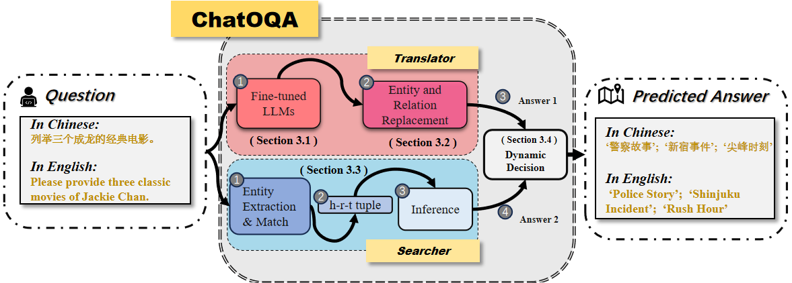
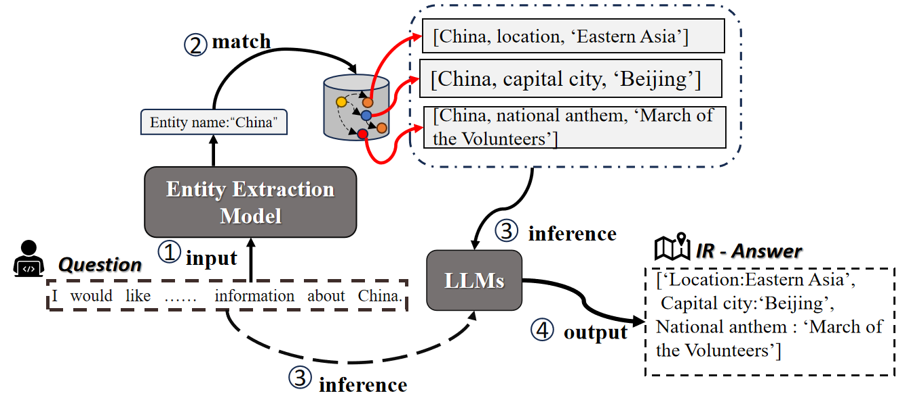
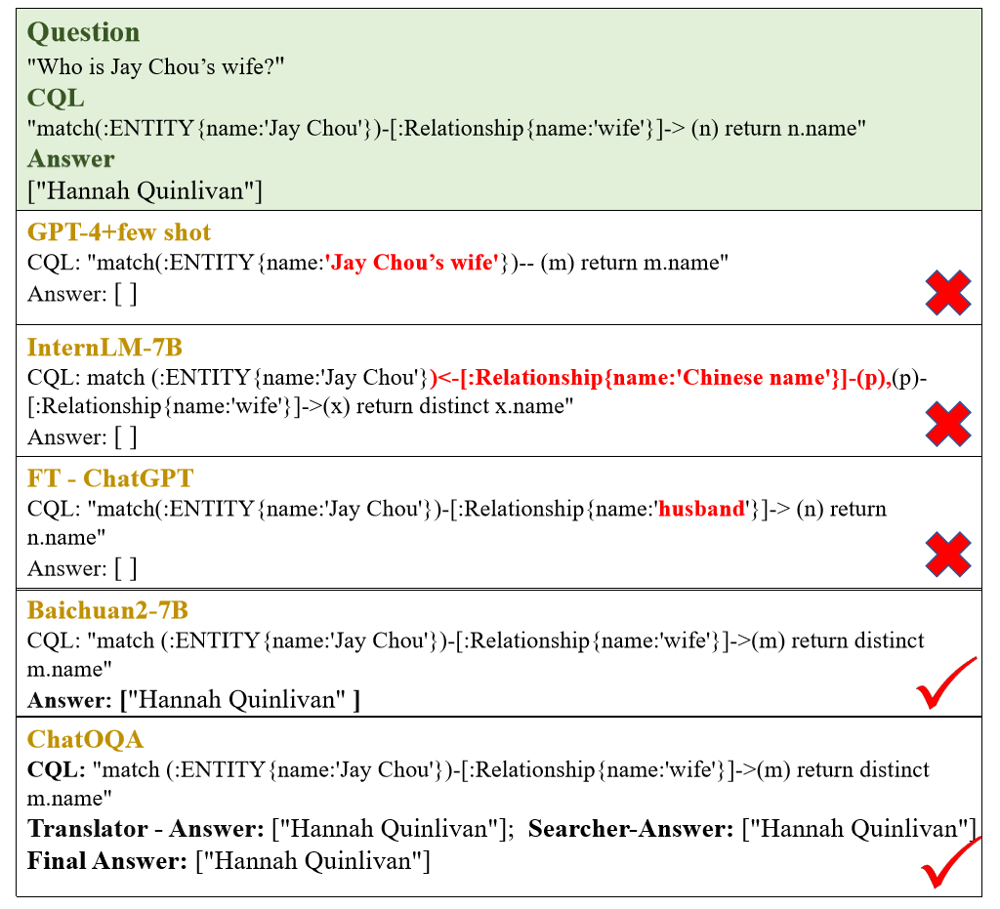
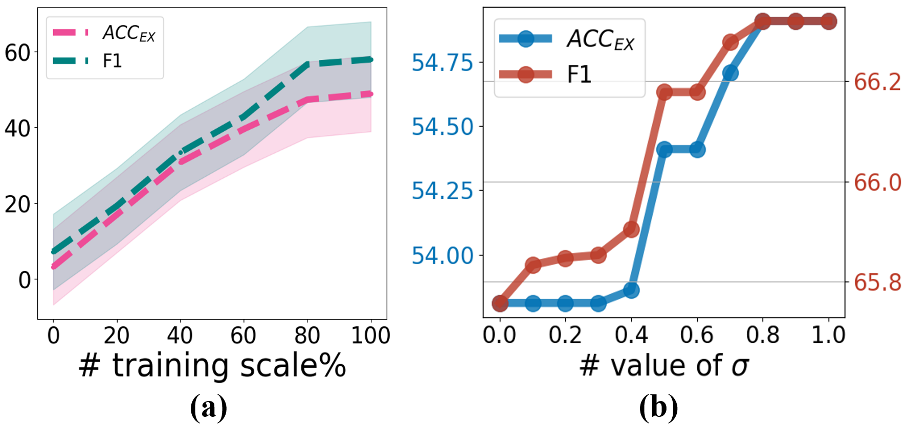
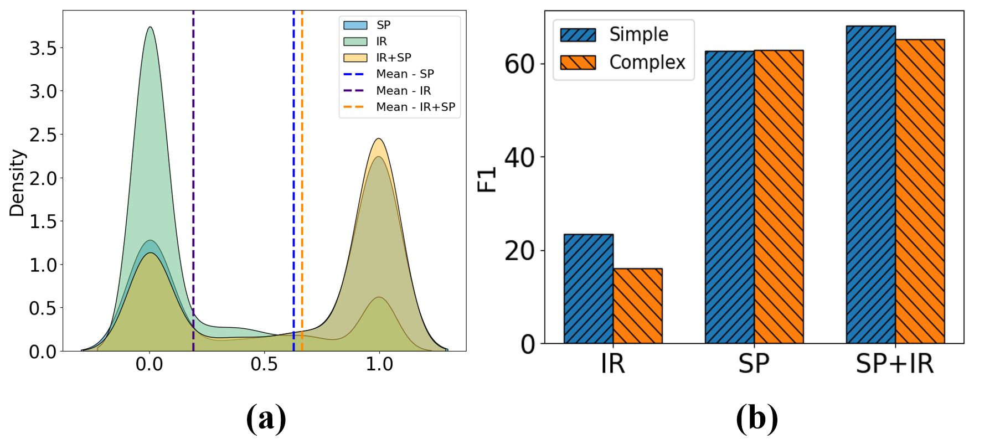

# UniOQA：大型语言模型下的知识图谱问答统一框架

发布时间：2024年06月04日

`RAG

理由：这篇论文主要介绍了 UniOQA 框架，该框架通过整合两个互补的并行流程来提升问答准确性。其中一个关键技术是检索增强生成（RAG）技术，它被应用于知识图谱以提升问答准确性。因此，这篇论文的核心贡献和讨论重点是 RAG 技术的应用，符合RAG分类。虽然论文中也涉及了 LLM 的使用，但这主要是为了支持 RAG 技术的实施，而不是主要讨论 LLM 的理论或应用。` `知识图谱` `问答系统`

> UniOQA: A Unified Framework for Knowledge Graph Question Answering with Large Language Models

# 摘要

> OwnThink 作为近期推出的最全面的中文开放领域知识图谱，尽管已有基于其的问答尝试（OQA），但现有研究在模型表示能力上仍显不足，难以进一步提升问答准确性。本文提出的 UniOQA 框架，通过整合两个互补的并行流程，打破了传统模式。它不仅利用 LLMs 实现精准问答，还引入了直接答案预测作为经济高效的补充。首先，通过微调 LLM 将问题转换为 Cypher 查询语言（CQL），解决了语义理解受限和幻觉问题。接着，采用实体与关系替换算法确保 CQL 的可执行性。同时，将检索增强生成（RAG）技术应用于知识图谱，以提升问答准确性。最终，通过动态决策算法优化答案精度。实验显示，UniOQA 将 SpCQL 逻辑准确率提升至 21.2%，执行准确率达 54.9%，刷新了该领域的记录。消融实验进一步验证了 UniOQA 的强大表示能力及其性能的显著提升。

> OwnThink stands as the most extensive Chinese open-domain knowledge graph introduced in recent times. Despite prior attempts in question answering over OwnThink (OQA), existing studies have faced limitations in model representation capabilities, posing challenges in further enhancing overall accuracy in question answering. In this paper, we introduce UniOQA, a unified framework that integrates two complementary parallel workflows. Unlike conventional approaches, UniOQA harnesses large language models (LLMs) for precise question answering and incorporates a direct-answer-prediction process as a cost-effective complement. Initially, to bolster representation capacity, we fine-tune an LLM to translate questions into the Cypher query language (CQL), tackling issues associated with restricted semantic understanding and hallucinations. Subsequently, we introduce the Entity and Relation Replacement algorithm to ensure the executability of the generated CQL. Concurrently, to augment overall accuracy in question answering, we further adapt the Retrieval-Augmented Generation (RAG) process to the knowledge graph. Ultimately, we optimize answer accuracy through a dynamic decision algorithm. Experimental findings illustrate that UniOQA notably advances SpCQL Logical Accuracy to 21.2% and Execution Accuracy to 54.9%, achieving the new state-of-the-art results on this benchmark. Through ablation experiments, we delve into the superior representation capacity of UniOQA and quantify its performance breakthrough.

[Arxiv](https://arxiv.org/abs/2406.02110)