# 为何如此建议？探讨人类对语言模型回答的信任度

发布时间：2024年06月04日

`Agent

这篇论文主要探讨了大型语言模型（LLMs）在人机协作中的应用，特别是在信任和依赖方面的影响。通过研究新闻标题生成任务中的人类研究和模型评估，论文分析了框架和解释如何影响用户对模型的信任及其性能。这涉及到Agent（代理）的概念，即模型作为代理在人机交互中如何影响用户的信任和决策。因此，这篇论文更适合归类到Agent分类中。` `新闻媒体` `人机交互`

> Why Would You Suggest That? Human Trust in Language Model Responses

# 摘要

> 大型语言模型（LLMs）的兴起凸显了人机协作在创造性决策场景中的重要性，尤其是在信任和依赖成为关键因素的情况下。通过LaMP基准的新闻标题生成任务中的人类研究和模型评估，我们探讨了框架和解释如何影响用户对模型的信任及其性能。研究表明，在模型输出中加入解释以阐明其推理过程，能显著提升用户在比较多个响应时的信任感。解释的位置和真实性同样关键。然而，当用户单独查看响应时，这种信任提升效应不复存在，表明人类在孤立情况下对所有模型输出（包括可能误导的）的信任是一视同仁的。这些发现促使我们呼吁未来研究更深入地探讨人机协作系统中信任的复杂性。

> The emergence of Large Language Models (LLMs) has revealed a growing need for human-AI collaboration, especially in creative decision-making scenarios where trust and reliance are paramount. Through human studies and model evaluations on the open-ended News Headline Generation task from the LaMP benchmark, we analyze how the framing and presence of explanations affect user trust and model performance. Overall, we provide evidence that adding an explanation in the model response to justify its reasoning significantly increases self-reported user trust in the model when the user has the opportunity to compare various responses. Position and faithfulness of these explanations are also important factors. However, these gains disappear when users are shown responses independently, suggesting that humans trust all model responses, including deceptive ones, equitably when they are shown in isolation. Our findings urge future research to delve deeper into the nuanced evaluation of trust in human-machine teaming systems.

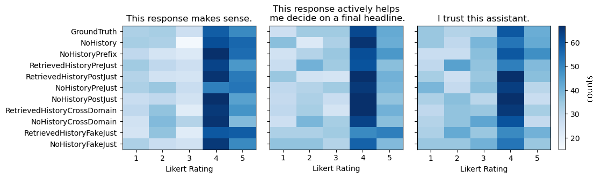

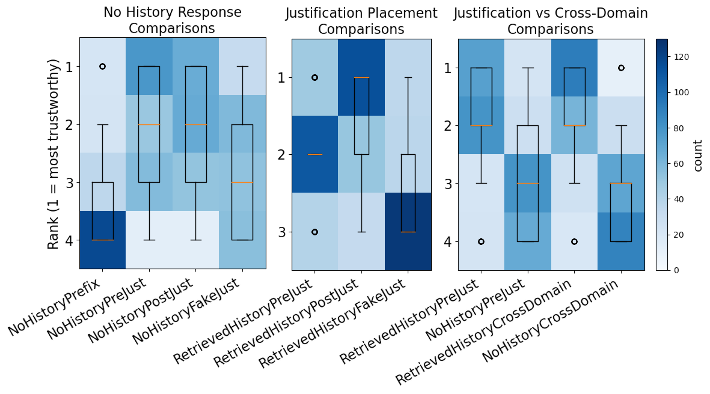

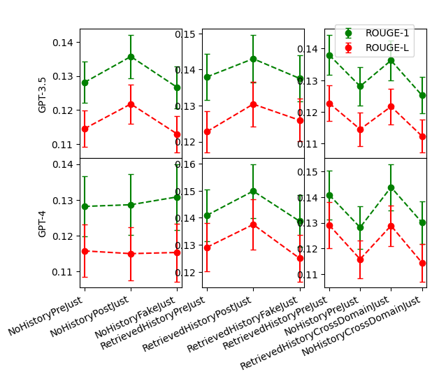

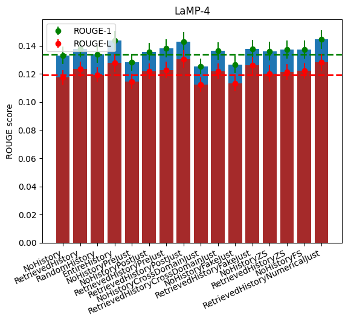

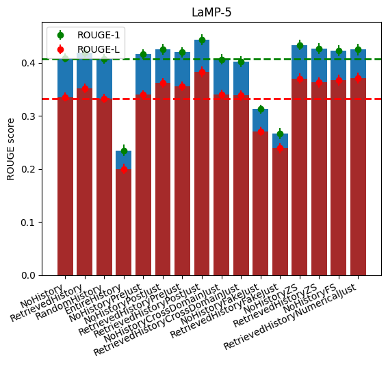

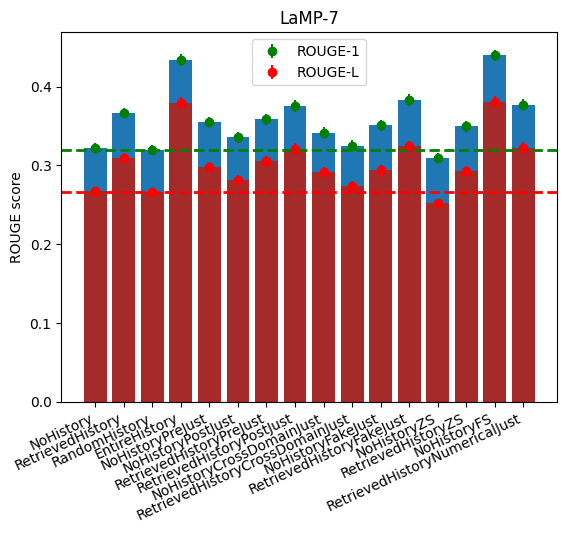

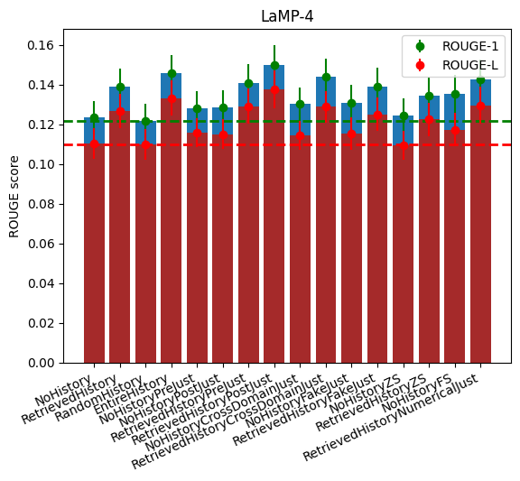

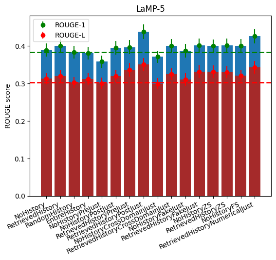

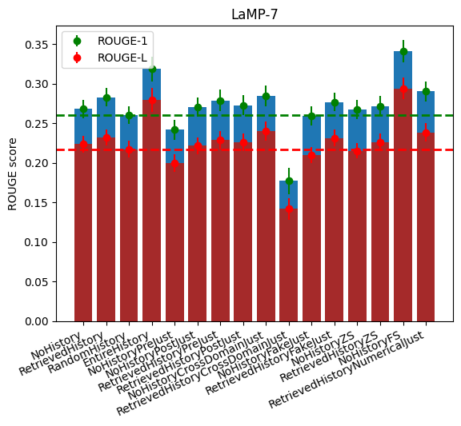

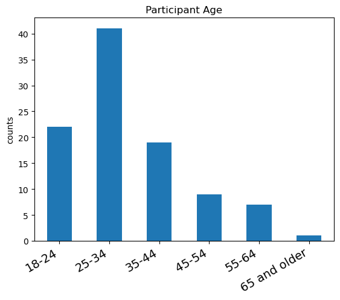

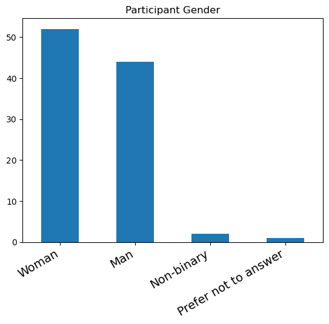

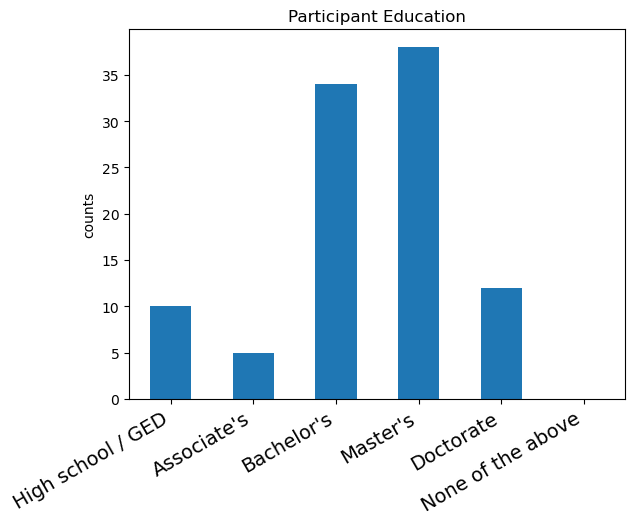

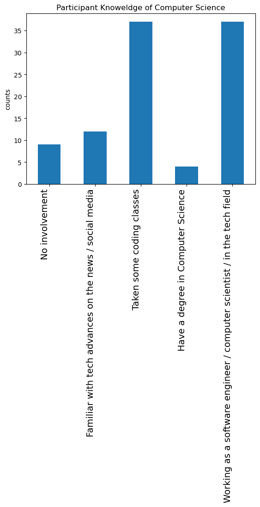

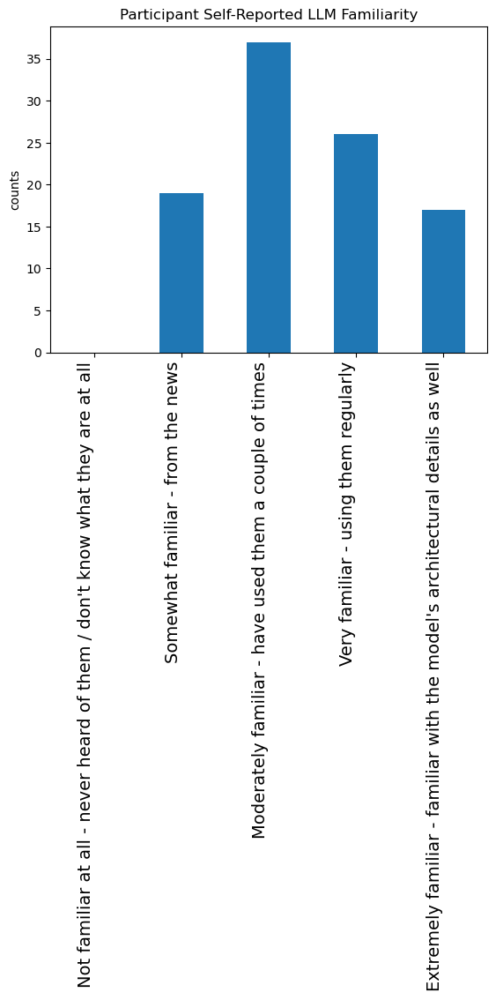

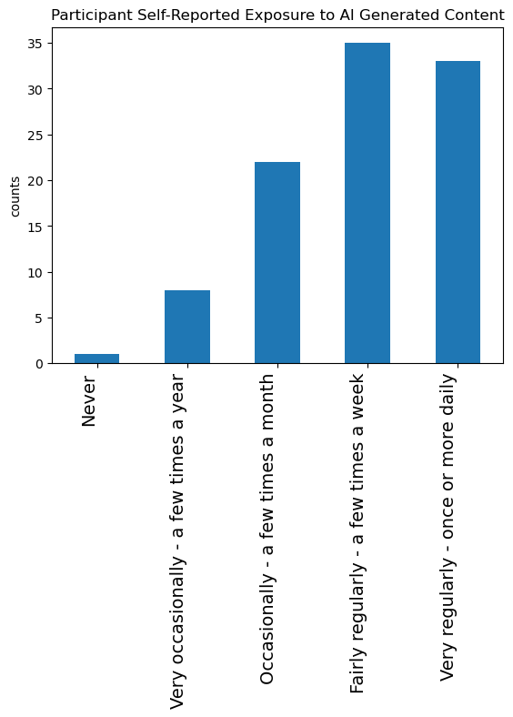

[Arxiv](https://arxiv.org/abs/2406.02018)