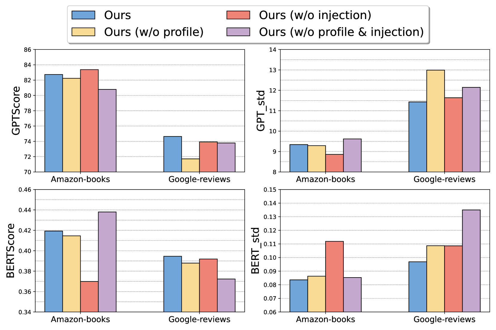

# XRec：利用大型语言模型实现推荐系统的透明解析

发布时间：2024年06月04日

`LLM应用

这篇论文摘要描述了一个利用大型语言模型（LLMs）来增强推荐系统可解释性的框架XRec。该框架通过融合协同信号和设计轻量级协同适配器，使LLMs能够洞察用户与项目间的复杂互动，并深入理解用户偏好，从而生成有意义的推荐解释。这与LLM的应用相关，特别是在推荐系统和可解释性方面，因此应归类为LLM应用。` `推荐系统` `个性化推荐`

> XRec: Large Language Models for Explainable Recommendation

# 摘要

> 推荐系统通过个性化推荐帮助用户应对信息泛滥，而协同过滤（CF）是其中一种常用方法。尽管图神经网络（GNNs）和自监督学习（SSL）等技术提升了CF模型，使其能更好地捕捉用户特征，但它们往往难以解释推荐背后的原因。可解释推荐旨在通过揭示推荐决策过程，增强用户的理解。本研究利用大型语言模型（LLMs）的语言能力，推动了可解释推荐系统的发展。我们提出了一个名为XRec的框架，它使LLMs能够为推荐系统中的用户行为提供详尽解释。通过融合协同信号并设计轻量级协同适配器，XRec框架让LLMs能洞察用户与项目间的复杂互动，并深入理解用户偏好。大量实验表明，XRec在生成有意义的解释方面表现出色，超越了现有方法。我们已在https://github.com/HKUDS/XRec上公开了模型代码。

> Recommender systems help users navigate information overload by providing personalized recommendations aligned with their preferences. Collaborative Filtering (CF) is a widely adopted approach, but while advanced techniques like graph neural networks (GNNs) and self-supervised learning (SSL) have enhanced CF models for better user representations, they often lack the ability to provide explanations for the recommended items. Explainable recommendations aim to address this gap by offering transparency and insights into the recommendation decision-making process, enhancing users' understanding. This work leverages the language capabilities of Large Language Models (LLMs) to push the boundaries of explainable recommender systems. We introduce a model-agnostic framework called XRec, which enables LLMs to provide comprehensive explanations for user behaviors in recommender systems. By integrating collaborative signals and designing a lightweight collaborative adaptor, the framework empowers LLMs to understand complex patterns in user-item interactions and gain a deeper understanding of user preferences. Our extensive experiments demonstrate the effectiveness of XRec, showcasing its ability to generate comprehensive and meaningful explanations that outperform baseline approaches in explainable recommender systems. We open-source our model implementation at https://github.com/HKUDS/XRec.

[Arxiv](https://arxiv.org/abs/2406.02377)