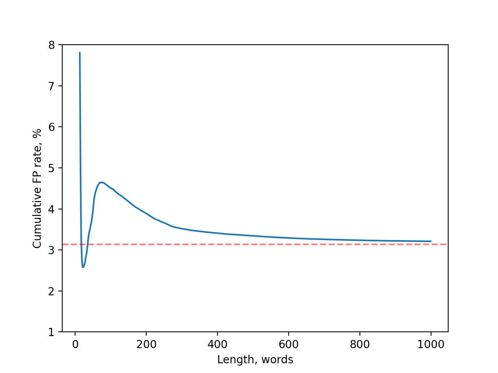

# Zyda：开放语言建模的巨型数据集，拥有1.3万亿条数据

发布时间：2024年06月04日

`LLM应用

这篇论文主要介绍了Zyda数据集的开发，这是一个包含1.3万亿令牌的高质量数据集，专门设计用于支持大型语言模型（LLMs）的预训练。论文强调了数据集的质量控制过程，包括严格的过滤和去重，以及其在提升模型性能方面的有效性。由于这项工作主要关注于数据集的创建和其在LLM预训练中的应用，因此它属于LLM应用分类。` `数据集`

> Zyda: A 1.3T Dataset for Open Language Modeling

# 摘要

> 近年来，大型语言模型（LLMs）的规模迅速膨胀，其计算和数据需求也随之飙升。即使是规模较小的最先进模型，也需在万亿级令牌上训练。然而，这种迅猛发展已超越了开放源数据集的增长速度，这些数据集本用于大规模LLM预训练。本文中，我们推出了Zyda（Zyphra数据集），一个包含1.3万亿令牌、采用宽松许可的高质量数据集，它整合了多个备受推崇的开放源数据集。我们通过严格的过滤和去重流程，确保了数据集的质量，并提升了原始数据集的性能。评估表明，Zyda不仅与Dolma、FineWeb和RefinedWeb等其他开放数据集相媲美，还大幅提升了Pythia系列模型的表现。我们的精细数据处理显著提升了Zyda的效能，使其即便单独使用，也超越了其组成数据集中的佼佼者。

> The size of large language models (LLMs) has scaled dramatically in recent years and their computational and data requirements have surged correspondingly. State-of-the-art language models, even at relatively smaller sizes, typically require training on at least a trillion tokens. This rapid advancement has eclipsed the growth of open-source datasets available for large-scale LLM pretraining. In this paper, we introduce Zyda (Zyphra Dataset), a dataset under a permissive license comprising 1.3 trillion tokens, assembled by integrating several major respected open-source datasets into a single, high-quality corpus. We apply rigorous filtering and deduplication processes, both within and across datasets, to maintain and enhance the quality derived from the original datasets. Our evaluations show that Zyda not only competes favorably with other open datasets like Dolma, FineWeb, and RefinedWeb, but also substantially improves the performance of comparable models from the Pythia suite. Our rigorous data processing methods significantly enhance Zyda's effectiveness, outperforming even the best of its constituent datasets when used independently.

[Arxiv](https://arxiv.org/abs/2406.01981)