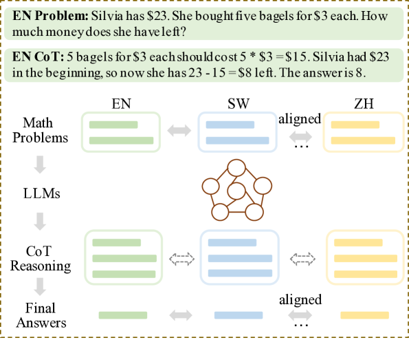
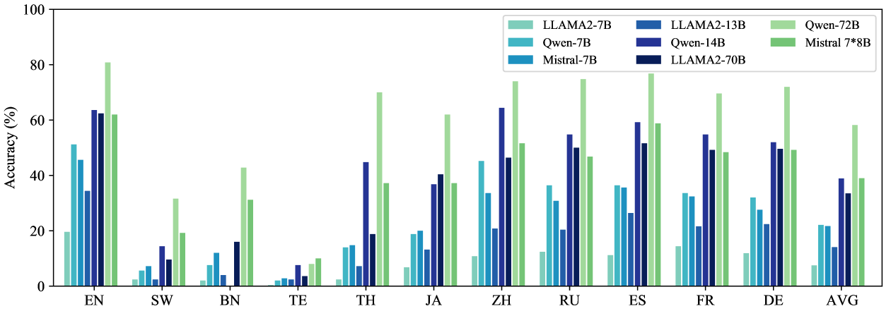
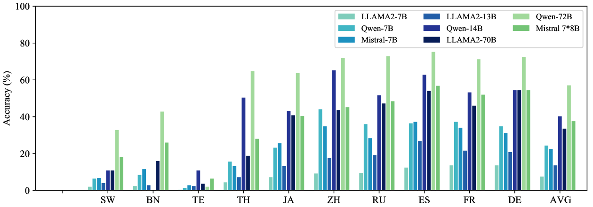
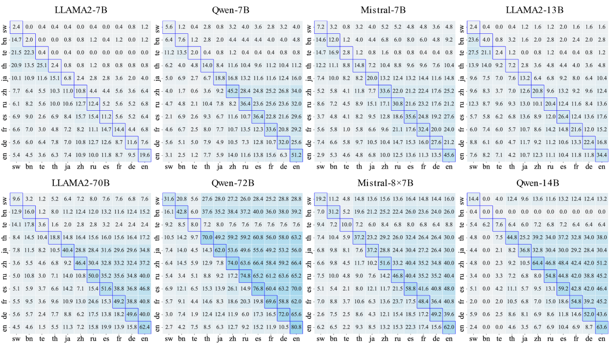
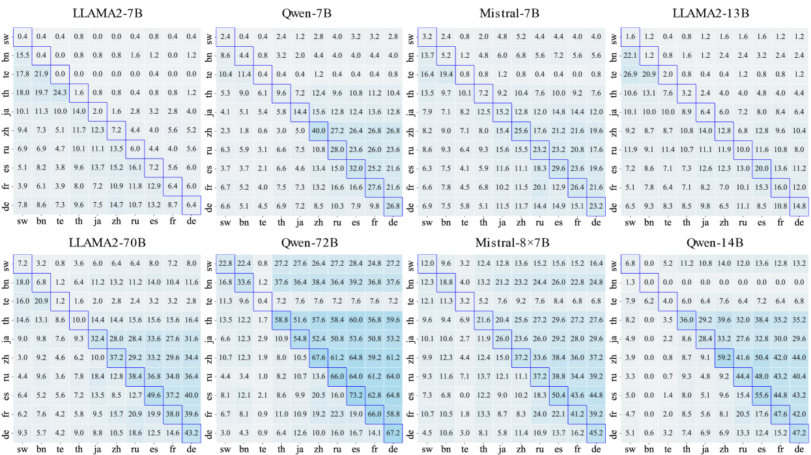
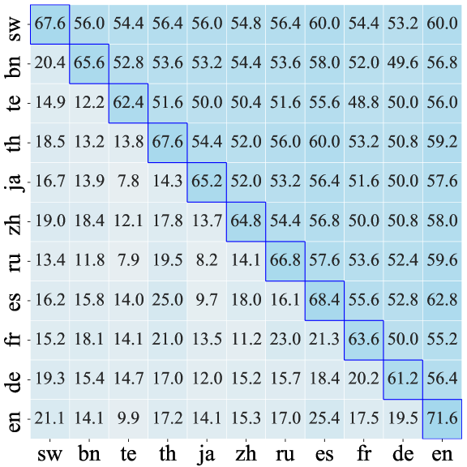

# mCoT：通过多语言指令调优，确保语言模型推理的一致性

发布时间：2024年06月04日

`LLM应用

这篇论文探讨了大型语言模型（LLMs）在多语言环境下的推理能力，特别是通过引入思维链（CoT）技术来提升跨语言的推理一致性。研究创建了一个新的多语言数学推理数据集（mCoT-MATH），并开发了一种多语言CoT指令调整方法，以增强模型在不同语言间的表现。这些工作直接应用于LLMs的实际使用中，特别是在多语言推理任务上，因此属于LLM应用分类。` `人工智能`

> mCoT: Multilingual Instruction Tuning for Reasoning Consistency in Language Models

# 摘要

> 近期，结合思维链（CoT）技术的大型语言模型（LLMs）已成为提升多种下游任务推理能力的强大工具。然而，由于多数研究集中于英语，多语言环境下的探索有限，不同语言中推理能力的可靠性仍是一个未解之谜。为此，我们通过流行的开源LLMs，研究了跨多种语言的多语言推理一致性。首先，我们创建了首个大规模多语言数学推理数据集mCoT-MATH，覆盖十一种语言。接着，我们引入了多语言CoT指令调整，旨在提升跨语言的推理能力，增强模型一致性。尽管现有LLMs在不同语言间表现差异显著，尤其在资源较少的语言上表现不佳，我们的70亿参数模型mCoT却实现了跨语言的出色一致性，性能甚至超越或与更大规模的闭源和开源模型相媲美。

> Large language models (LLMs) with Chain-of-thought (CoT) have recently emerged as a powerful technique for eliciting reasoning to improve various downstream tasks. As most research mainly focuses on English, with few explorations in a multilingual context, the question of how reliable this reasoning capability is in different languages is still open. To address it directly, we study multilingual reasoning consistency across multiple languages, using popular open-source LLMs. First, we compile the first large-scale multilingual math reasoning dataset, mCoT-MATH, covering eleven diverse languages. Then, we introduce multilingual CoT instruction tuning to boost reasoning capability across languages, thereby improving model consistency. While existing LLMs show substantial variation across the languages we consider, and especially low performance for lesser resourced languages, our 7B parameter model mCoT achieves impressive consistency across languages, and superior or comparable performance to close- and open-source models even of much larger sizes.

[Arxiv](https://arxiv.org/abs/2406.02301)