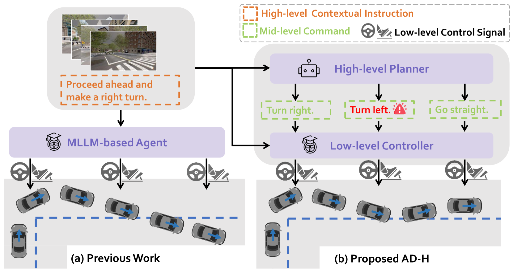
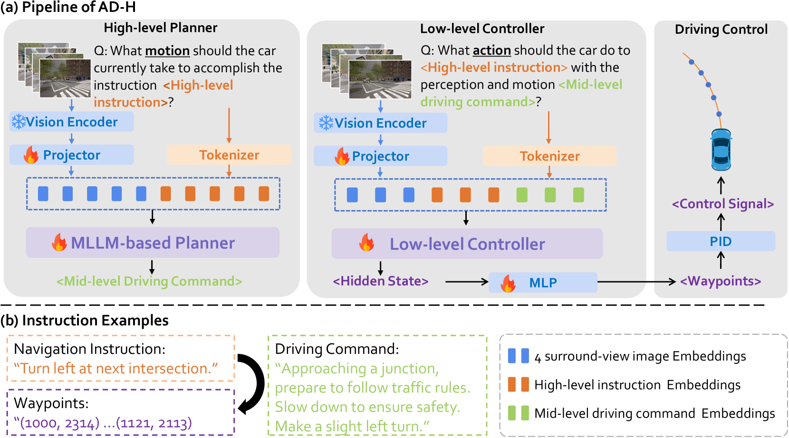
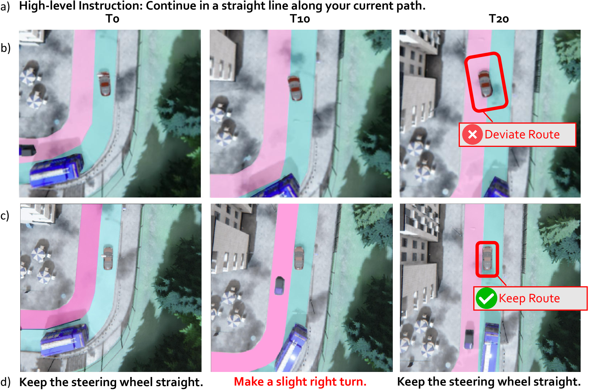
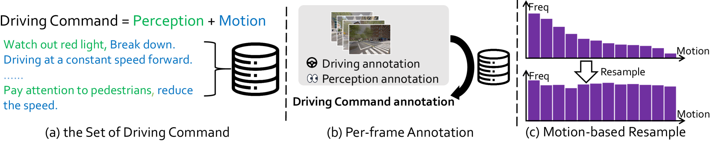

# AD-H：基于分层代理的自动驾驶技术

发布时间：2024年06月05日

`Agent

理由：这篇论文主要讨论了如何利用多模态大型语言模型（MLLMs）在自动驾驶领域的应用，并提出了一种分层多代理系统（AD-H）。在这个系统中，MLLM负责高级规划，而轻量级控制器执行低级操作。这种设计体现了Agent的概念，即通过智能代理来执行特定的任务和决策。因此，这篇论文更适合归类为Agent。` `自动驾驶` `人工智能`

> AD-H: Autonomous Driving with Hierarchical Agents

# 摘要

> 多模态大型语言模型（MLLMs）的强大能力促使研究者们探索其在自动驾驶领域的应用。然而，现有方法往往简单地将高级指令转化为低级控制信号，这不仅违背了MLLMs的语言生成本质，也未能充分发挥其潜能。为此，我们提出了一种新的方法：通过更细致、通用且可解释的中级语言驱动命令，有效连接高级指令与低级控制信号。我们设计了名为AD-H的分层多代理系统，其中MLLM负责高级规划，轻量级控制器执行低级操作。这种设计不仅释放了MLLM在高级感知和决策上的能力，还构建了一个包含动作层次的新数据集。实验证明，AD-H不仅在驾驶性能上超越了现有技术，还能在未见过的场景中自我修正，展现出在复杂指令和新环境下的卓越泛化能力。我们将在GitHub上公开相关数据和代码，网址为https://github.com/zhangzaibin/AD-H。

> Due to the impressive capabilities of multimodal large language models (MLLMs), recent works have focused on employing MLLM-based agents for autonomous driving in large-scale and dynamic environments. However, prevalent approaches often directly translate high-level instructions into low-level vehicle control signals, which deviates from the inherent language generation paradigm of MLLMs and fails to fully harness their emergent powers. As a result, the generalizability of these methods is highly restricted by autonomous driving datasets used during fine-tuning. To tackle this challenge, we propose to connect high-level instructions and low-level control signals with mid-level language-driven commands, which are more fine-grained than high-level instructions but more universal and explainable than control signals, and thus can effectively bridge the gap in between. We implement this idea through a hierarchical multi-agent driving system named AD-H, including a MLLM planner for high-level reasoning and a lightweight controller for low-level execution. The hierarchical design liberates the MLLM from low-level control signal decoding and therefore fully releases their emergent capability in high-level perception, reasoning, and planning. We build a new dataset with action hierarchy annotations. Comprehensive closed-loop evaluations demonstrate several key advantages of our proposed AD-H system. First, AD-H can notably outperform state-of-the-art methods in achieving exceptional driving performance, even exhibiting self-correction capabilities during vehicle operation, a scenario not encountered in the training dataset. Second, AD-H demonstrates superior generalization under long-horizon instructions and novel environmental conditions, significantly surpassing current state-of-the-art methods. We will make our data and code publicly accessible at https://github.com/zhangzaibin/AD-H

[Arxiv](https://arxiv.org/abs/2406.03474)