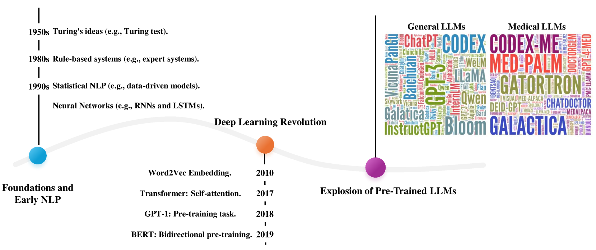
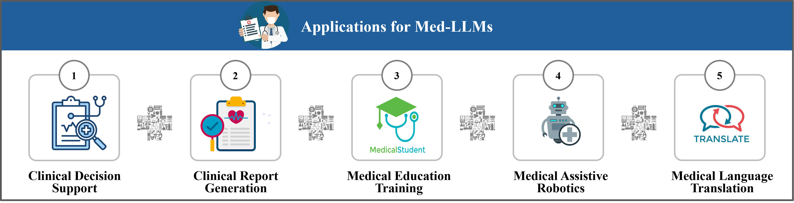

# 医学大型语言模型综述：探索其技术、应用、信任度及未来发展路径

发布时间：2024年06月05日

`LLM应用

这篇论文摘要详细介绍了大型语言模型（LLMs）在医疗领域的应用，特别强调了医疗大型语言模型（Med-LLMs）的发展及其对医疗保健的影响。文章从技术基础出发，探讨了通用模型如何适应医疗领域，并分析了提升LLMs在医疗环境中表现的高级算法。此外，论文还讨论了Med-LLMs在临床决策支持、医疗报告生成和医学教育等多个领域的应用，并强调了在推动这些技术发展中确保公平、责任、隐私和鲁棒性的重要性。因此，这篇论文属于LLM应用类别。` `临床决策支持`

> A Survey on Medical Large Language Models: Technology, Application, Trustworthiness, and Future Directions

# 摘要

> 大型语言模型（如GPT系列）因其卓越的语言生成和理解能力备受瞩目。近期，这些模型在医疗领域崭露头角，成为创新且强大的助手，革新传统医疗实践，引领医疗服务的新纪元。本综述详细介绍了医疗大型语言模型（Med-LLMs）的发展，从通用技术到医疗专用应用的转变，以及它们对医疗保健（如信任与安全）的深远影响。我们从LLMs的基础历史和技术入手，深入分析了通用模型如何适应医疗领域，并特别关注了提升LLMs在复杂医疗环境中（如临床推理、知识图谱、检索增强生成、人机对齐和多模态学习）表现的高级算法。接着，我们探讨了Med-LLMs在临床决策支持、医疗报告生成和医学教育等多个领域的应用，展示了它们如何优化医疗流程和提升患者福祉。同时，我们强调了在推动Med-LLMs发展中确保公平、责任、隐私和鲁棒性的重要性。最后，我们展望了Med-LLMs的未来发展方向，并探讨了如何审慎地扩展其应用。本综述旨在为医疗专业人士和研究者提供对Med-LLMs全面而深入的理解，确保在医疗领域负责任地应用这些技术。

> Large language models (LLMs), such as GPT series models, have received substantial attention due to their impressive capabilities for generating and understanding human-level language. More recently, LLMs have emerged as an innovative and powerful adjunct in the medical field, transforming traditional practices and heralding a new era of enhanced healthcare services. This survey provides a comprehensive overview of Medical Large Language Models (Med-LLMs), outlining their evolution from general to the medical-specific domain (i.e, Technology and Application), as well as their transformative impact on healthcare (e.g., Trustworthiness and Safety). Concretely, starting from the fundamental history and technology of LLMs, we first delve into the progressive adaptation and refinements of general LLM models in the medical domain, especially emphasizing the advanced algorithms that boost the LLMs' performance in handling complicated medical environments, including clinical reasoning, knowledge graph, retrieval-augmented generation, human alignment, and multi-modal learning. Secondly, we explore the extensive applications of Med-LLMs across domains such as clinical decision support, report generation, and medical education, illustrating their potential to streamline healthcare services and augment patient outcomes. Finally, recognizing the imperative and responsible innovation, we discuss the challenges of ensuring fairness, accountability, privacy, and robustness in Med-LLMs applications. Finally, we conduct a concise discussion for anticipating possible future trajectories of Med-LLMs, identifying avenues for the prudent expansion of Med-LLMs. By consolidating above-mentioned insights, this review seeks to provide a comprehensive investigation of the potential strengths and limitations of Med-LLMs for professionals and researchers, ensuring a responsible landscape in the healthcare setting.

[Arxiv](https://arxiv.org/abs/2406.03712)