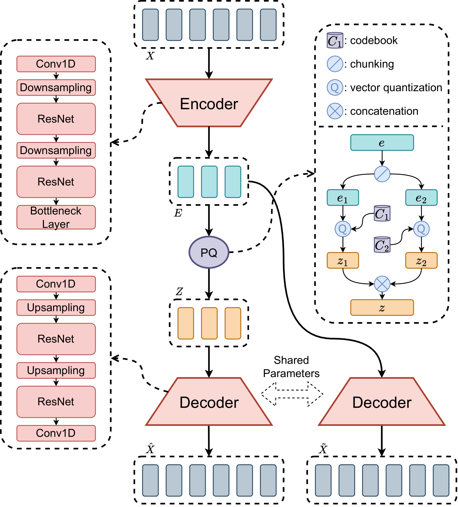
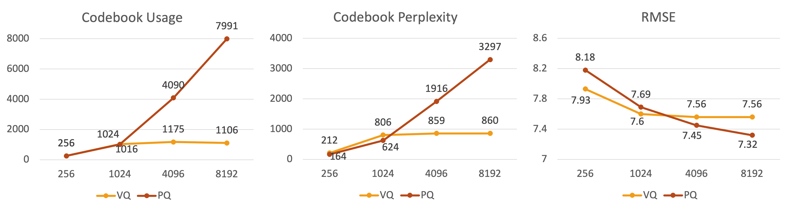
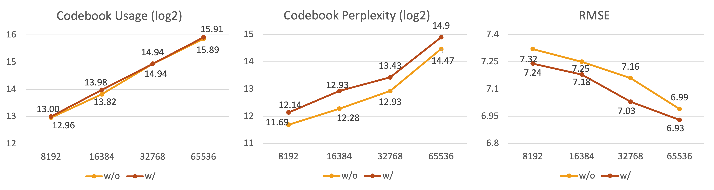

# 利用双解码产品量化变分自编码器，有效应对大型码本语音分词器中的索引崩溃挑战

发布时间：2024年06月05日

`RAG

理由：这篇论文主要讨论了VQ-VAE在语音分词器中的应用，特别是通过引入产品量化（PQ）VAE来解决“索引崩溃”问题。这种方法通过增加代码本数量和减少每个代码本的码字来改进语音特征的编码。此外，论文还介绍了双解码训练策略以提升性能。这些内容主要集中在改进和优化现有的技术（如VQ-VAE），以提高其在特定任务（如语音分词）中的表现，因此更适合归类为RAG，即研究如何调整和优化现有模型以适应特定应用的技术。` `语音处理` `机器学习`

> Addressing Index Collapse of Large-Codebook Speech Tokenizer with Dual-Decoding Product-Quantized Variational Auto-Encoder

# 摘要

> VQ-VAE，作为语音分词器的主流技术，常因“索引崩溃”而受限，即大代码本中仅少数码字活跃。为此，我们提出了产品量化（PQ）VAE，通过增加代码本数量并减少每个代码本的码字，有效解决了这一难题，并构建了大型代码本的语音分词器。该方法将语音特征编码至多个VQ子空间，并组合成更大代码本中的码字。为充分发挥每个VQ子空间的作用，我们还引入了双解码训练策略，进一步提升PQ-VAE的性能。实验证明，PQ-VAE在处理“索引崩溃”问题上表现出色，尤其是在大型代码本中。采用新训练策略的模型在代码本困惑度和重建质量上均有显著提升，超越了其他多代码本VQ方法。此外，PQ-VAE在基于语言模型的TTS中展现了其优越性，支持使用更大代码本生成更高质量的语音。

> VQ-VAE, as a mainstream approach of speech tokenizer, has been troubled by ``index collapse'', where only a small number of codewords are activated in large codebooks. This work proposes product-quantized (PQ) VAE with more codebooks but fewer codewords to address this problem and build large-codebook speech tokenizers. It encodes speech features into multiple VQ subspaces and composes them into codewords in a larger codebook. Besides, to utilize each VQ subspace well, we also enhance PQ-VAE via a dual-decoding training strategy with the encoding and quantized sequences. The experimental results demonstrate that PQ-VAE addresses ``index collapse" effectively, especially for larger codebooks. The model with the proposed training strategy further improves codebook perplexity and reconstruction quality, outperforming other multi-codebook VQ approaches. Finally, PQ-VAE demonstrates its effectiveness in language-model-based TTS, supporting higher-quality speech generation with larger codebooks.

[Arxiv](https://arxiv.org/abs/2406.02940)