# 大型语言模型的对抗性时刻匹配蒸馏法

发布时间：2024年06月05日

`Agent

理由：这篇论文主要讨论了通过知识蒸馏（KD）技术提升大型语言模型（LLMs）的效率，并采用了模仿学习策略和对抗性训练算法来优化学生模型。这种方法涉及到模型的策略优化和行为模仿，更偏向于Agent的范畴，即如何通过策略和学习来优化模型的行为。虽然涉及到了LLM的应用，但其核心在于模型的策略学习和优化，因此更适合归类为Agent。` `机器学习`

> Adversarial Moment-Matching Distillation of Large Language Models

# 摘要

> 知识蒸馏（KD）技术通过大型教师模型指导学生模型，显著提升了大型语言模型（LLMs）的计算与内存效率。当前顶尖的KD方法主要通过缩小教师与学生模型预测概率的分布差异来实现。我们另辟蹊径，采用模仿学习策略，不拘泥于传统的行为克隆目标，而是通过匹配教师模型的动作值时刻，从在线与离线策略双重视角缩小模仿差距。为此，我们设计了一种对抗性训练算法，旨在同时评估时刻匹配距离并优化学生模型策略，以期达到最小化该距离的目的。实验结果显示，无论是任务无关的指令遵循测试还是特定任务场景，我们的方法均表现出色，刷新了性能记录。

> Knowledge distillation (KD) has been shown to be highly effective in guiding a student model with a larger teacher model and achieving practical benefits in improving the computational and memory efficiency for large language models (LLMs). State-of-the-art KD methods for LLMs mostly rely on minimizing explicit distribution distance between teacher and student probability predictions. Instead of optimizing these mandatory behaviour cloning objectives, we explore an imitation learning strategy for KD of LLMs. In particular, we minimize the imitation gap by matching the action-value moments of the teacher's behavior from both on- and off-policy perspectives. To achieve this action-value moment-matching goal, we propose an adversarial training algorithm to jointly estimate the moment-matching distance and optimize the student policy to minimize it. Results from both task-agnostic instruction-following experiments and task-specific experiments demonstrate the effectiveness of our method and achieve new state-of-the-art performance.

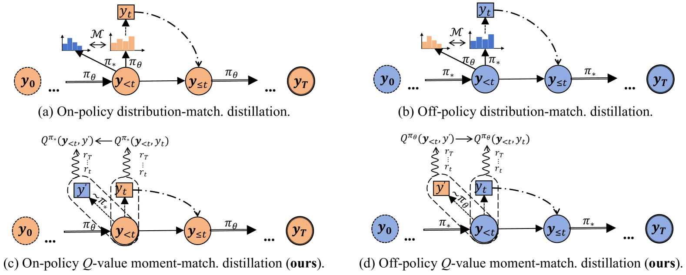

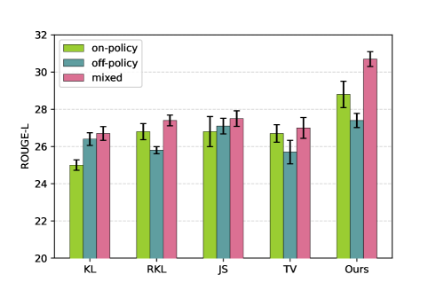

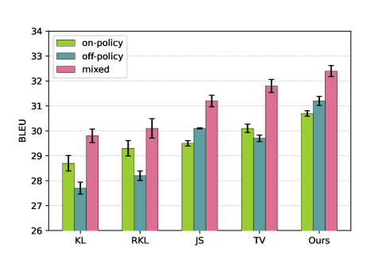

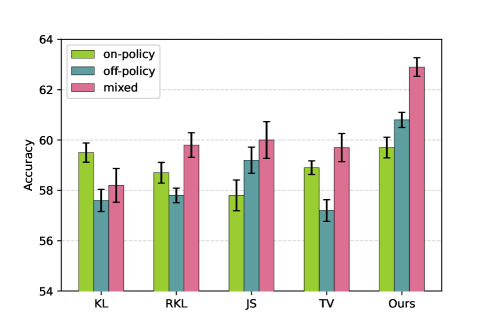

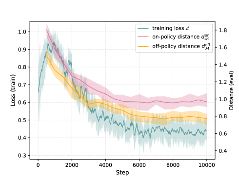

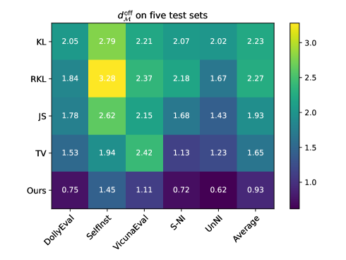

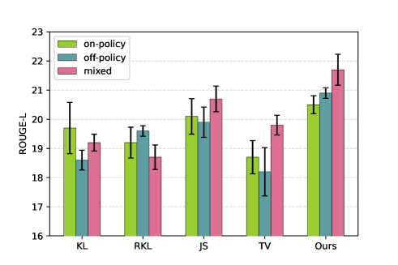

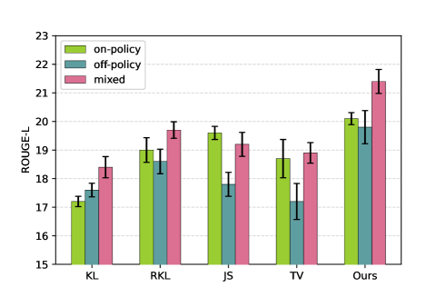

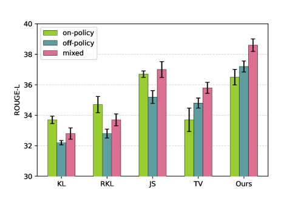

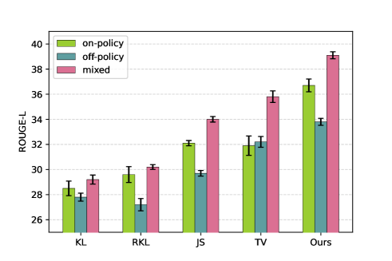

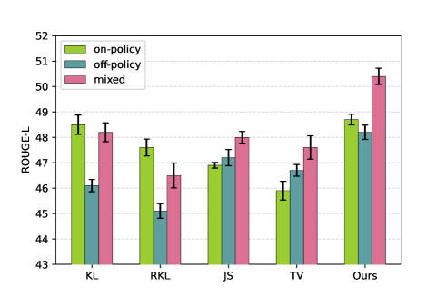

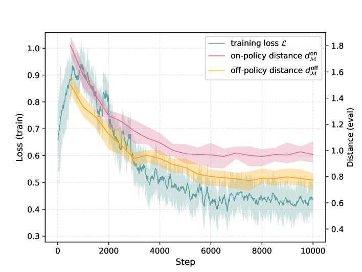

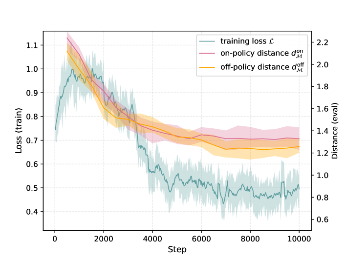

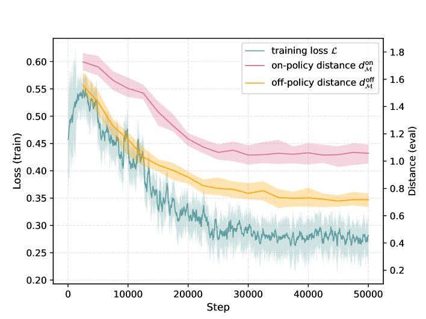

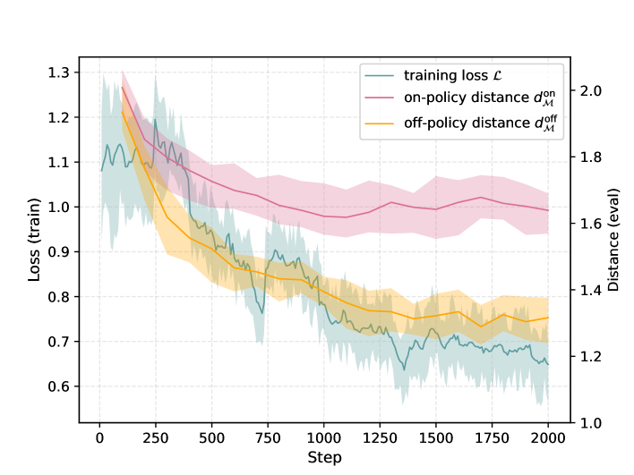

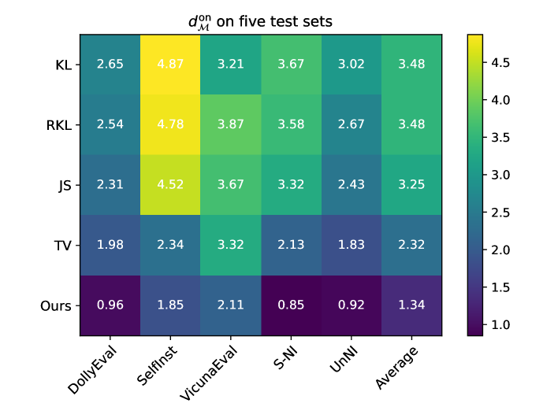

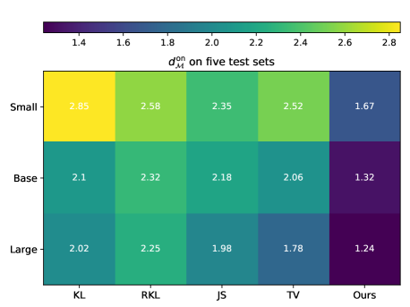

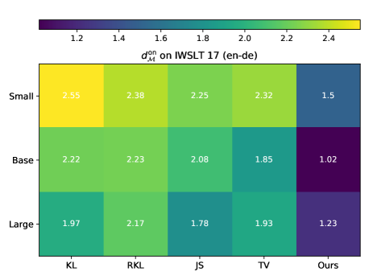

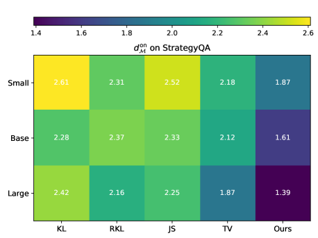

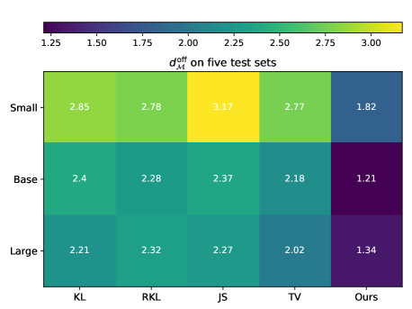

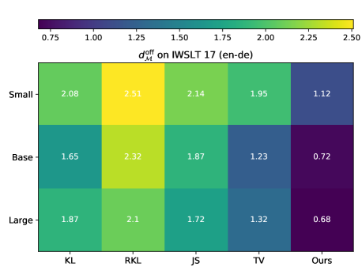

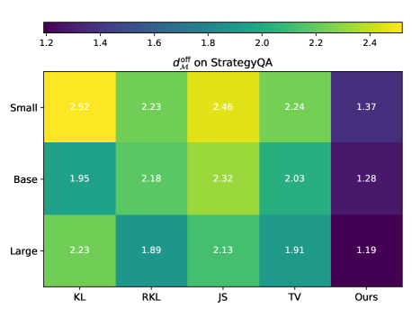

[Arxiv](https://arxiv.org/abs/2406.02959)