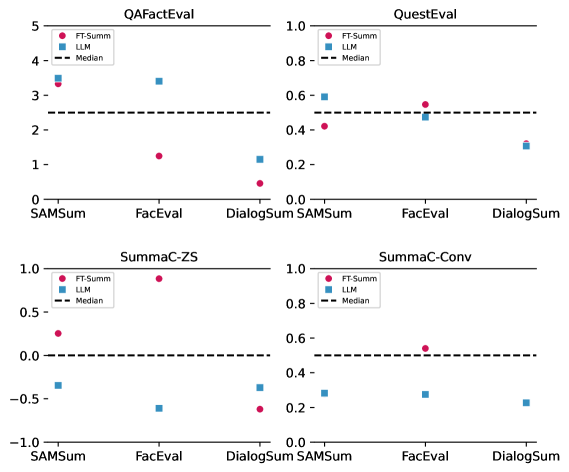

# 探究大型语言模型在对话摘要中的行为，揭露情境性幻觉的演变趋势

发布时间：2024年06月05日

`LLM应用

这篇论文主要关注大型语言模型（LLMs）在对话摘要中的应用，特别是在评估和改进其忠实度方面。论文通过人工标注和错误分类，研究了LLMs在处理对话摘要时可能出现的幻觉问题，并提出了新的错误分类和检测方法。这些研究内容直接关联到LLMs的实际应用场景，即对话摘要，因此属于LLM应用分类。` `对话摘要`

> Analyzing LLM Behavior in Dialogue Summarization: Unveiling Circumstantial Hallucination Trends

# 摘要

> 大型语言模型（LLMs）的进步是摘要系统的一大飞跃，但幻觉问题依旧困扰着它们。尽管新闻领域的LLMs评估已相当广泛，对话摘要的评估却多集中在BART模型上，对LLMs的忠实度理解尚显不足。我们的研究通过人工标注，专注于对话中跨度级别的不一致性，来评估LLMs在对话摘要中的忠实度，特别关注了GPT-4和Alpaca-13B。我们发现，LLMs常基于对话中的情境证据做出看似合理的推断，但这些推断缺乏直接证据，这在旧模型中较为少见。为此，我们提出了新的错误分类，特别新增了“情境推断”类别，并发布了相关数据集。通过这一分类，我们比较了LLMs与旧微调模型的行为差异，并发现自动错误检测方法在处理LLM摘要的细微错误时表现不佳。为此，我们开发了两种基于提示的细粒度错误检测方法，它们在识别“情境推断”方面超越了现有指标。

> Recent advancements in large language models (LLMs) have considerably advanced the capabilities of summarization systems. However, they continue to face concerns about hallucinations. While prior work has evaluated LLMs extensively in news domains, most evaluation of dialogue summarization has focused on BART-based models, leaving a gap in our understanding of their faithfulness. Our work benchmarks the faithfulness of LLMs for dialogue summarization, using human annotations and focusing on identifying and categorizing span-level inconsistencies. Specifically, we focus on two prominent LLMs: GPT-4 and Alpaca-13B. Our evaluation reveals subtleties as to what constitutes a hallucination: LLMs often generate plausible inferences, supported by circumstantial evidence in the conversation, that lack direct evidence, a pattern that is less prevalent in older models. We propose a refined taxonomy of errors, coining the category of "Circumstantial Inference" to bucket these LLM behaviors and release the dataset. Using our taxonomy, we compare the behavioral differences between LLMs and older fine-tuned models. Additionally, we systematically assess the efficacy of automatic error detection methods on LLM summaries and find that they struggle to detect these nuanced errors. To address this, we introduce two prompt-based approaches for fine-grained error detection that outperform existing metrics, particularly for identifying "Circumstantial Inference."

[Arxiv](https://arxiv.org/abs/2406.03487)