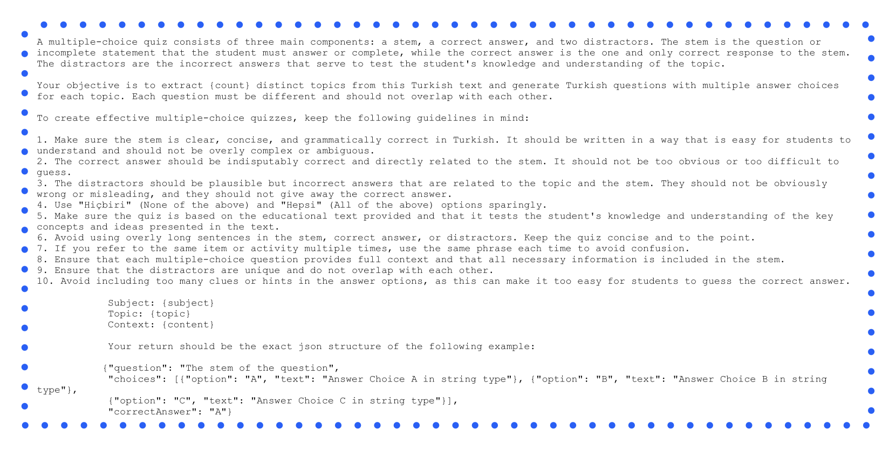
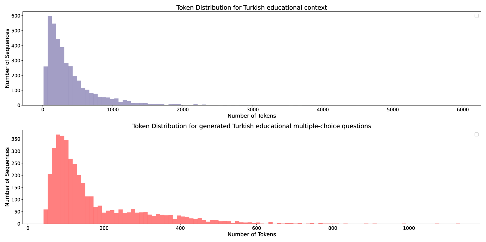
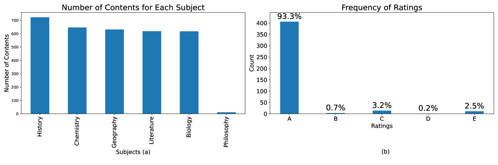
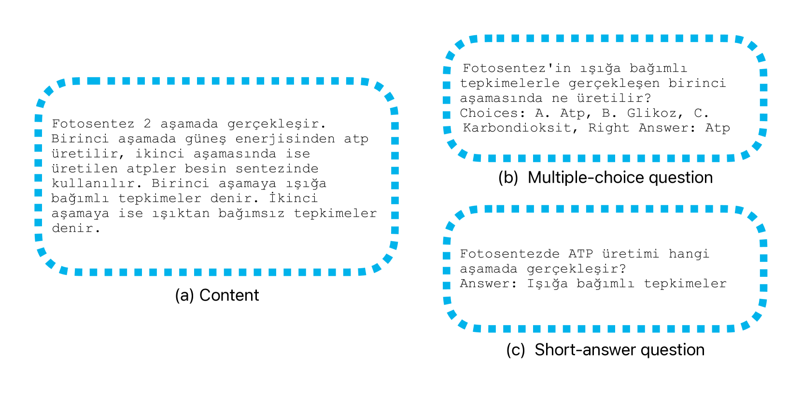
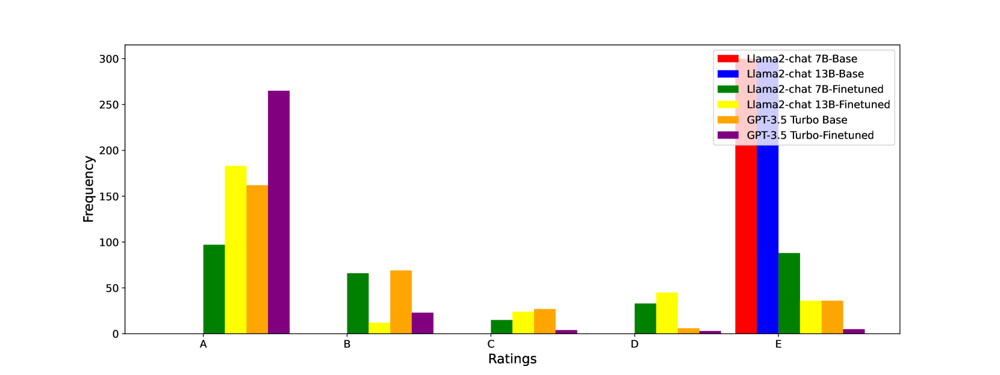
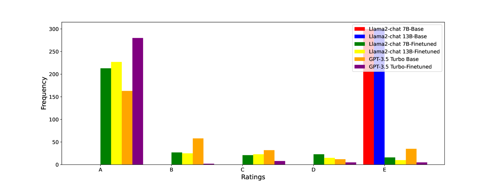

# 利用大型语言模型自动生成土耳其教育测验内容

发布时间：2024年06月05日

`LLM应用

这篇论文介绍了一种利用大型语言模型（LLMs）如GPT-4-Turbo、GPT-3.5-Turbo、Llama-2-7b-chat-hf和Llama-2-13b-chat-hf来自动生成土耳其教育文本测验的方法。研究的重点在于展示这些模型在非英语语言环境下的应用，特别是在土耳其语教育内容自动化创建方面的有效性。此外，研究还推出了一个专门的数据集，为土耳其语言环境下的教育技术研究提供了资源。因此，这篇论文属于LLM应用类别，因为它展示了LLMs在特定语言和教育领域的实际应用。` `教育技术` `语言模型`

> Automating Turkish Educational Quiz Generation Using Large Language Models

# 摘要

> 本研究介绍了一种创新方法，用于从土耳其教育文本自动生成测验，这是教育技术领域针对土耳其背景的先驱性尝试。我们创建了名为土耳其-测验-指令的专门数据集，包含丰富的土耳其教育文本及相应的多项选择和简答题。研究中，我们运用了包括GPT-4-Turbo、GPT-3.5-Turbo、Llama-2-7b-chat-hf和Llama-2-13b-chat-hf在内的大型语言模型（LLMs），自动生成测验内容。此研究不仅展示了这些模型在生成连贯且相关测验内容方面的有效性，也为非英语语言的教育内容自动化创建研究奠定了基础。土耳其-测验-指令数据集的推出，为探索教育技术和LLMs在土耳其语言应用的研究者提供了宝贵资源。通过专注于非英语环境下的测验生成，尤其是土耳其语，本研究极大地推动了土耳其教育技术的发展，揭示了LLMs在多元语言环境中教育应用的潜力。

> Crafting quizzes from educational content is a pivotal activity that benefits both teachers and students by reinforcing learning and evaluating understanding. In this study, we introduce a novel approach to generate quizzes from Turkish educational texts, marking a pioneering endeavor in educational technology specifically tailored to the Turkish educational context. We present a specialized dataset, named the Turkish-Quiz-Instruct, comprising an extensive collection of Turkish educational texts accompanied by multiple-choice and short-answer quizzes. This research leverages the capabilities of Large Language Models (LLMs), including GPT-4-Turbo, GPT-3.5-Turbo, Llama-2-7b-chat-hf, and Llama-2-13b-chat-hf, to automatically generate quiz questions and answers from the Turkish educational content. Our work delineates the methodology for employing these LLMs in the context of Turkish educational material, thereby opening new avenues for automated Turkish quiz generation. The study not only demonstrates the efficacy of using such models for generating coherent and relevant quiz content but also sets a precedent for future research in the domain of automated educational content creation for languages other than English. The Turkish-Quiz-Instruct dataset is introduced as a valuable resource for researchers and practitioners aiming to explore the boundaries of educational technology and language-specific applications of LLMs in Turkish. By addressing the challenges of quiz generation in a non-English context specifically Turkish, this study contributes significantly to the field of Turkish educational technology, providing insights into the potential of leveraging LLMs for educational purposes across diverse linguistic landscapes.

[Arxiv](https://arxiv.org/abs/2406.03397)