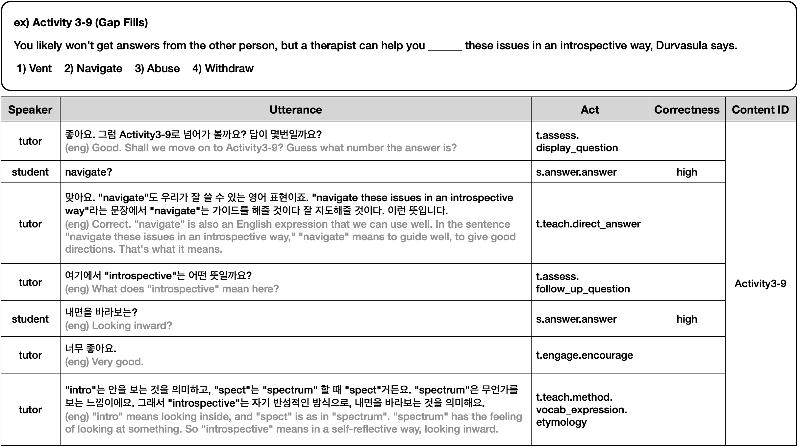
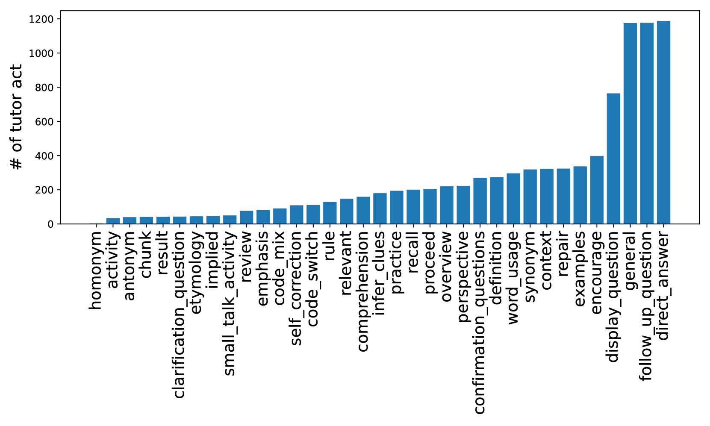
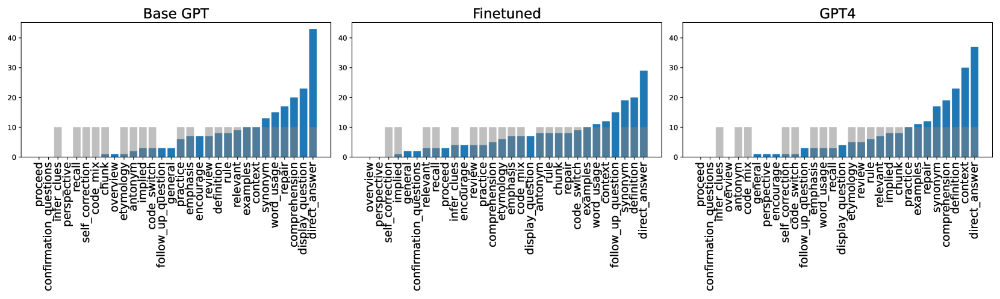

# BIPED：教育学指导下的ESL教学系统

发布时间：2024年06月05日

`LLM应用

这篇论文探讨了大型语言模型（LLMs）在英语第二语言学习中的应用，特别是在创建对话智能辅导系统（CITS）方面的应用。通过构建双语教学指导性辅导数据集（BIPED）和开发基于预测教师行为及生成相应回应的模型，论文展示了LLMs如何被用于提高教学辅导系统的效能和适应性。这与LLM的理论研究不同，因为它侧重于实际应用而非模型本身的理论分析。同时，它也不属于Agent或RAG分类，因为它不涉及自主代理或检索增强生成技术。因此，最合适的分类是LLM应用。` `语言学习`

> BIPED: Pedagogically Informed Tutoring System for ESL Education

# 摘要

> 大型语言模型（LLMs）为英语第二语言学习者提供了高效且经济的对话智能辅导系统（CITS）。然而，现有系统往往局限于教授基础概念，缺乏应对多样化学习策略的教学深度。为此，我们创建了双语教学指导性辅导数据集（BIPED），记录了一对一的英语辅导互动，并通过分析这些互动，构建了包含34种教师行为和9种学生行为的对话行为词汇表。基于预测教师行为和生成相应回应的两步框架，我们利用GPT-4和SOLAR-KO开发了两个CITS模型。实验结果显示，这些模型不仅模仿了人类教师的风格，还灵活运用了适合情境的教学策略。

> Large Language Models (LLMs) have a great potential to serve as readily available and cost-efficient Conversational Intelligent Tutoring Systems (CITS) for teaching L2 learners of English. Existing CITS, however, are designed to teach only simple concepts or lack the pedagogical depth necessary to address diverse learning strategies. To develop a more pedagogically informed CITS capable of teaching complex concepts, we construct a BIlingual PEDagogically-informed Tutoring Dataset (BIPED) of one-on-one, human-to-human English tutoring interactions. Through post-hoc analysis of the tutoring interactions, we come up with a lexicon of dialogue acts (34 tutor acts and 9 student acts), which we use to further annotate the collected dataset. Based on a two-step framework of first predicting the appropriate tutor act then generating the corresponding response, we implemented two CITS models using GPT-4 and SOLAR-KO, respectively. We experimentally demonstrate that the implemented models not only replicate the style of human teachers but also employ diverse and contextually appropriate pedagogical strategies.

[Arxiv](https://arxiv.org/abs/2406.03486)