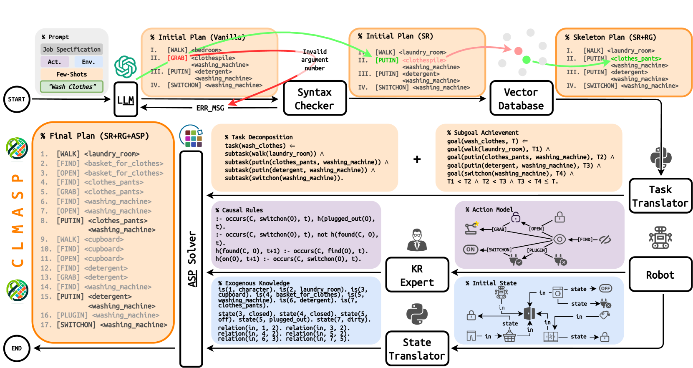

# CLMASP：融合大型语言模型与答案集编程，助力机器人任务规划

发布时间：2024年06月05日

`Agent

这篇论文主要探讨了如何将大型语言模型（LLMs）生成的计划转化为机器人可执行的计划，通过提出CLMASP方法，结合LLMs与答案集编程（ASP）来解决这一挑战。这种方法涉及将LLM的输出转化为具体可执行的机器人动作，因此属于Agent相关的研究，即如何构建和优化智能体（Agent）以执行特定任务。` `机器人技术` `人工智能`

> CLMASP: Coupling Large Language Models with Answer Set Programming for Robotic Task Planning

# 摘要

> 大型语言模型（LLMs）具备广泛的基础知识和适度的推理能力，非常适合在开放世界中进行任务规划。然而，将LLM生成的计划转化为特定机器人可执行的计划颇具挑战。本文提出的CLMASP方法，通过结合LLMs与答案集编程（ASP），有效克服了这一难题。ASP以其非单调逻辑编程特性，擅长处理机器人动作知识。CLMASP首先由LLM生成计划骨架，再通过向量数据库针对具体场景进行定制，最后由ASP程序细化，融入实施细节，确保LLM的抽象输出在实际机器人环境中得以落地。我们在VirtualHome平台上的实验显示，CLMASP的执行率从LLM方法的不足2%大幅提升至超过90%，效果显著。

> Large Language Models (LLMs) possess extensive foundational knowledge and moderate reasoning abilities, making them suitable for general task planning in open-world scenarios. However, it is challenging to ground a LLM-generated plan to be executable for the specified robot with certain restrictions. This paper introduces CLMASP, an approach that couples LLMs with Answer Set Programming (ASP) to overcome the limitations, where ASP is a non-monotonic logic programming formalism renowned for its capacity to represent and reason about a robot's action knowledge. CLMASP initiates with a LLM generating a basic skeleton plan, which is subsequently tailored to the specific scenario using a vector database. This plan is then refined by an ASP program with a robot's action knowledge, which integrates implementation details into the skeleton, grounding the LLM's abstract outputs in practical robot contexts. Our experiments conducted on the VirtualHome platform demonstrate CLMASP's efficacy. Compared to the baseline executable rate of under 2% with LLM approaches, CLMASP significantly improves this to over 90%.

[Arxiv](https://arxiv.org/abs/2406.03367)