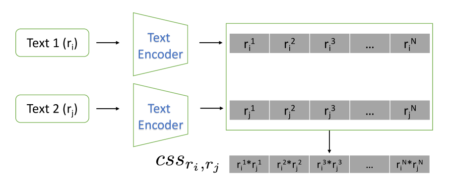
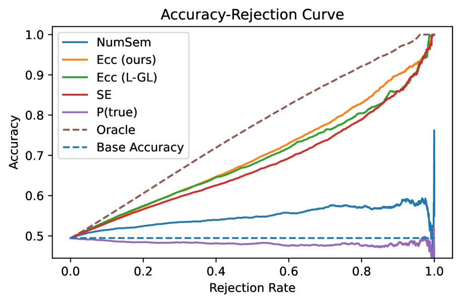

# CSS：通过对比语义相似性评估大型语言模型的不确定性

发布时间：2024年06月05日

`LLM应用

这篇论文探讨了如何通过使用CLIP模型来评估大型语言模型（LLMs）生成内容的不确定性，并提出了一个基于CLIP的“对比语义相似性”模块来增强LLMs的可信度。这种方法特别应用于选择性自然语言生成（NLG），以识别和排除不可靠的生成内容。论文通过在多个问答数据集上对三种LLMs进行测试，并使用全面的评估指标来验证其方法的有效性。因此，这篇论文属于LLM应用类别，因为它专注于实际应用中如何提高LLMs生成内容的可靠性。` `问答系统`

> CSS: Contrastive Semantic Similarity for Uncertainty Quantification of LLMs

# 摘要

> 尽管大型语言模型（LLMs）能力非凡，但何时信任其生成内容仍是一大挑战。近期研究利用传统自然语言推理（NLI）分类器评估LLMs输出的语义分散度，通过NLI分类器的logits进行语义聚类来估算不确定性。然而，logits仅反映预测类别的概率，缺乏用于聚类的特征信息。相比之下，CLIP（对比语言-图像预训练模型）在提取图像与文本特征及衡量其相似性方面表现卓越。为此，我们提出基于CLIP的“对比语义相似性”模块，用以提取文本对的相似性特征，进而评估不确定性。此方法应用于选择性NLG，旨在识别并排除不可靠生成，增强LLMs的可信度。我们在多个问答数据集上对三种LLMs进行了详尽测试，并采用全面评估指标。实验结果表明，我们的方法在评估LLMs生成内容的可靠性上优于同类基线。相关代码已公开于\url{https://github.com/AoShuang92/css_uq_llms}。

> Despite the impressive capability of large language models (LLMs), knowing when to trust their generations remains an open challenge. The recent literature on uncertainty quantification of natural language generation (NLG) utilises a conventional natural language inference (NLI) classifier to measure the semantic dispersion of LLMs responses. These studies employ logits of NLI classifier for semantic clustering to estimate uncertainty. However, logits represent the probability of the predicted class and barely contain feature information for potential clustering. Alternatively, CLIP (Contrastive Language-Image Pre-training) performs impressively in extracting image-text pair features and measuring their similarity. To extend its usability, we propose Contrastive Semantic Similarity, the CLIP-based feature extraction module to obtain similarity features for measuring uncertainty for text pairs. We apply this method to selective NLG, which detects and rejects unreliable generations for better trustworthiness of LLMs. We conduct extensive experiments with three LLMs on several benchmark question-answering datasets with comprehensive evaluation metrics. Results show that our proposed method performs better in estimating reliable responses of LLMs than comparable baselines. Results show that our proposed method performs better in estimating reliable responses of LLMs than comparable baselines. The code are available at \url{https://github.com/AoShuang92/css_uq_llms}.

[Arxiv](https://arxiv.org/abs/2406.03158)