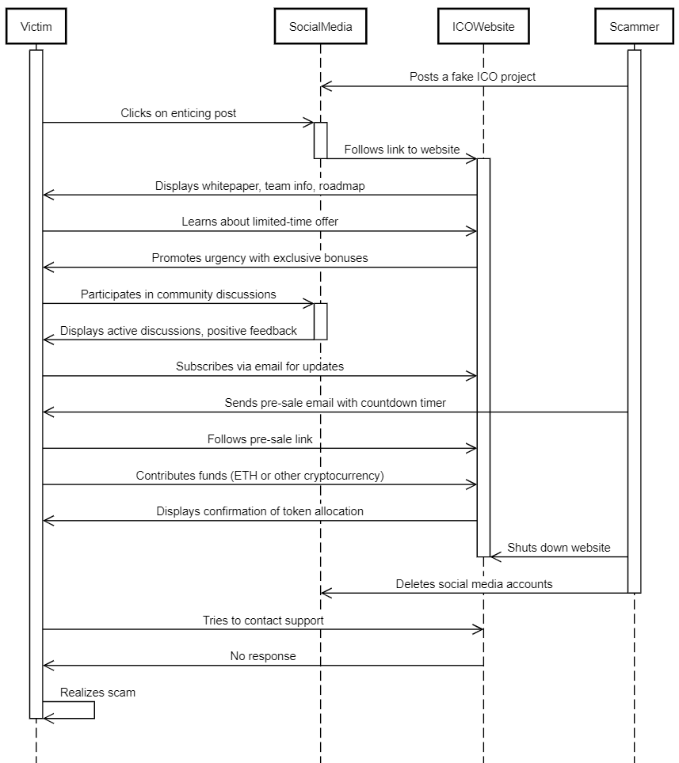

# 《ChatGPT 揭秘：加密货币欺诈入门指南》

发布时间：2024年06月05日

`LLM应用

理由：这篇论文主要探讨了ChatGPT等大型语言模型在加密货币欺诈中的应用，分析了如何通过调整模型的输入来操控输出以实现欺诈目的。研究内容聚焦于模型的实际应用场景及其可能带来的伦理和安全风险，因此属于“LLM应用”类别。` `加密货币` `人工智能伦理`

> Cryptocurrency Frauds for Dummies: How ChatGPT introduces us to fraud?

# 摘要

> 近期，ChatGPT等大型语言模型的进步和应用，创造了一个知识渊博且功能多样的机器对话者，它既能为人类带来益处，也可能被用于不良目的。本研究深入分析了ChatGPT与加密货币欺诈之间的复杂关系，揭示了在波动不定的加密货币市场中，ChatGPT可能与欺诈行为存在紧密联系。我们通过分类加密货币欺诈案例，展示了如何通过调整ChatGPT的提示来操控输出，规避伦理限制，达成特定欺诈目的。研究还强调，ChatGPT对初入行的欺诈者而言，可能是一个极具价值的“导师”，并提醒我们在加密货币领域安全使用复杂语言模型的重要性。最终，本研究呼吁在数字货币领域内，应负责任且伦理地使用大型语言模型，识别并解决潜在的伦理风险。我们旨在提高公众对使用ChatGPT可能带来的欺诈风险的认识，而非鼓励欺诈行为。

> Recent advances in the field of large language models (LLMs), particularly the ChatGPT family, have given rise to a powerful and versatile machine interlocutor, packed with knowledge and challenging our understanding of learning. This interlocutor is a double-edged sword: it can be harnessed for a wide variety of beneficial tasks, but it can also be used to cause harm. This study explores the complicated interaction between ChatGPT and the growing problem of cryptocurrency fraud. Although ChatGPT is known for its adaptability and ethical considerations when used for harmful purposes, we highlight the deep connection that may exist between ChatGPT and fraudulent actions in the volatile cryptocurrency ecosystem. Based on our categorization of cryptocurrency frauds, we show how to influence outputs, bypass ethical terms, and achieve specific fraud goals by manipulating ChatGPT prompts. Furthermore, our findings emphasize the importance of realizing that ChatGPT could be a valuable instructor even for novice fraudsters, as well as understanding and safely deploying complex language models, particularly in the context of cryptocurrency frauds. Finally, our study underlines the importance of using LLMs responsibly and ethically in the digital currency sector, identifying potential risks and resolving ethical issues. It should be noted that our work is not intended to encourage and promote fraud, but rather to raise awareness of the risks of fraud associated with the use of ChatGPT.

[Arxiv](https://arxiv.org/abs/2406.03079)