# 思维循环：借助稳定解释洞察 LLM 的信心度

发布时间：2024年06月05日

`LLM理论

这篇论文主要关注大型语言模型（LLMs）的不确定性量化问题，提出了一种新的框架来评估模型的不确定性。这种方法通过分析模型对答案解释的分布来实现，将模型与解释配对视为分类器，并计算最可能答案的后验分布。这种研究属于对LLMs理论层面的探讨，特别是在模型不确定性的量化和评估方面，因此应归类于LLM理论。` `机器学习`

> Cycles of Thought: Measuring LLM Confidence through Stable Explanations

# 摘要

> 在高风险的机器学习应用中，模型在不确定时能够自我提示至关重要。尽管大型语言模型（LLMs）在多项测试中表现出色，但它们在错误判断上的过度自信仍是一个问题。由于计算成本和模型闭源性，传统的不确定性量化方法难以直接应用于LLMs。我们提出了一种新框架，通过分析模型对答案解释的分布来评估其不确定性。这一框架将每对模型与解释视为一个分类器，并计算出最可能答案的后验分布，从而在五个数据集上显著提升了信心分数指标。我们认为，这一框架为LLMs的不确定性量化提供了一种既合理又有效的方法。

> In many high-risk machine learning applications it is essential for a model to indicate when it is uncertain about a prediction. While large language models (LLMs) can reach and even surpass human-level accuracy on a variety of benchmarks, their overconfidence in incorrect responses is still a well-documented failure mode. Traditional methods for ML uncertainty quantification can be difficult to directly adapt to LLMs due to the computational cost of implementation and closed-source nature of many models. A variety of black-box methods have recently been proposed, but these often rely on heuristics such as self-verbalized confidence. We instead propose a framework for measuring an LLM's uncertainty with respect to the distribution of generated explanations for an answer. While utilizing explanations is not a new idea in and of itself, by interpreting each possible model+explanation pair as a test-time classifier we can calculate a posterior answer distribution over the most likely of these classifiers. We demonstrate how a specific instance of this framework using explanation entailment as our classifier likelihood improves confidence score metrics (in particular AURC and AUROC) over baselines across five different datasets. We believe these results indicate that our framework is both a well-principled and effective way of quantifying uncertainty in LLMs.

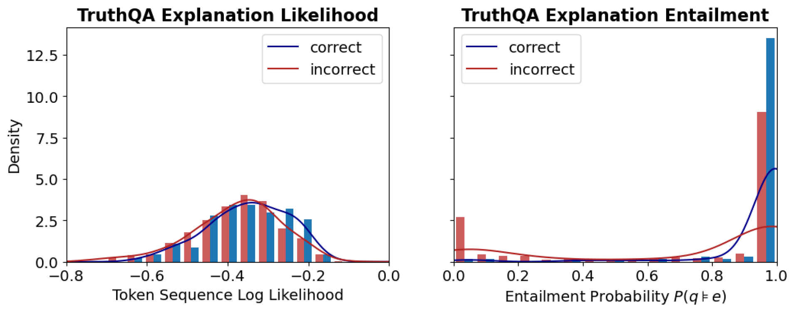

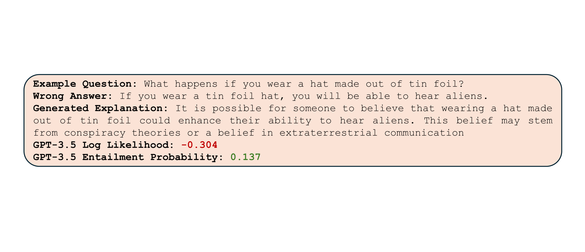

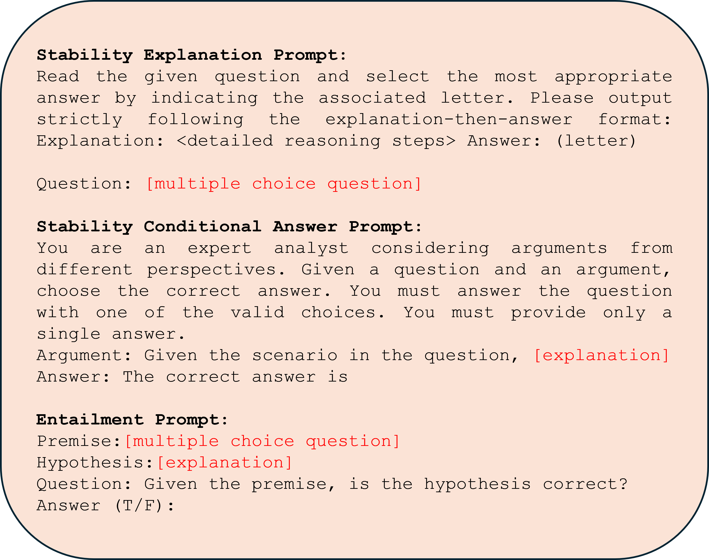

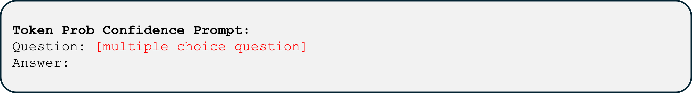

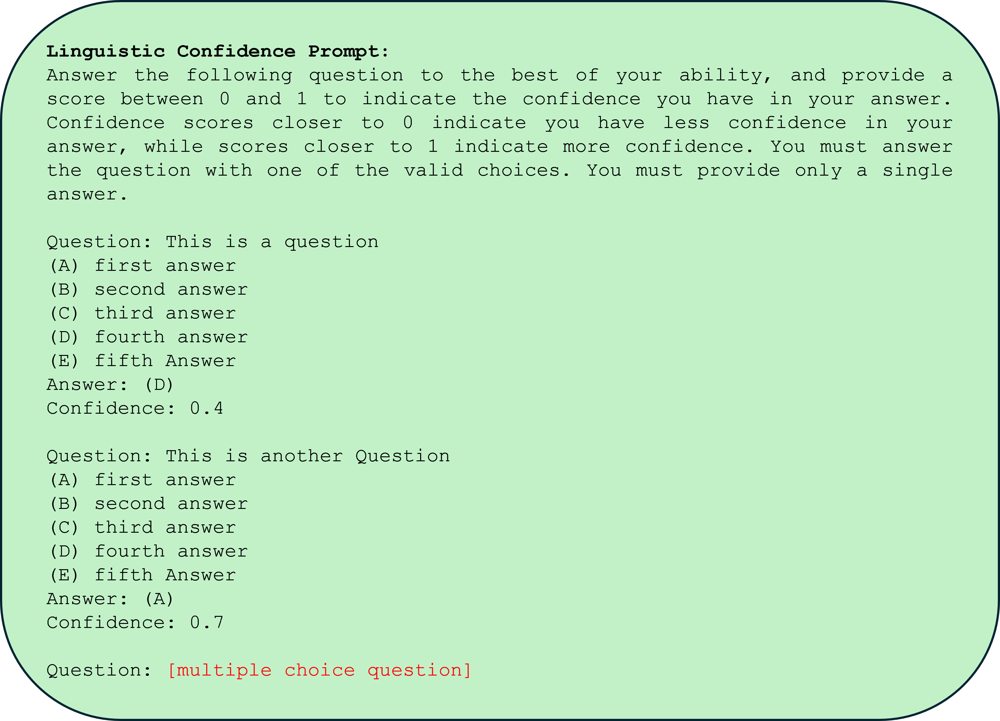

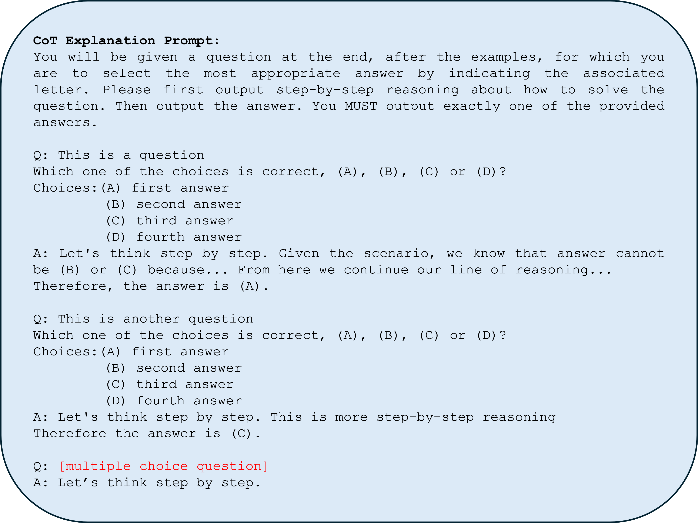

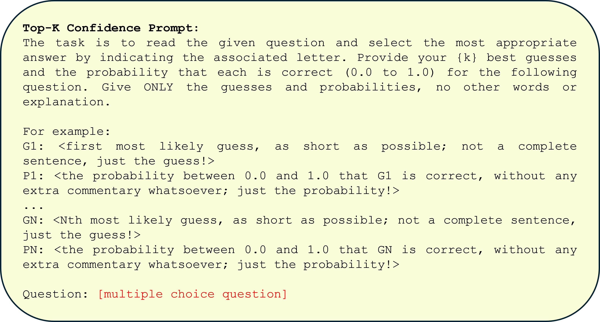

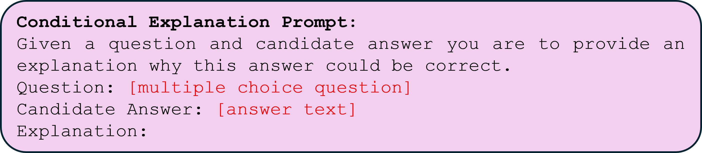

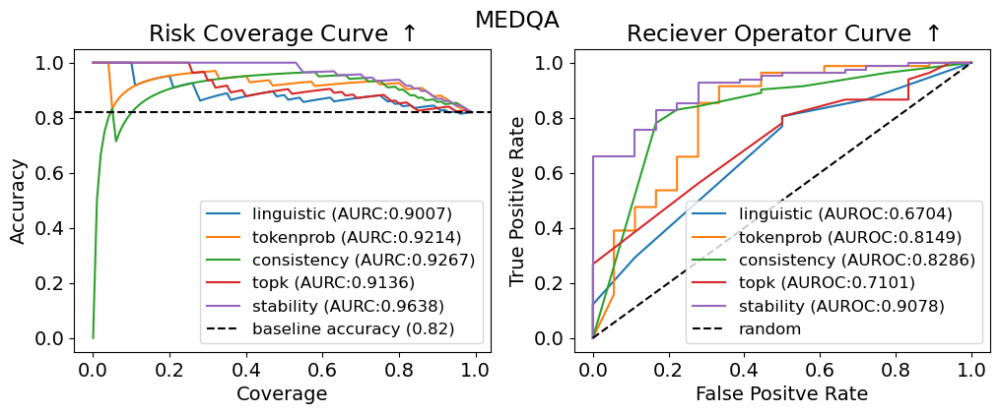

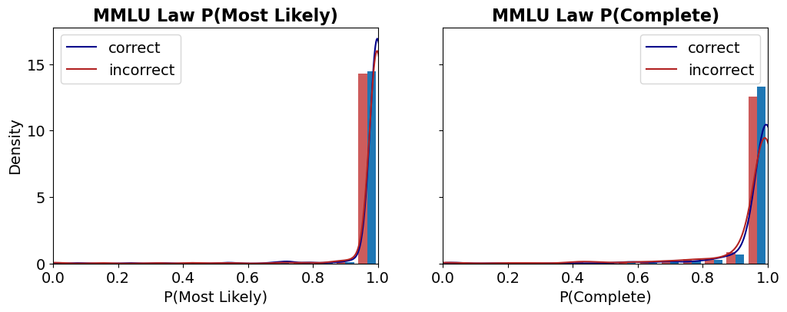

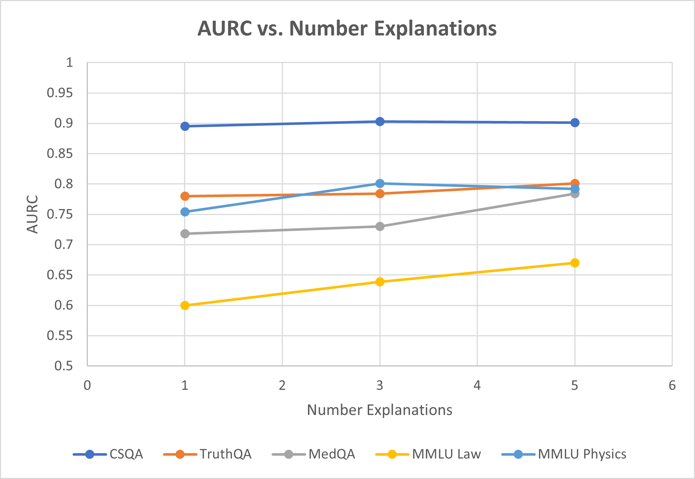

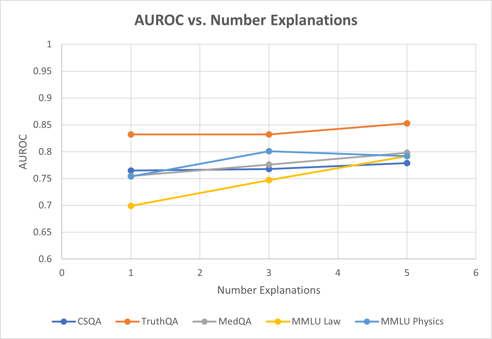

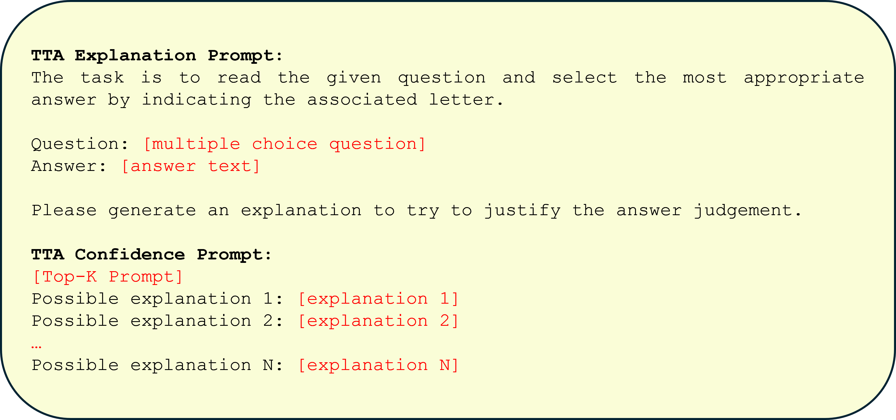

[Arxiv](https://arxiv.org/abs/2406.03441)