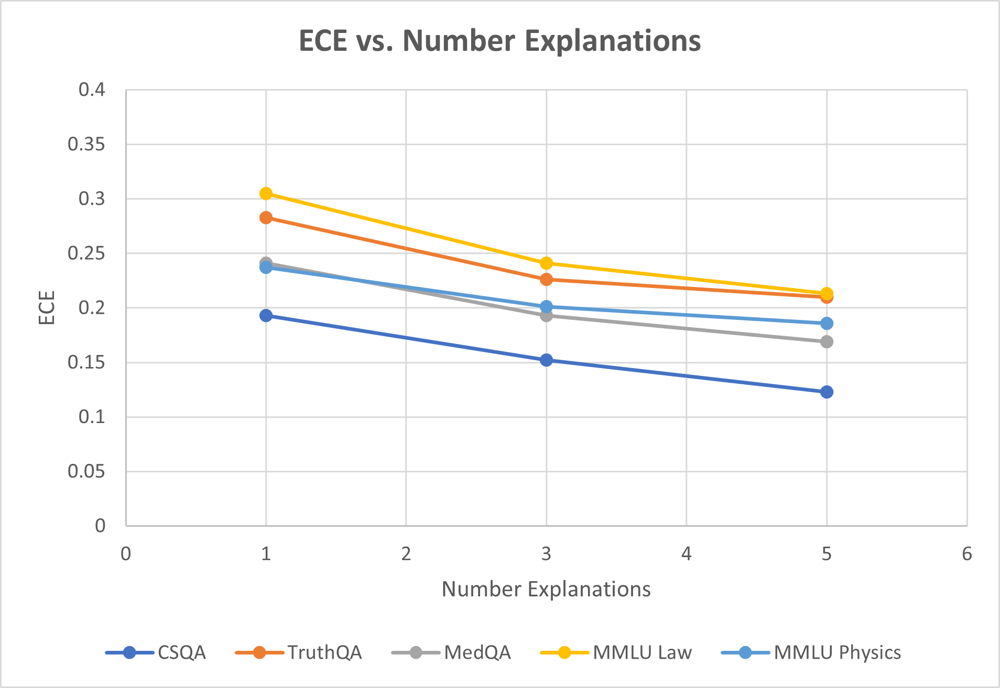

# 思维循环：借助稳定解释洞察 LLM 信心

发布时间：2024年06月05日

`LLM理论

这篇论文主要探讨了大型语言模型（LLMs）的不确定性量化问题，提出了一种新的框架来评估LLM的不确定性。这种方法通过分析答案解释的分布来实现，将每个模型与解释的组合视为一个测试时的分类器，并计算出最可能答案的后验分布。这一研究是对LLM理论的深入探讨，特别是在不确定性量化这一理论问题上，因此应归类于LLM理论。` `机器学习`

> Cycles of Thought: Measuring LLM Confidence through Stable Explanations

# 摘要

> 在高风险机器学习应用中，模型能准确表达其预测的不确定性至关重要。尽管大型语言模型（LLMs）在多项测试中表现出色，甚至超越人类，但它们对错误答案的过度自信仍是一个公认的缺陷。由于计算成本高昂和模型闭源，传统的不确定性量化方法难以直接应用于LLMs。近期虽有多种黑盒方法提出，但多依赖于自我表达的信心等启发式手段。我们提出了一种新框架，通过分析答案解释的分布来评估LLM的不确定性。虽然利用解释并非首创，但我们将每个模型与解释的组合视为一个测试时的分类器，从而计算出最可能答案的后验分布。我们通过特定实例展示了这一框架，特别是使用解释蕴含作为分类器似然性，显著提升了信心分数指标（如AURC和AUROC）在五个数据集上的表现，超越了基线水平。我们相信，这证明了我们的框架是量化LLMs不确定性的一个既合理又有效的方法。

> In many high-risk machine learning applications it is essential for a model to indicate when it is uncertain about a prediction. While large language models (LLMs) can reach and even surpass human-level accuracy on a variety of benchmarks, their overconfidence in incorrect responses is still a well-documented failure mode. Traditional methods for ML uncertainty quantification can be difficult to directly adapt to LLMs due to the computational cost of implementation and closed-source nature of many models. A variety of black-box methods have recently been proposed, but these often rely on heuristics such as self-verbalized confidence. We instead propose a framework for measuring an LLM's uncertainty with respect to the distribution of generated explanations for an answer. While utilizing explanations is not a new idea in and of itself, by interpreting each possible model+explanation pair as a test-time classifier we can calculate a posterior answer distribution over the most likely of these classifiers. We demonstrate how a specific instance of this framework using explanation entailment as our classifier likelihood improves confidence score metrics (in particular AURC and AUROC) over baselines across five different datasets. We believe these results indicate that our framework is both a well-principled and effective way of quantifying uncertainty in LLMs.

[Arxiv](https://arxiv.org/abs/2406.03441)