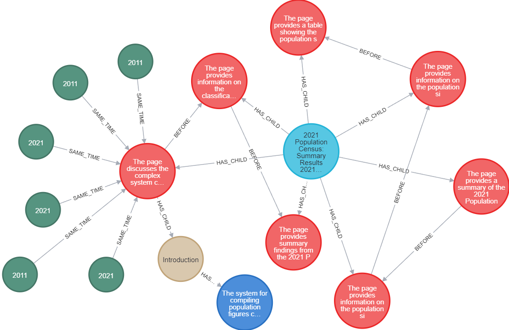

# Docs2KG：借助大型语言模型，整合异构文档构建统一知识图谱

发布时间：2024年06月05日

`Agent

理由：这篇论文介绍的 Docs2KG 框架是一个能够从多种非结构化文档中提取信息并构建知识图谱的系统。它不仅处理数据，还动态构建知识图谱以支持高效的查询和探索，这表明它具有一定的自主性和智能性，类似于一个Agent在处理和组织信息。虽然它涉及到数据处理和知识图谱构建，这些功能可能与LLM应用相关，但其核心在于作为一个智能系统来处理和整合信息，因此更适合归类为Agent。` `数据管理` `知识图谱`

> Docs2KG: Unified Knowledge Graph Construction from Heterogeneous Documents Assisted by Large Language Models

# 摘要

> 即便保守估计，企业数据的80%也藏匿于非结构化文件之中，这些文件存储在能容纳多种格式的数据湖里。传统搜索引擎已难以满足深度信息探索的需求，尤其是在需要通过浏览来提炼见解的场景下，往往缺乏明确的搜索关键词。知识图谱因其直观的视觉呈现，有效减轻了认知负担，成为整合异构数据和展现知识的首选工具。本文推出的 Docs2KG 框架，能够从电子邮件、网页、PDF 及 Excel 等多样非结构化文档中提取多模态信息，并动态构建统一的知识图谱，助力高效查询与探索文档数据湖。不同于以往局限于特定领域或预设架构的方法，Docs2KG 提供了灵活可扩展的解决方案，适应各类文档结构与内容。该框架整合了数据处理流程，支持多样下游任务，并增强了领域解释力。Docs2KG 的访问地址为 https://docs2kg.ai4wa.com，演示视频亦可在此链接观看。

> Even for a conservative estimate, 80% of enterprise data reside in unstructured files, stored in data lakes that accommodate heterogeneous formats. Classical search engines can no longer meet information seeking needs, especially when the task is to browse and explore for insight formulation. In other words, there are no obvious search keywords to use. Knowledge graphs, due to their natural visual appeals that reduce the human cognitive load, become the winning candidate for heterogeneous data integration and knowledge representation.
  In this paper, we introduce Docs2KG, a novel framework designed to extract multimodal information from diverse and heterogeneous unstructured documents, including emails, web pages, PDF files, and Excel files. Dynamically generates a unified knowledge graph that represents the extracted key information, Docs2KG enables efficient querying and exploration of document data lakes. Unlike existing approaches that focus on domain-specific data sources or pre-designed schemas, Docs2KG offers a flexible and extensible solution that can adapt to various document structures and content types. The proposed framework unifies data processing supporting a multitude of downstream tasks with improved domain interpretability. Docs2KG is publicly accessible at https://docs2kg.ai4wa.com, and a demonstration video is available at https://docs2kg.ai4wa.com/Video.

[Arxiv](https://arxiv.org/abs/2406.02962)