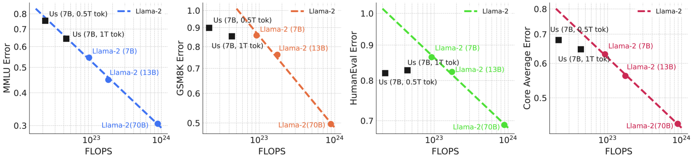
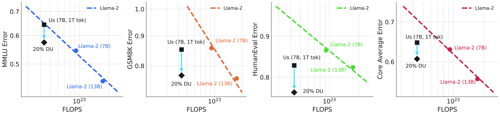
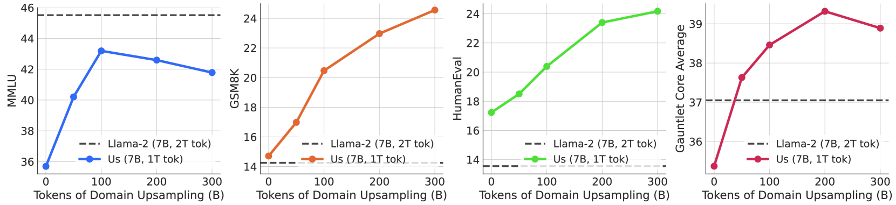

# 你的数据是否让你感到愉悦？在训练末期进行领域上采样，能显著提升性能。

发布时间：2024年06月05日

`LLM理论

这篇论文主要探讨了大型语言模型（LLMs）预训练数据集中特定领域数据的影响，并提出了一种在训练末期对特定领域数据进行上采样的方法，以优化模型在复杂基准上的表现。这种方法涉及对预训练数据集的策略调整，以及对模型性能影响的理论分析，因此属于LLM理论分类。论文中的研究重点在于理解和优化预训练数据集的构成，以及这种优化如何影响模型的性能，这是对LLMs理论层面的深入探讨。` `机器学习` `数据处理`

> Does your data spark joy? Performance gains from domain upsampling at the end of training

# 摘要

> 大型语言模型（LLMs）的预训练数据集已包含数万亿令牌，主要由大量CommonCrawl网页抓取和少量特定领域数据组成。然而，要评估这些特定领域数据对模型性能的影响，需要在大型计算规模上进行训练，成本高昂。随着预训练数据实验成本的上升，如何找到通用网页数据多样性与特定领域数据信息密度之间的最佳平衡点？在本研究中，我们提出了一种简单方法：在训练末期对特定领域数据进行上采样，以提升在复杂基准上的表现。这种方法使我们为训练1万亿令牌的7B模型在MMLU、GSM8K和HumanEval上分别提升了6.90、8.26和6.17个百分点，与训练时间长一倍的Llama-2（7B）模型相媲美。通过实验，我们发现将领域上采样的比例控制在10%至20%，能有效平衡通用语言建模与特定基准的需求。此外，我们还利用这一技术在训练的最后阶段移除特定数据集，以评估它们对提升不同基准的贡献。这一方法大大降低了实验成本，使我们能以较低的成本探索不同预训练数据集的影响。

> Pretraining datasets for large language models (LLMs) have grown to trillions of tokens composed of large amounts of CommonCrawl (CC) web scrape along with smaller, domain-specific datasets. It is expensive to understand the impact of these domain-specific datasets on model capabilities as training at large FLOP scales is required to reveal significant changes to difficult and emergent benchmarks. Given the increasing cost of experimenting with pretraining data, how does one determine the optimal balance between the diversity in general web scrapes and the information density of domain specific data? In this work, we show how to leverage the smaller domain specific datasets by upsampling them relative to CC at the end of training to drive performance improvements on difficult benchmarks. This simple technique allows us to improve up to 6.90 pp on MMLU, 8.26 pp on GSM8K, and 6.17 pp on HumanEval relative to the base data mix for a 7B model trained for 1 trillion (T) tokens, thus rivaling Llama-2 (7B)$\unicode{x2014}$a model trained for twice as long. We experiment with ablating the duration of domain upsampling from 5% to 30% of training and find that 10% to 20% percent is optimal for navigating the tradeoff between general language modeling capabilities and targeted benchmarks. We also use domain upsampling to characterize at scale the utility of individual datasets for improving various benchmarks by removing them during this final phase of training. This tool opens up the ability to experiment with the impact of different pretraining datasets at scale, but at an order of magnitude lower cost compared to full pretraining runs.

[Arxiv](https://arxiv.org/abs/2406.03476)