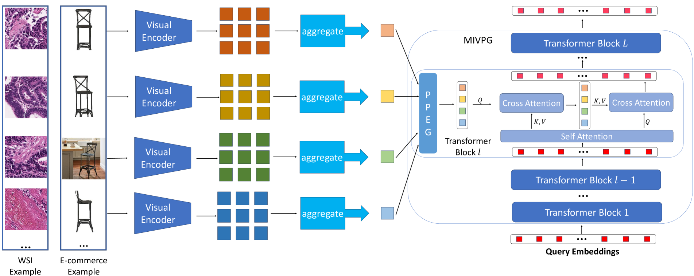
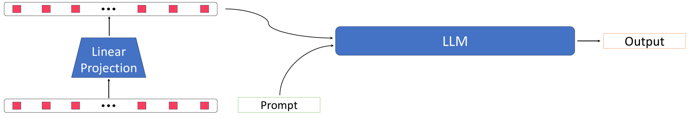

# 利用多实例视觉提示生成器，丰富多模态大型语言模型的视觉表示能力

发布时间：2024年06月05日

`RAG

理由：这篇论文主要关注的是多模态大型语言模型（MLLMs）中的视觉适配器和视觉提示生成器的改进，特别是在多实例学习方法中的应用。它提出了一种新的组件——多实例视觉提示生成器（MIVPG），以改善视觉信息的融合和处理。这种研究更偏向于模型架构的改进和优化，属于模型增强（RAG）的范畴，而不是Agent、LLM应用或LLM理论。` `视觉语言任务` `多模态学习`

> Enhancing Multimodal Large Language Models with Multi-instance Visual Prompt Generator for Visual Representation Enrichment

# 摘要

> 多模态大型语言模型（MLLMs）通过融合视觉表示与大型语言模型（LLMs），借助视觉适配器在多种视觉语言任务中取得了顶尖成绩。本文首先指出，使用基于查询的Transformer（如Q-former）的适配器是一种简化的多实例学习方法，忽略了实例间的异质性和相关性。随后，我们提出了一种创新组件——多实例视觉提示生成器（MIVPG），它利用同一样本内图像或补丁间的实例相关性，将更丰富的视觉信息融入LLMs。在多个不同场景下的公开视觉语言（VL）数据集上的评估表明，MIVPG显著提升了Q-former在关键VL任务中的表现。

> Multimodal Large Language Models (MLLMs) have achieved SOTA performance in various visual language tasks by fusing the visual representations with LLMs leveraging some visual adapters. In this paper, we first establish that adapters using query-based Transformers such as Q-former is a simplified Multi-instance Learning method without considering instance heterogeneity/correlation. We then propose a general component termed Multi-instance Visual Prompt Generator (MIVPG) to incorporate enriched visual representations into LLMs by taking advantage of instance correlation between images or patches for the same sample. Quantatitive evaluation on three public vision-language (VL) datasets from different scenarios shows that the proposed MIVPG improves Q-former in main VL tasks.

[Arxiv](https://arxiv.org/abs/2406.02987)