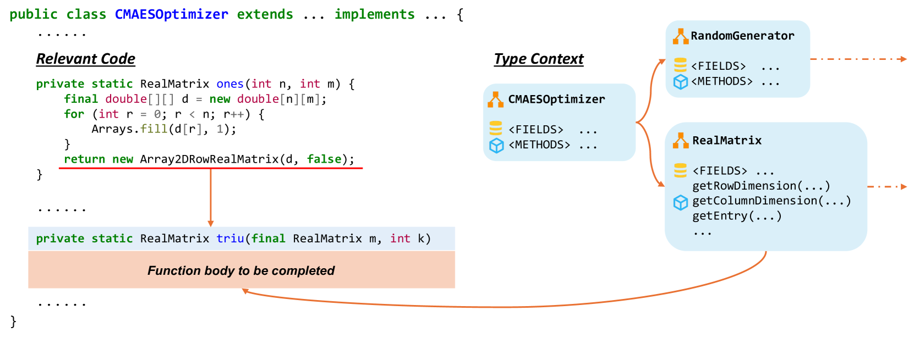
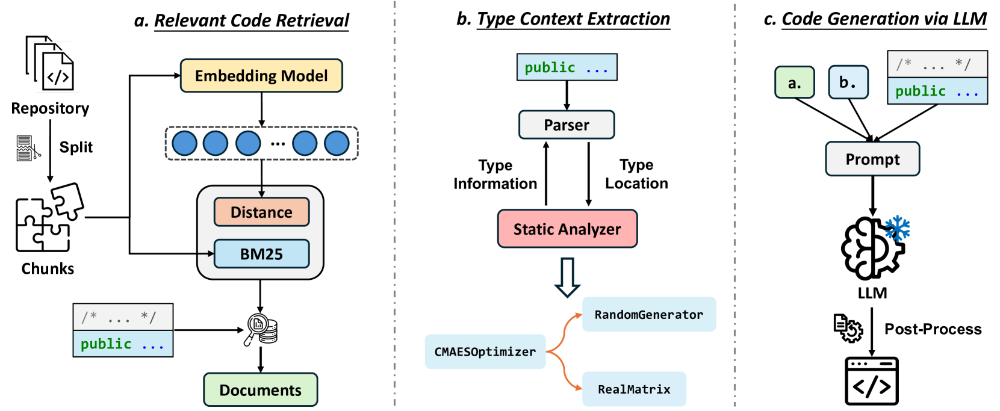
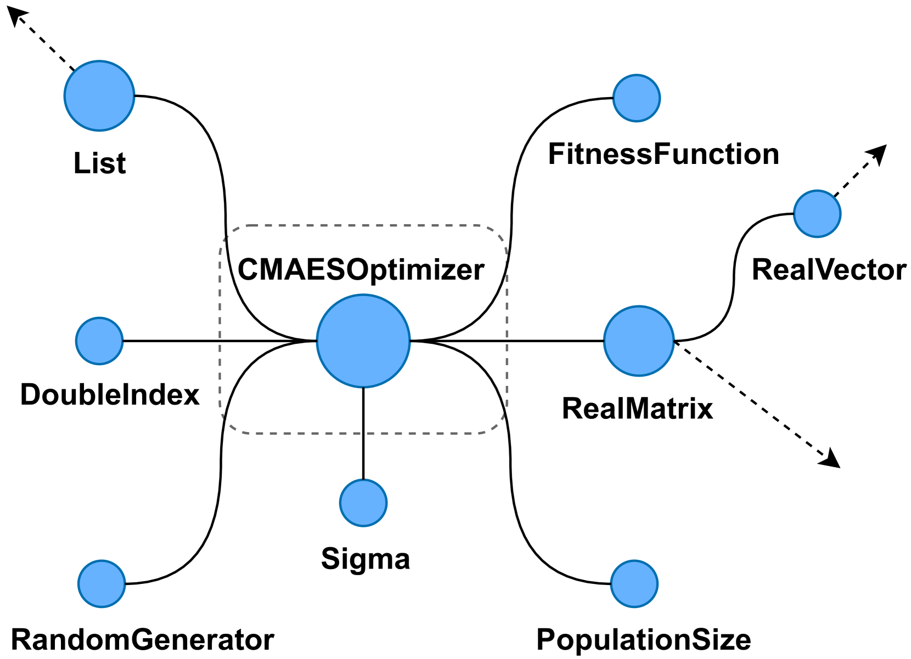
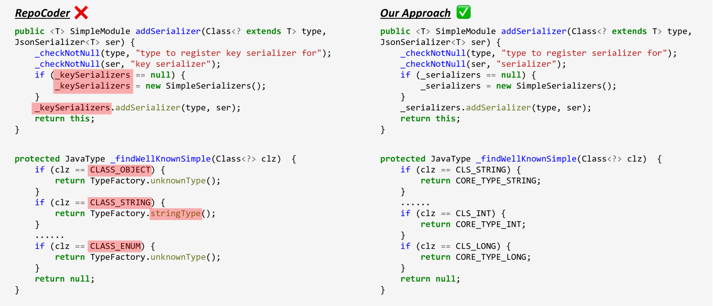
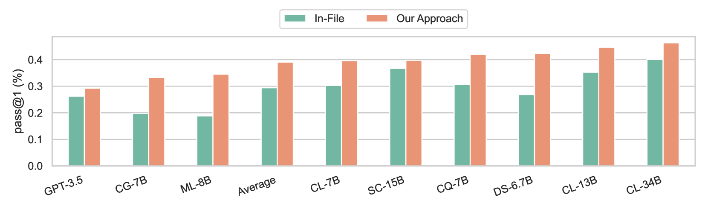
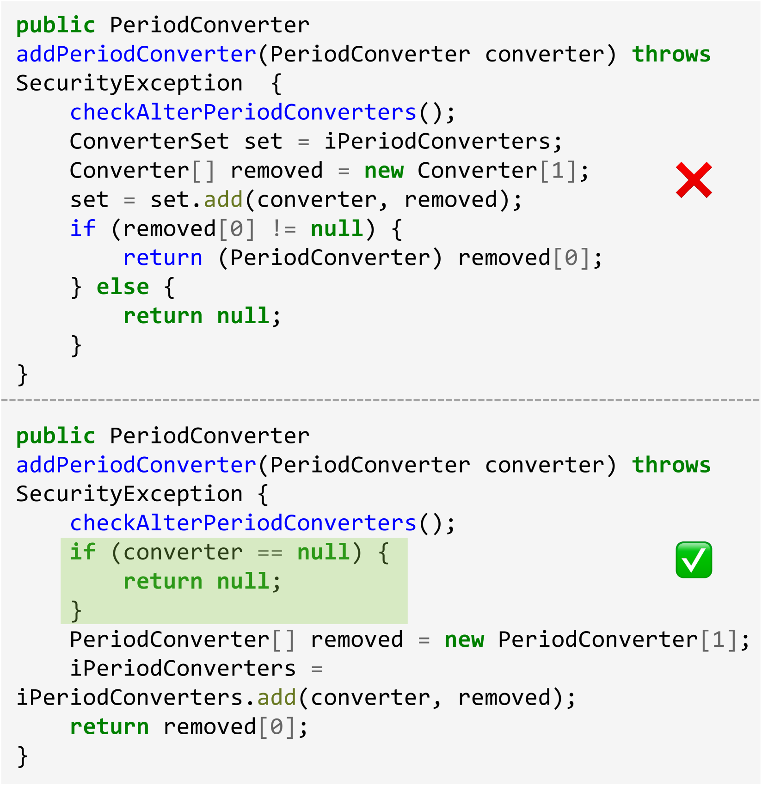

# 集成上下文信息，提升仓库级代码生成能力

发布时间：2024年06月05日

`LLM应用

这篇论文介绍了CatCoder，一个专为静态类型语言设计的创新代码生成框架，它通过结合类型分析与代码检索来提升大型语言模型（LLMs）在仓库级别代码生成任务中的表现。论文通过实验证明了CatCoder在特定任务上的性能提升，并强调了其在不同LLMs上的广泛适用性。因此，这篇论文属于LLM应用分类，因为它专注于将LLMs应用于特定的实际问题——仓库级别的代码生成，并提出了一个具体的解决方案。` `软件开发` `代码生成`

> Enhancing Repository-Level Code Generation with Integrated Contextual Information

# 摘要

> 大型语言模型（LLMs）在代码生成领域表现出色，但仓库级别的代码生成因其涉及跨文件信息的复杂性而面临挑战。现有基于检索的方法在深入理解仓库上下文方面存在不足。为此，我们推出了CatCoder，一个专为静态类型语言设计的创新代码生成框架。CatCoder通过结合类型分析与代码检索，为LLMs提供丰富的上下文提示，显著提升了仓库级代码生成的质量。我们通过包含199个Java任务和90个Rust任务的基准测试，证明了CatCoder在pass@k评分上超越了基线RepoCoder达17.35%。此外，CatCoder在多种LLMs上的广泛适用性也得到了验证，无论是专精于代码的模型还是通用模型，均显示出一致的性能提升，凸显了CatCoder的实际应用价值。

> Large language models (LLMs) have demonstrated remarkable capabilities in code generation tasks. However, repository-level code generation presents unique challenges, particularly due to the need to utilize information spread across multiple files within a repository. Existing retrieval-based approaches sometimes fall short as they are limited in obtaining a broader and deeper repository context. In this paper, we present CatCoder, a novel code generation framework designed for statically typed programming languages. CatCoder enhances repository-level code generation by integrating relevant code and type context. Specifically, it leverages static analyzers to extract type dependencies and merges this information with retrieved code to create comprehensive prompts for LLMs. To evaluate the effectiveness of CatCoder, we adapt and construct benchmarks that include 199 Java tasks and 90 Rust tasks. The results show that CatCoder outperforms the RepoCoder baseline by up to 17.35%, in terms of pass@k score. Furthermore, the generalizability of CatCoder is assessed using various LLMs, including both code-specialized models and general-purpose models. Our findings indicate consistent performance improvements across all models, which underlines the practicality of CatCoder.

[Arxiv](https://arxiv.org/abs/2406.03283)