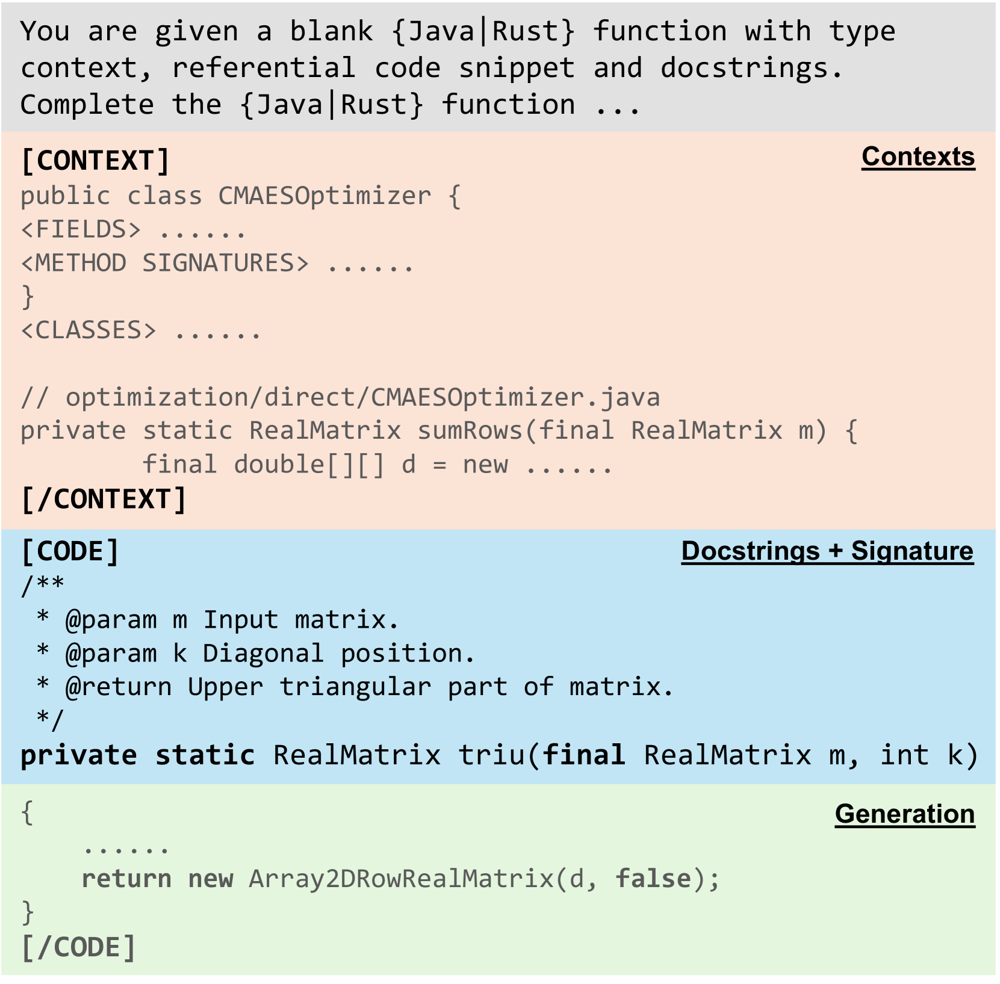

# 融合上下文信息，提升仓库级代码生成能力

发布时间：2024年06月05日

`LLM应用

这篇论文介绍了一种名为CatCoder的创新代码生成框架，专门设计用于静态类型语言，并针对仓库级别的代码生成进行了优化。CatCoder通过结合类型上下文和相关代码，利用静态分析技术提取类型依赖，并将这些信息与检索代码结合，为大型语言模型（LLMs）提供详尽的提示。论文通过实验验证了CatCoder在提高仓库级代码生成效率方面的有效性，并展示了其在不同LLMs上的广泛适用性。因此，这篇论文属于LLM应用类别，因为它专注于开发和应用LLMs于特定的实际问题——仓库级别的代码生成。` `软件开发` `编程辅助工具`

> Enhancing Repository-Level Code Generation with Integrated Contextual Information

# 摘要

> 大型语言模型（LLMs）在代码生成方面表现出色，但仓库级别的代码生成因其需要跨多个文件整合信息而面临特殊挑战。现有的基于检索的方法在获取全面仓库上下文方面存在局限。为此，我们推出了CatCoder，一种专为静态类型语言设计的创新代码生成框架。CatCoder通过结合类型上下文和相关代码，显著提升了仓库级代码生成的效率。它运用静态分析技术提取类型依赖，并将这些信息与检索代码结合，为LLMs提供详尽的提示。我们通过包含199个Java任务和90个Rust任务的定制基准测试了CatCoder的性能，结果显示其性能比基线高出17.35%。此外，CatCoder在多种LLMs上的广泛测试表明，无论是专用代码模型还是通用模型，其性能均有显著提升，这验证了CatCoder的实用性和广泛适用性。

> Large language models (LLMs) have demonstrated remarkable capabilities in code generation tasks. However, repository-level code generation presents unique challenges, particularly due to the need to utilize information spread across multiple files within a repository. Existing retrieval-based approaches sometimes fall short as they are limited in obtaining a broader and deeper repository context. In this paper, we present CatCoder, a novel code generation framework designed for statically typed programming languages. CatCoder enhances repository-level code generation by integrating relevant code and type context. Specifically, it leverages static analyzers to extract type dependencies and merges this information with retrieved code to create comprehensive prompts for LLMs. To evaluate the effectiveness of CatCoder, we adapt and construct benchmarks that include 199 Java tasks and 90 Rust tasks. The results show that CatCoder outperforms the RepoCoder baseline by up to 17.35%, in terms of pass@k score. Furthermore, the generalizability of CatCoder is assessed using various LLMs, including both code-specialized models and general-purpose models. Our findings indicate consistent performance improvements across all models, which underlines the practicality of CatCoder.

[Arxiv](https://arxiv.org/abs/2406.03283)