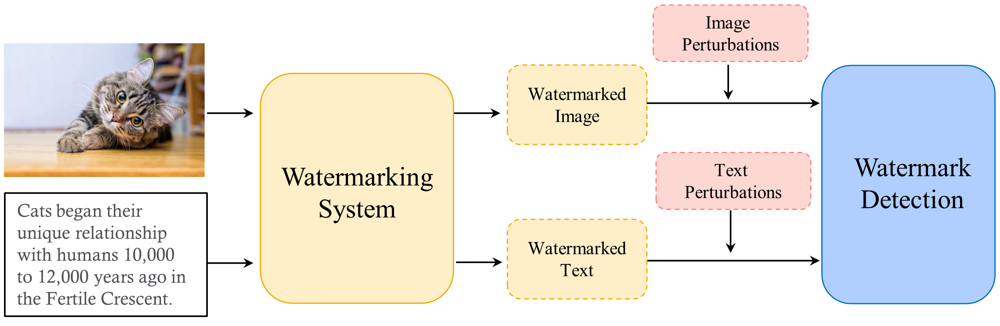
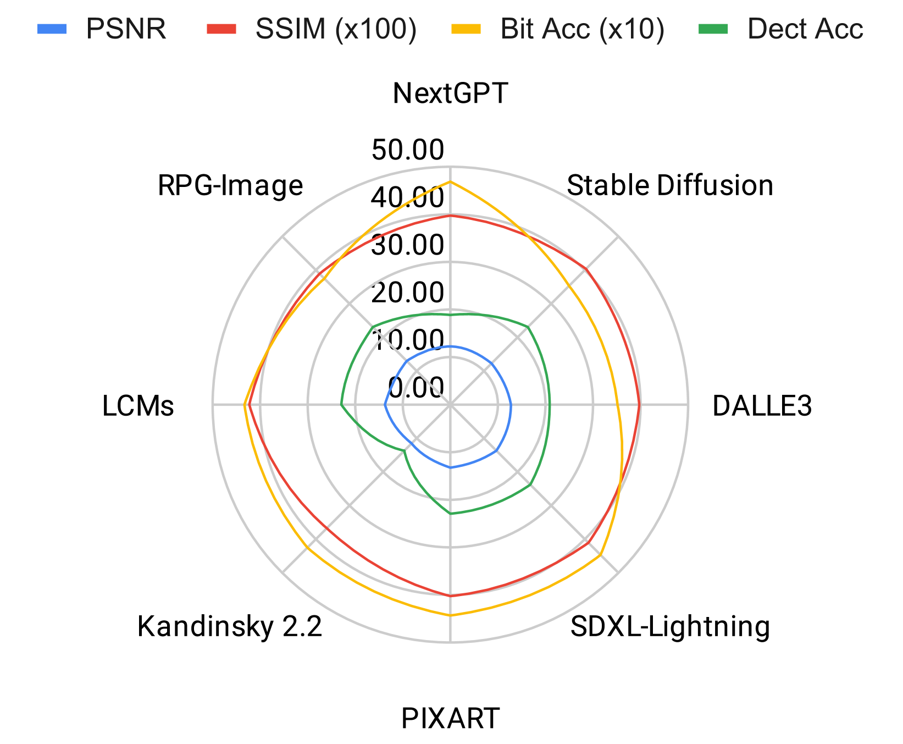
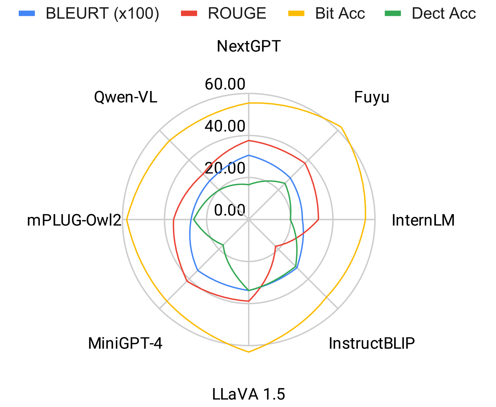
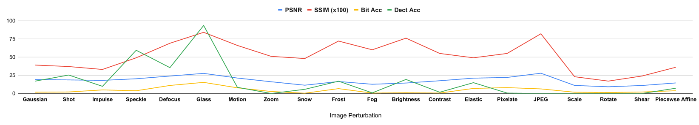
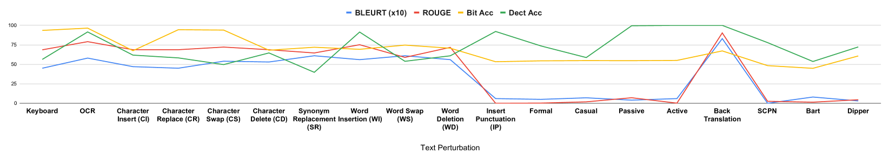
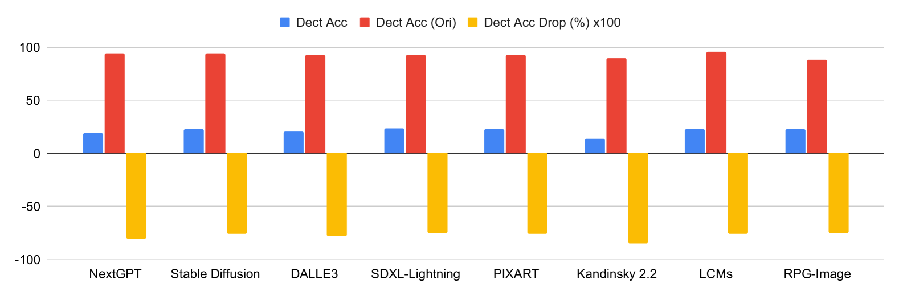
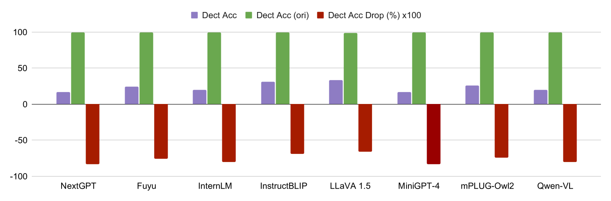
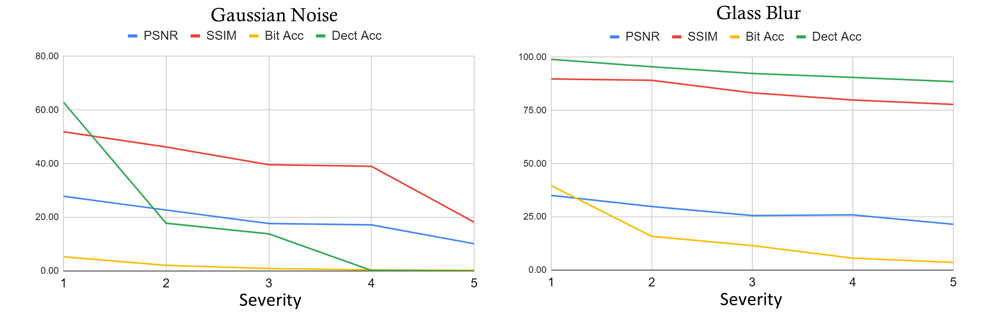
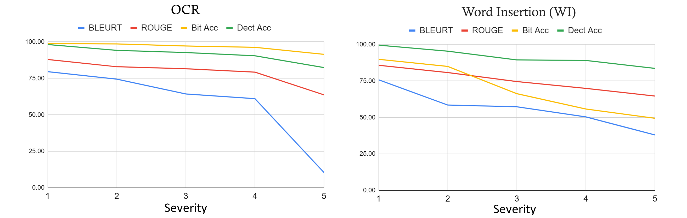

# 探究耐久性：多模态水印技术的基准启示

发布时间：2024年06月05日

`LLM应用

理由：这篇论文主要探讨了水印技术在多模态应用中的效用，特别是在图像和文本生成模型中的应用。它评估了水印对现实世界中常见图像损坏及文本扰动的抵抗能力，这直接关联到大型语言模型（LLM）在实际应用中的安全性和可靠性问题。因此，这篇论文更偏向于LLM的应用层面，而不是理论研究或Agent、RAG相关的研究。` `版权保护` `内容监控`

> Evaluating Durability: Benchmark Insights into Multimodal Watermarking

# 摘要

> 随着大型模型技术的进步，水印技术在版权声明、真实性验证及内容监控方面的应用日益增多。特别是在多模态应用中，水印技术的效用显得尤为关键。水印的效能与可靠性，很大程度上取决于其对多种干扰的抵抗能力。然而，在实际环境中，尤其是在遭受干扰和损坏时，水印的鲁棒性尚未得到充分理解。为了凸显鲁棒性在水印技术中的重要性，本研究针对图像与文本生成模型所产生的水印内容，评估了其对现实世界中常见图像损坏及文本扰动的抵抗能力。研究结果有望为未来开发更为强健的水印技术奠定基础。项目详情可访问我们的网站：\url{https://mmwatermark-robustness.github.io/}。

> With the development of large models, watermarks are increasingly employed to assert copyright, verify authenticity, or monitor content distribution. As applications become more multimodal, the utility of watermarking techniques becomes even more critical. The effectiveness and reliability of these watermarks largely depend on their robustness to various disturbances. However, the robustness of these watermarks in real-world scenarios, particularly under perturbations and corruption, is not well understood. To highlight the significance of robustness in watermarking techniques, our study evaluated the robustness of watermarked content generated by image and text generation models against common real-world image corruptions and text perturbations. Our results could pave the way for the development of more robust watermarking techniques in the future. Our project website can be found at \url{https://mmwatermark-robustness.github.io/}.

[Arxiv](https://arxiv.org/abs/2406.03728)