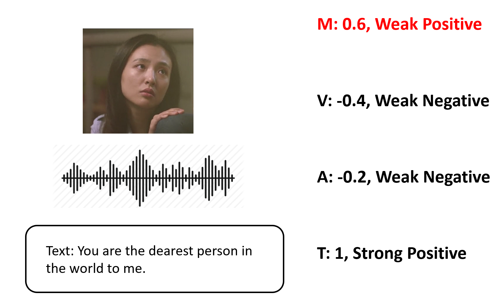
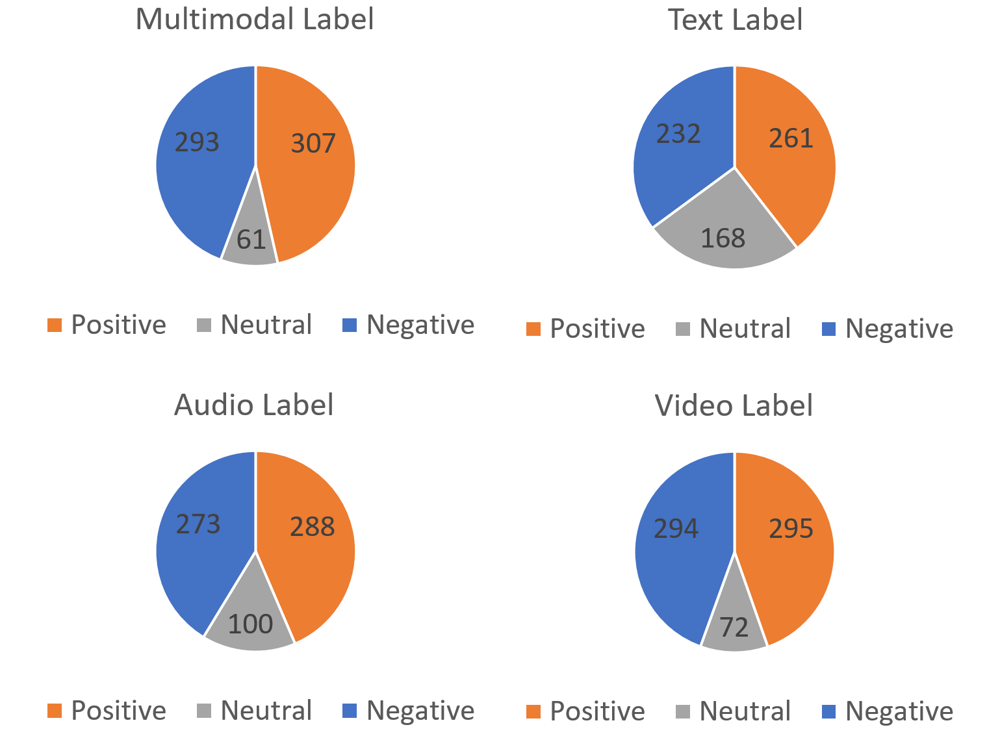

# 评估多模态情感分析中的数据一致性问题

发布时间：2024年06月05日

`Agent

这篇论文主要关注的是多模态情感分析（MSA）领域中的情感语义不一致问题，并探讨了这一问题如何影响人工代理（Agent）的预测准确性。论文通过创建模态冲突测试集，对比了传统多模态情感分析模型与多模态大型语言模型（MLLMs）的性能，揭示了MLLMs在处理多模态情感分析时的不足。因此，这篇论文更适合归类到Agent分类中，因为它主要探讨了多模态情感分析对人工代理性能的影响。` `情感分析` `多模态分析`

> Evaluation of data inconsistency for multi-modal sentiment analysis

# 摘要

> 在多模态情感分析（MSA）领域，情感语义不一致是一个普遍难题。MSA 旨在分析文本、音频和视频等多种模态中的情感表达。由于人类表达的细腻差异，各模态传达的情感信息可能不尽相同，导致语义上的不一致，进而影响人工代理的预测准确性。本研究中，我们创建了一个模态冲突测试集，并对比了传统多模态情感分析模型与多模态大型语言模型（MLLMs）的性能。结果显示，面对语义冲突的数据，传统模型性能显著下降，同时揭示了 MLLMs 在处理多模态情感分析时的不足。我们的研究不仅提出了新的挑战，也为情感分析技术的未来发展提供了深刻的洞见。

> Emotion semantic inconsistency is an ubiquitous challenge in multi-modal sentiment analysis (MSA). MSA involves analyzing sentiment expressed across various modalities like text, audio, and videos. Each modality may convey distinct aspects of sentiment, due to subtle and nuanced expression of human beings, leading to inconsistency, which may hinder the prediction of artificial agents. In this work, we introduce a modality conflicting test set and assess the performance of both traditional multi-modal sentiment analysis models and multi-modal large language models (MLLMs). Our findings reveal significant performance degradation across traditional models when confronted with semantically conflicting data and point out the drawbacks of MLLMs when handling multi-modal emotion analysis. Our research presents a new challenge and offer valuable insights for the future development of sentiment analysis systems.

[Arxiv](https://arxiv.org/abs/2406.03004)