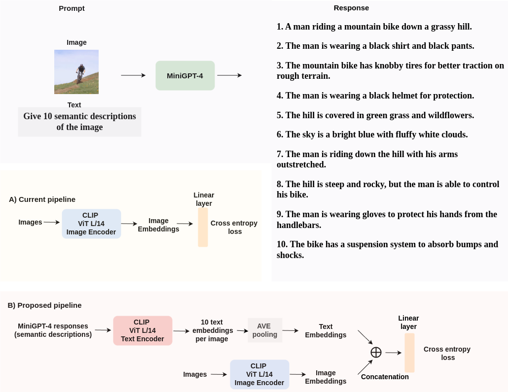
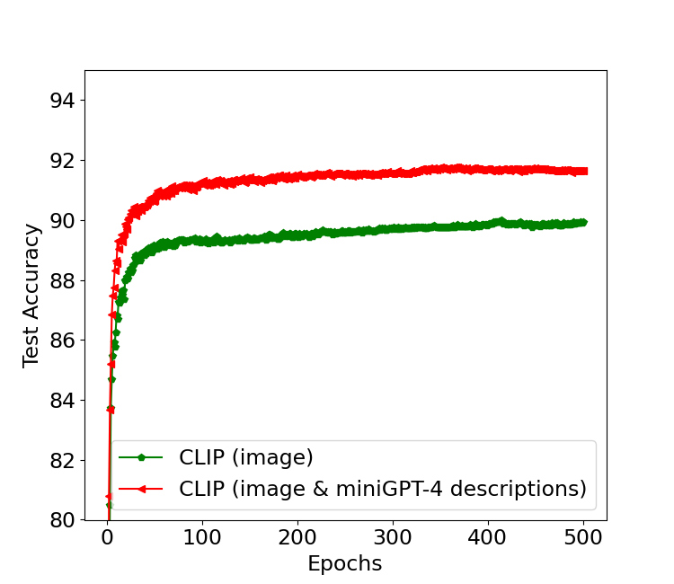
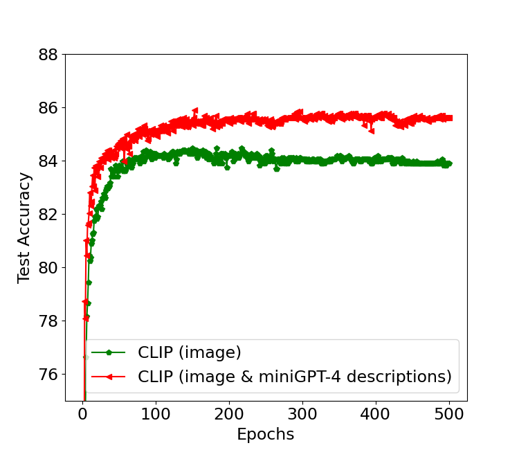
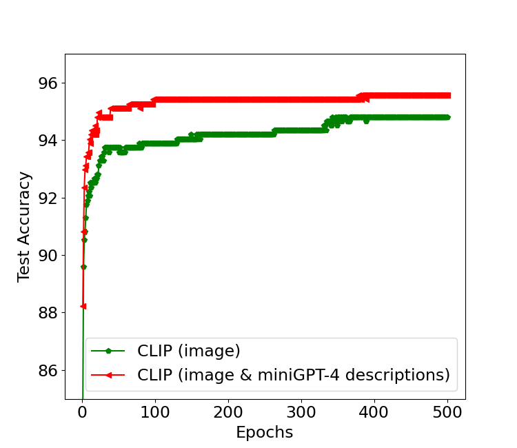
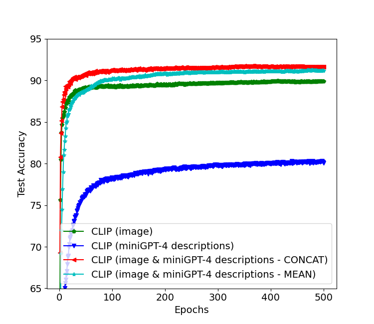
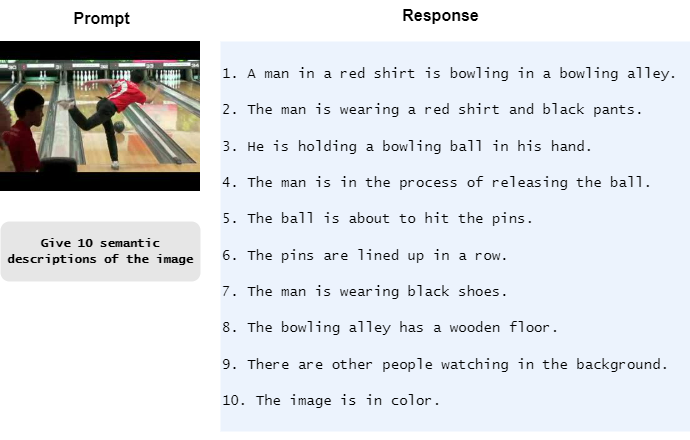
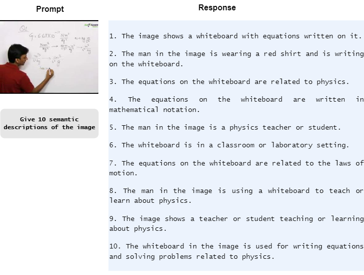
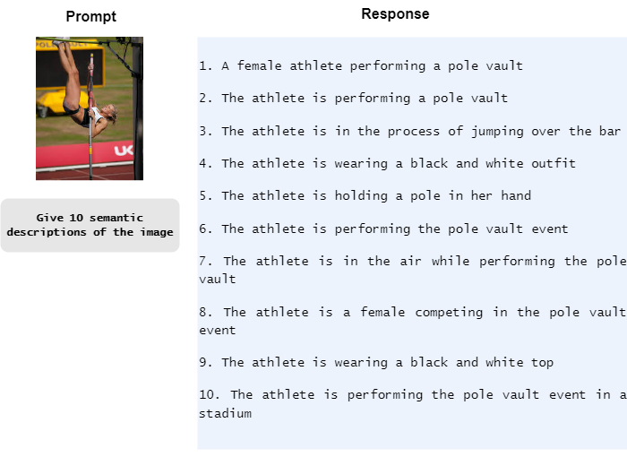
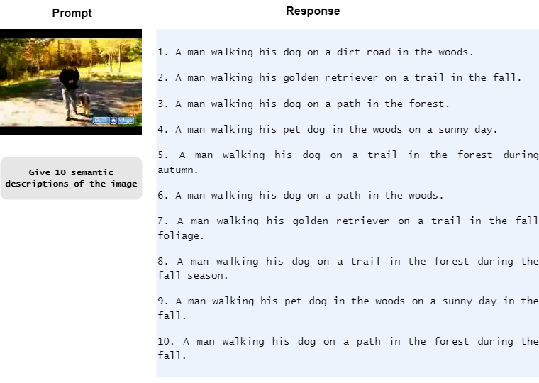

# 借助基于LMM的知识提升图像分类任务的性能

发布时间：2024年06月05日

`LLM应用

这篇论文探讨了如何利用大型多模态模型（LMMs），特别是通过MiniGPT-4模型，来提取图像的语义描述，以增强图像分类任务的性能。这种方法通过结合文本编码器来获取图像的语义描述对应的文本嵌入，从而综合利用了图像和文本信息。实验结果表明，这种策略在多个数据集上显著提高了分类准确性，证明了基于LMM的方法的有效性。因此，这篇论文属于LLM应用分类，因为它展示了如何应用大型模型来解决实际的图像分类问题。` `图像分类` `多模态学习`

> Exploiting LMM-based knowledge for image classification tasks

# 摘要

> 本文探讨了如何借助大型多模态模型（LMMs）的知识，通过MiniGPT-4模型提取图像的语义描述，以提升图像分类任务的性能。不同于仅依赖图像编码器的传统方法，我们创新性地结合了文本编码器，获取与图像语义描述对应的文本嵌入，从而综合利用图像与文本信息。实验结果显示，这一策略在三个数据集上均显著提高了分类准确性，证明了基于LMM的方法的有效性。

> In this paper we address image classification tasks leveraging knowledge encoded in Large Multimodal Models (LMMs). More specifically, we use the MiniGPT-4 model to extract semantic descriptions for the images, in a multimodal prompting fashion. In the current literature, vision language models such as CLIP, among other approaches, are utilized as feature extractors, using only the image encoder, for solving image classification tasks. In this paper, we propose to additionally use the text encoder to obtain the text embeddings corresponding to the MiniGPT-4-generated semantic descriptions. Thus, we use both the image and text embeddings for solving the image classification task. The experimental evaluation on three datasets validates the improved classification performance achieved by exploiting LMM-based knowledge.

[Arxiv](https://arxiv.org/abs/2406.03071)