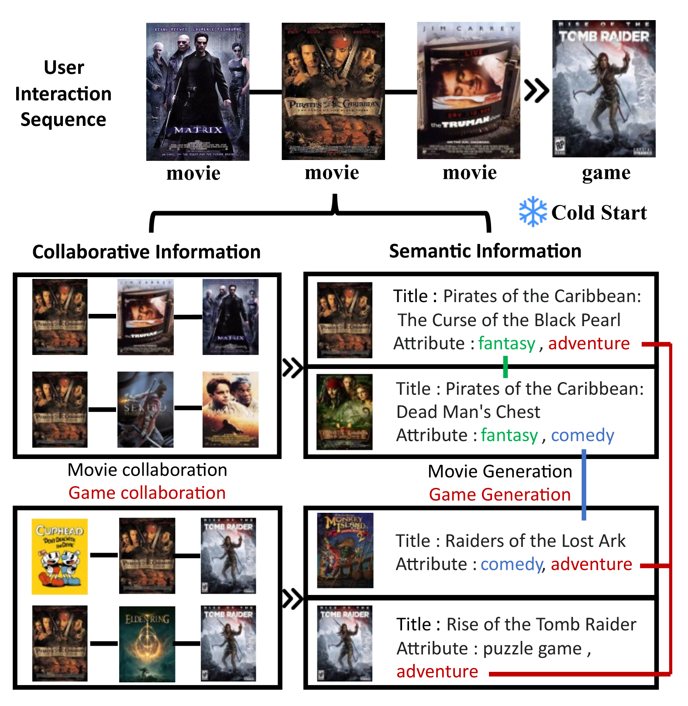
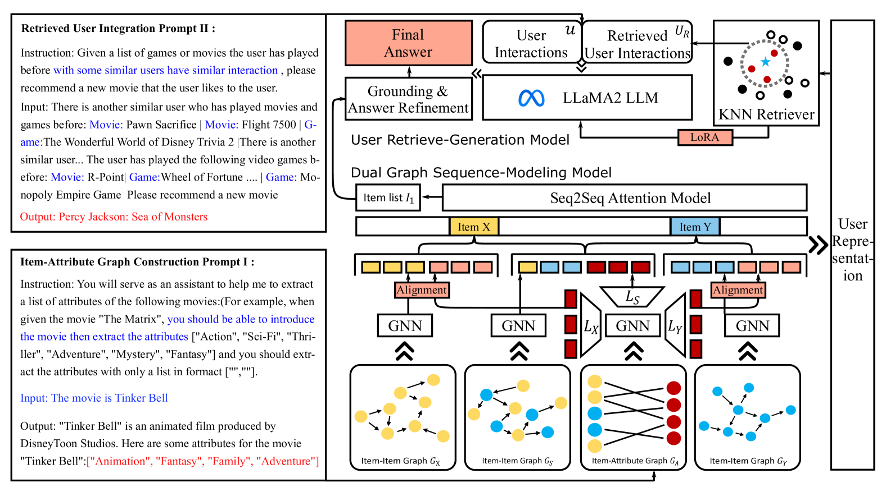
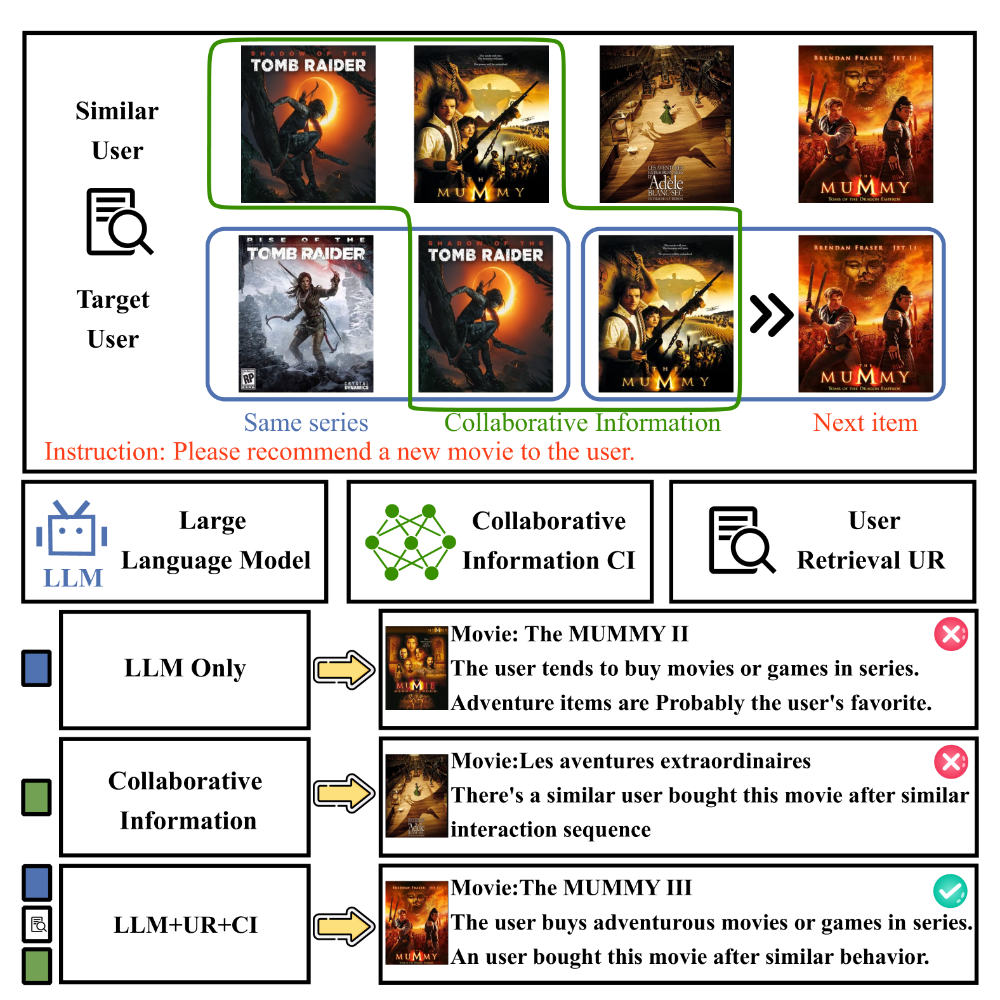
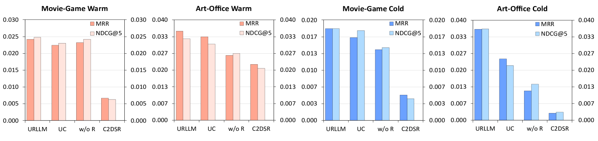
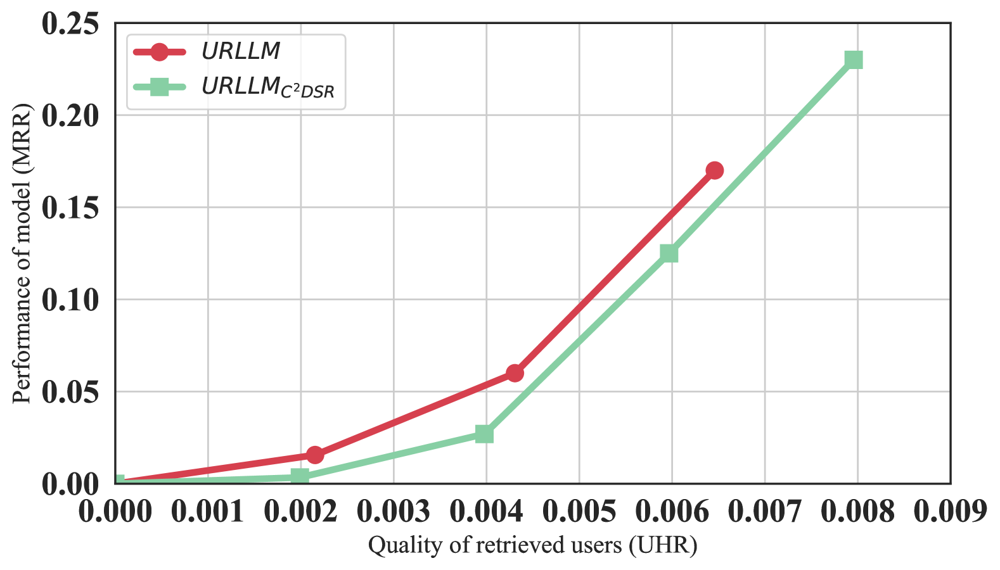

# 研究如何通过整合用户检索信息，提升大型语言模型在跨领域序列推荐中的性能

发布时间：2024年06月05日

`LLM应用

这篇论文摘要描述了一个名为URLLM的框架，该框架旨在通过利用大型语言模型（LLM）的强大语义推理能力来改进跨域序列推荐（CDSR）系统。论文中提到，URLLM框架通过用户检索和域接地技术，以及双图序列模型和对齐与对比学习方法，来捕捉和转移用户在不同领域的序列偏好。此外，该框架还包括特定域策略和精炼模块，以防止域外生成。这些特性表明，该论文主要关注于如何将LLM应用于实际的推荐系统中，以解决特定的技术挑战，因此属于LLM应用分类。` `电子商务` `推荐系统`

> Exploring User Retrieval Integration towards Large Language Models for Cross-Domain Sequential Recommendation

# 摘要

> 跨域序列推荐（CDSR）旨在挖掘并转移用户在不同领域的序列偏好，以缓解冷启动问题。传统模型虽捕捉了用户与项目的协同信息，却忽视了语义价值。大型语言模型（LLM）的强大语义推理能力启发了我们，希望借此更好地捕捉语义信息。然而，将LLM融入CDSR面临两大挑战：信息的无缝集成与特定域生成。为此，我们提出了URLLM框架，通过用户检索与域接地技术，旨在提升CDSR性能。我们首先设计了双图序列模型捕捉多样化信息，并运用对齐与对比学习促进域知识转移。接着，采用用户检索生成模型，将结构信息与LLM无缝结合，发挥其推理潜能。此外，我们还开发了特定域策略与精炼模块，防止域外生成。在亚马逊平台上的实验充分展示了URLLM在信息集成与特定域生成方面的优越性，代码已公开于https://github.com/TingJShen/URLLM。

> Cross-Domain Sequential Recommendation (CDSR) aims to mine and transfer users' sequential preferences across different domains to alleviate the long-standing cold-start issue. Traditional CDSR models capture collaborative information through user and item modeling while overlooking valuable semantic information. Recently, Large Language Model (LLM) has demonstrated powerful semantic reasoning capabilities, motivating us to introduce them to better capture semantic information. However, introducing LLMs to CDSR is non-trivial due to two crucial issues: seamless information integration and domain-specific generation. To this end, we propose a novel framework named URLLM, which aims to improve the CDSR performance by exploring the User Retrieval approach and domain grounding on LLM simultaneously. Specifically, we first present a novel dual-graph sequential model to capture the diverse information, along with an alignment and contrastive learning method to facilitate domain knowledge transfer. Subsequently, a user retrieve-generation model is adopted to seamlessly integrate the structural information into LLM, fully harnessing its emergent inferencing ability. Furthermore, we propose a domain-specific strategy and a refinement module to prevent out-of-domain generation. Extensive experiments on Amazon demonstrated the information integration and domain-specific generation ability of URLLM in comparison to state-of-the-art baselines. Our code is available at https://github.com/TingJShen/URLLM

[Arxiv](https://arxiv.org/abs/2406.03085)