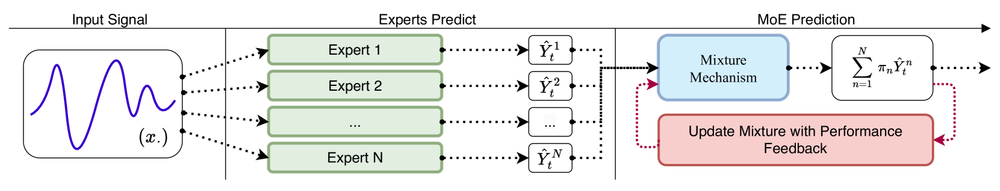
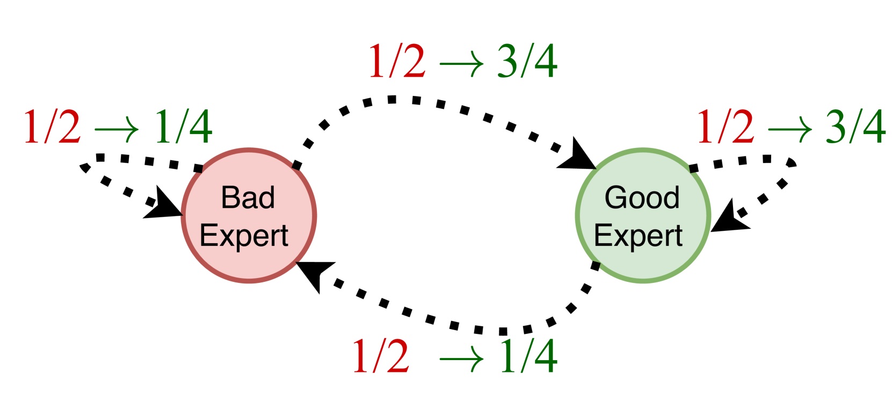
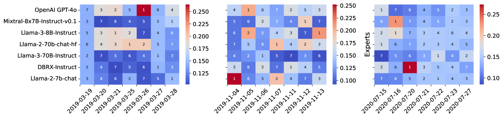
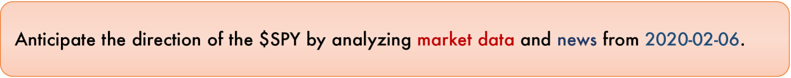
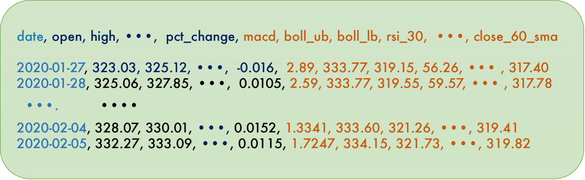

# 随机过滤而非混合：大型语言模型混合中的在线门控机制

发布时间：2024年06月05日

`LLM应用

理由：这篇论文介绍了一种创新的机制MoE-F，用于优化大型语言模型（LLMs）在在线时间序列预测中的应用。该机制通过动态结合多个预训练的LLMs，并实时评估和调整权重，以提高预测性能。这种方法特别强调了在实际应用中如何有效地集成和利用多个LLMs，以提升预测的准确性和效率。因此，这篇论文更偏向于LLM的应用层面，而不是理论研究或Agent的设计。` `时间序列预测`

> Filtered not Mixed: Stochastic Filtering-Based Online Gating for Mixture of Large Language Models

# 摘要

> 我们创新性地提出了MoE-F机制，这是一种即插即用的滤波框架，能够动态结合$N$个预训练的大型语言模型(LLMs)，以优化在线时间序列预测。MoE-F通过实时评估各LLM的表现，智能调整权重，确保在每个时间点都能获得最佳预测组合。与传统的静态混合专家方法不同，MoE-F运用了时间自适应的随机滤波技术，将专家选择问题转化为一个连续时间的隐马尔可夫模型，进而利用Wohman-Shiryaev滤波器进行精确预测。我们的方法首先为每个LLM构建独立的滤波器，然后汇总这些滤波器的输出，以闭式优化LLMs的损失下界，最终形成一个高效的集成预测器。我们的研究成果包括：(I) MoE-F算法的设计与实现，(II) 基于滤波的门控算法的理论最优性证明，以及(III) 在真实金融市场的实证研究，显示MoE-F相较于其他LLM专家，F1度量提升了17%绝对值和48.5%相对值。

> We propose MoE-F -- a formalised mechanism for combining $N$ pre-trained expert Large Language Models (LLMs) in online time-series prediction tasks by adaptively forecasting the best weighting of LLM predictions at every time step. Our mechanism leverages the conditional information in each expert's running performance to forecast the best combination of LLMs for predicting the time series in its next step. Diverging from static (learned) Mixture of Experts (MoE) methods, MoE-F employs time-adaptive stochastic filtering techniques to combine experts. By framing the expert selection problem as a finite state-space, continuous-time Hidden Markov model (HMM), we can leverage the Wohman-Shiryaev filter. Our approach first constructs $N$ parallel filters corresponding to each of the $N$ individual LLMs. Each filter proposes its best combination of LLMs, given the information that they have access to. Subsequently, the $N$ filter outputs are aggregated to optimize a lower bound for the loss of the aggregated LLMs, which can be optimized in closed-form, thus generating our ensemble predictor. Our contributions here are: (I) the MoE-F algorithm -- deployable as a plug-and-play filtering harness, (II) theoretical optimality guarantees of the proposed filtering-based gating algorithm, and (III) empirical evaluation and ablative results using state of the art foundational and MoE LLMs on a real-world Financial Market Movement task where MoE-F attains a remarkable 17% absolute and 48.5% relative F1 measure improvement over the next best performing individual LLM expert.

[Arxiv](https://arxiv.org/abs/2406.02969)