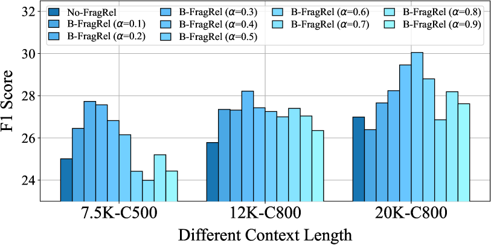

# FragRel：挖掘大型语言模型外部存储中片段间的深层联系

发布时间：2024年06月05日

`RAG

理由：这篇论文主要关注的是如何改进大型语言模型（LLM）处理长文本的能力，特别是在处理外部记忆中的文本片段时，考虑它们之间的结构联系。这种方法与检索增强生成（RAG）模型的工作方式相似，后者通过结合检索模型和生成模型来处理复杂的上下文信息。因此，这篇论文更符合RAG分类，因为它探讨了如何通过增强LLM的上下文处理能力来提高其在特定任务上的表现。` `软件开发`

> FragRel: Exploiting Fragment-level Relations in the External Memory of Large Language Models

# 摘要

> 为了应对LLMs处理无限长度上下文的挑战，研究者们开始探索分层管理长文本的策略。他们仅从外部记忆中选取几个文本片段，送入LLM的临时工作记忆——上下文窗口。遗憾的是，现有方法在处理这些片段时忽视了它们之间的结构联系，导致在处理如连贯故事和代码仓库这类内部关系紧密的文本时效果不佳。本研究旨在通过挖掘外部记忆中片段间的联系来克服这一难题。首先，我们明确了片段间的关系，并为不同文本类型提供了具体实例。随后，我们在原有的独立片段评估基础上，引入了关系感知的评估标准。最终，我们开发了基于片段连接的分层记忆LLM，并通过长故事理解、仓库级代码生成和长期聊天等任务，证明了考虑片段间关系的显著优势。

> To process contexts with unlimited length using Large Language Models (LLMs), recent studies explore hierarchically managing the long text. Only several text fragments are taken from the external memory and passed into the temporary working memory, i.e., LLM's context window. However, existing approaches isolatedly handle the text fragments without considering their structural connections, thereby suffering limited capability on texts with intensive inter-relations, e.g., coherent stories and code repositories. This work attempts to resolve this by exploiting the fragment-level relations in external memory. First, we formulate the fragment-level relations and present several instantiations for different text types. Next, we introduce a relation-aware fragment assessment criteria upon previous independent fragment assessment. Finally, we present the fragment-connected Hierarchical Memory based LLM. We validate the benefits of involving these relations on long story understanding, repository-level code generation, and long-term chatting.

[Arxiv](https://arxiv.org/abs/2406.03092)