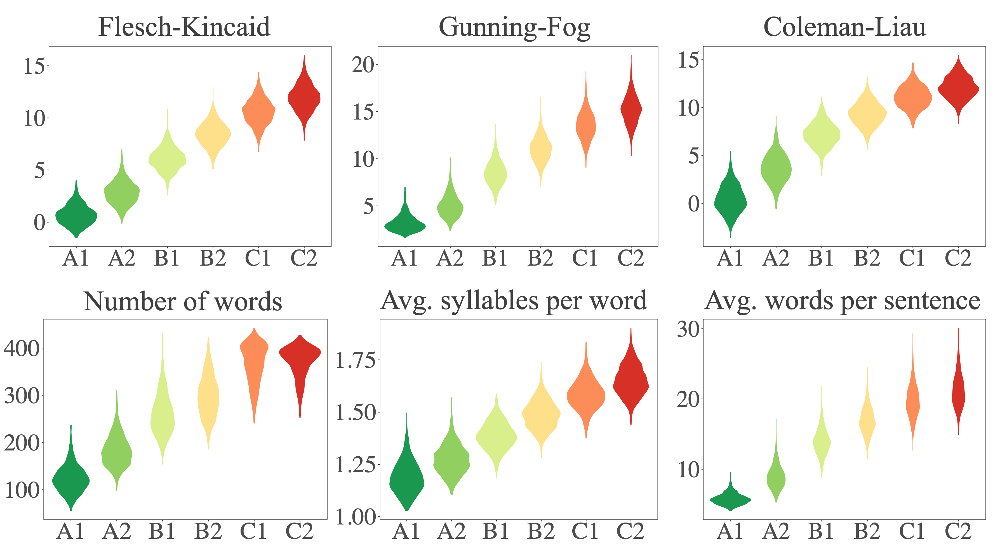

# 从泰山到托尔金：驾驭大型语言模型，定制内容生成的语言熟练度

发布时间：2024年06月05日

`LLM应用

这篇论文探讨了如何调整大型语言模型（LLMs）生成的文本难度，以适应语言学习者等非完全熟练用户的需求。研究涉及了多种方法，包括少量样本提示、监督微调及强化学习，并评估了这些方法在GPT-4及开源模型如LLama2-7B和Mistral-7B上的效果。通过创新框架，研究者开发了CALM模型（CEFR对齐语言模型），该模型在性能上超越了GPT-4及其他方法，并且成本低廉。此外，通过一项小型人类研究，进一步证实了结果的优质性。因此，这篇论文属于LLM应用类别，因为它专注于实际应用中的问题解决和技术改进。` `语言学习` `教育技术`

> From Tarzan to Tolkien: Controlling the Language Proficiency Level of LLMs for Content Generation

# 摘要

> 我们探讨了如何调整大型语言模型（LLMs）生成的文本难度，以适应语言学习者等非完全熟练用户的需求。通过创新框架，我们评估了包括少量样本提示、监督微调及强化学习在内的多种方法的效果，涉及GPT-4及开源模型如LLama2-7B和Mistral-7B。研究发现，在采用提示策略时，GPT-4与开源模型间存在明显性能差异。但我们通过巧妙融合微调与RL对齐技术，成功缩小了这一差距。我们的CALM模型（CEFR对齐语言模型）不仅成本低廉，更在性能上超越了GPT-4及其他方法。此外，我们还通过一项小型人类研究，进一步证实了结果的优质性。

> We study the problem of controlling the difficulty level of text generated by Large Language Models (LLMs) for contexts where end-users are not fully proficient, such as language learners. Using a novel framework, we evaluate the effectiveness of several key approaches for this task, including few-shot prompting, supervised finetuning, and reinforcement learning (RL), utilising both GPT-4 and open source alternatives like LLama2-7B and Mistral-7B.
  Our findings reveal a large performance gap between GPT-4 and the open source models when using prompt-based strategies. However, we show how to bridge this gap with a careful combination of finetuning and RL alignment. Our best model, CALM (CEFR-Aligned Language Model), surpasses the performance of GPT-4 and other strategies, at only a fraction of the cost. We further validate the quality of our results through a small-scale human study.

[Arxiv](https://arxiv.org/abs/2406.03030)