# 截断权重：提升语言模型推理能力的秘诀

发布时间：2024年06月05日

`LLM理论

这篇论文摘要主要探讨了大型语言模型（LLM）在推理能力方面的性能提升机制，特别是通过分析和调整预训练模型的权重矩阵来增强推理能力。这种研究涉及对模型内部工作机制的深入理解，包括权重组件和Transformer架构中的前馈层的作用。因此，这项工作更偏向于对LLM的理论研究，即探究和理解模型内部的运作原理和性能优化方法。` `人工智能` `逻辑推理`

> How Truncating Weights Improves Reasoning in Language Models

# 摘要

> 大型语言模型不仅能流畅地生成多语种文本，还在涉及基础逻辑推理的任务上表现出色。最新研究表明，从预训练模型的权重矩阵中剔除特定部分能增强推理能力。我们深入探讨了这一现象，发现某些全局关联往往存储在特定的权重组件或Transformer的前馈层中，这些关联可能影响推理任务的准确性，而移除它们则能提升性能。我们通过实验和理论分析，探究了这一现象在训练中的形成，涉及一个在基础推理任务上训练的带有噪声的两层Transformer模型，以及Pythia系列模型在简单推理任务上的表现。

> In addition to the ability to generate fluent text in various languages, large language models have been successful at tasks that involve basic forms of logical "reasoning" over their context. Recent work found that selectively removing certain components from weight matrices in pre-trained models can improve such reasoning capabilities. We investigate this phenomenon further by carefully studying how certain global associations tend to be stored in specific weight components or Transformer blocks, in particular feed-forward layers. Such associations may hurt predictions in reasoning tasks, and removing the corresponding components may then improve performance. We analyze how this arises during training, both empirically and theoretically, on a two-layer Transformer trained on a basic reasoning task with noise, a toy associative memory model, and on the Pythia family of pre-trained models tested on simple reasoning tasks.

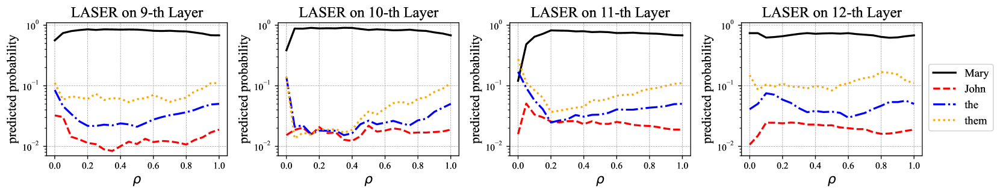

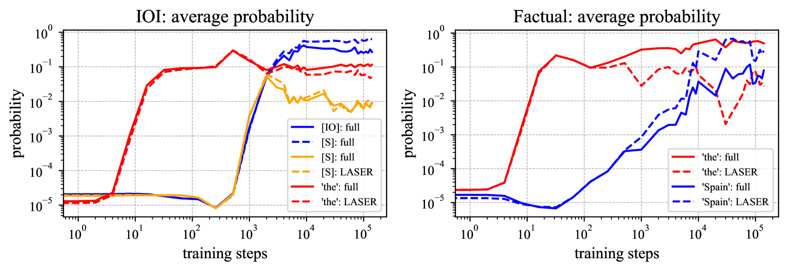

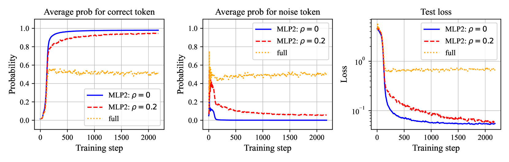

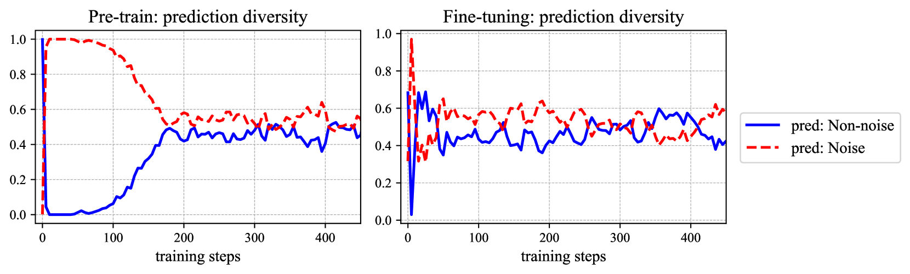

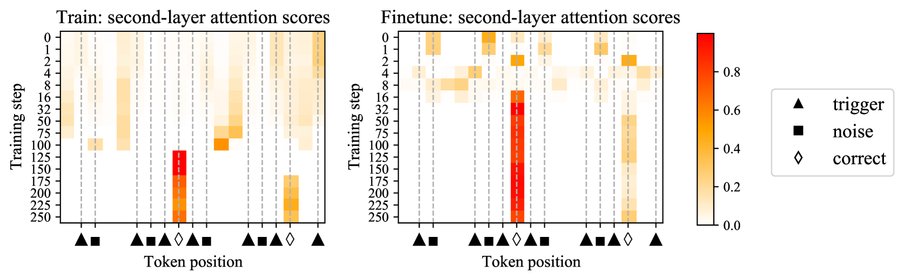

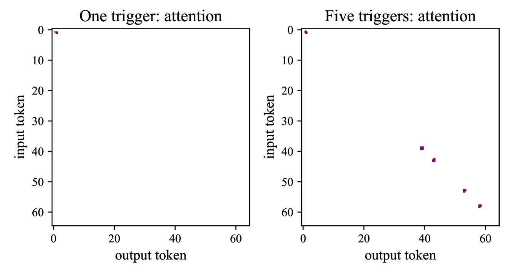

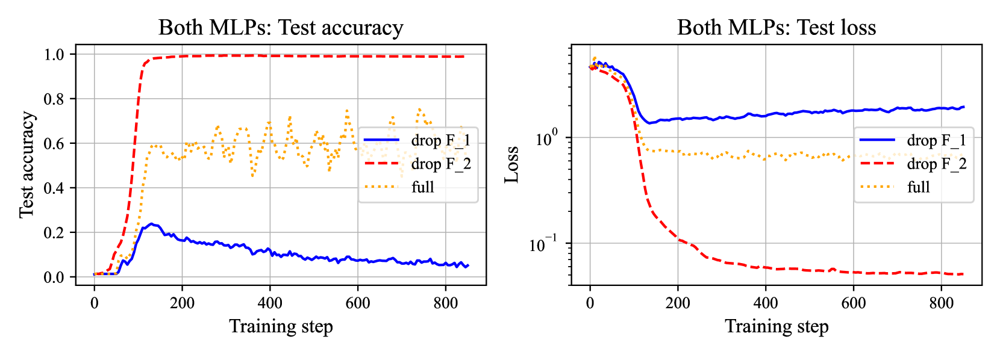

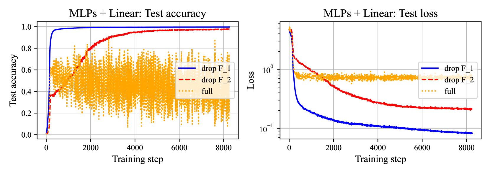

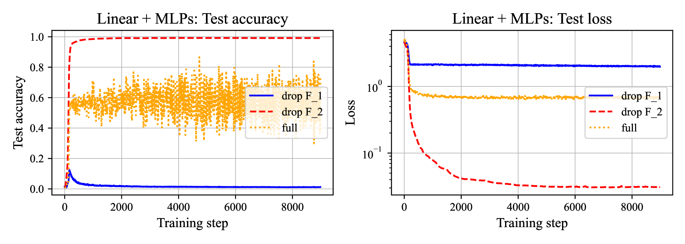

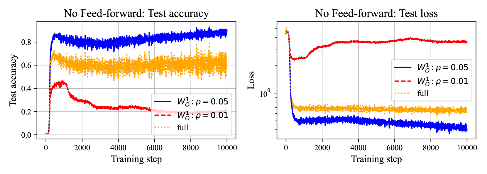

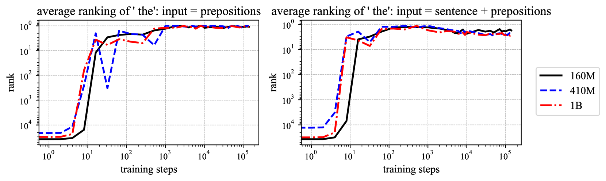

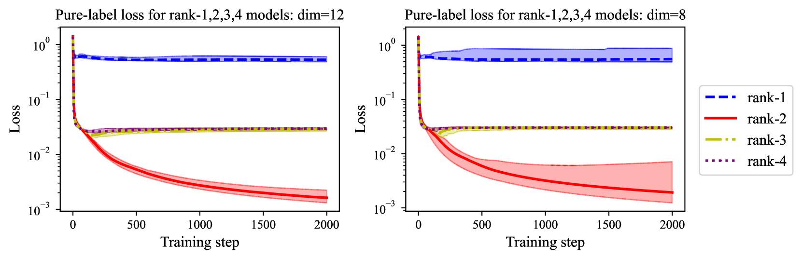

[Arxiv](https://arxiv.org/abs/2406.03068)