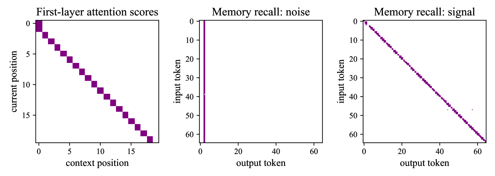

# 权重截断：提升语言模型推理能力的秘诀

发布时间：2024年06月05日

`LLM理论

理由：这篇论文主要探讨了大型语言模型（LLM）的内部结构和权重矩阵对推理能力的影响，以及如何通过调整这些结构来增强模型的推理性能。这涉及到对LLM内部工作机制的理论分析和实验验证，因此属于LLM理论的范畴。论文中提到的实验和理论分析都是为了更好地理解LLM的工作原理，而不是直接应用于特定的Agent或RAG系统，也不是关于LLM的具体应用案例。` `人工智能` `逻辑推理`

> How Truncating Weights Improves Reasoning in Language Models

# 摘要

> 大型语言模型不仅能够流畅地生成多语种文本，还在涉及基础逻辑推理的任务上表现出色。最新研究发现，从预训练模型的权重矩阵中剔除特定部分能增强推理能力。我们深入探讨了这一现象，发现某些全局关联往往存储在特定的权重组件或Transformer的前馈层中，这些关联可能对推理任务的预测产生负面影响。通过移除这些关联部分，推理性能得以提升。我们通过实验和理论分析，研究了这一过程在训练中的表现，包括一个针对基本推理任务的两层Transformer模型，以及Pythia系列模型在简单推理任务上的测试。

> In addition to the ability to generate fluent text in various languages, large language models have been successful at tasks that involve basic forms of logical "reasoning" over their context. Recent work found that selectively removing certain components from weight matrices in pre-trained models can improve such reasoning capabilities. We investigate this phenomenon further by carefully studying how certain global associations tend to be stored in specific weight components or Transformer blocks, in particular feed-forward layers. Such associations may hurt predictions in reasoning tasks, and removing the corresponding components may then improve performance. We analyze how this arises during training, both empirically and theoretically, on a two-layer Transformer trained on a basic reasoning task with noise, a toy associative memory model, and on the Pythia family of pre-trained models tested on simple reasoning tasks.

[Arxiv](https://arxiv.org/abs/2406.03068)