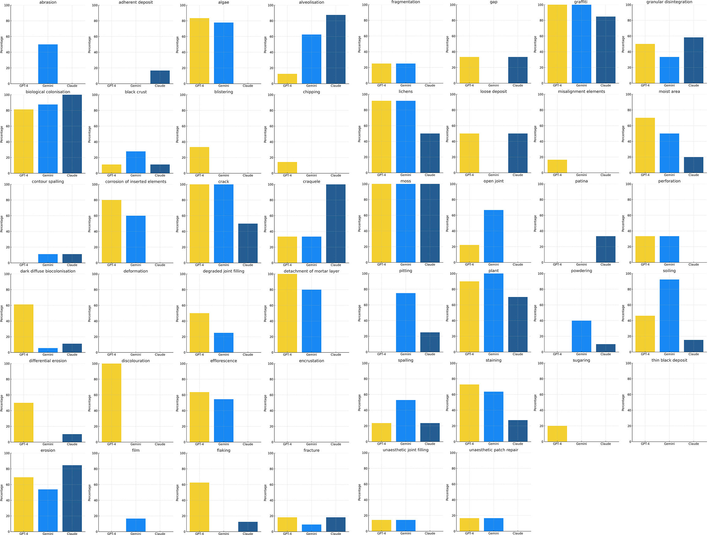
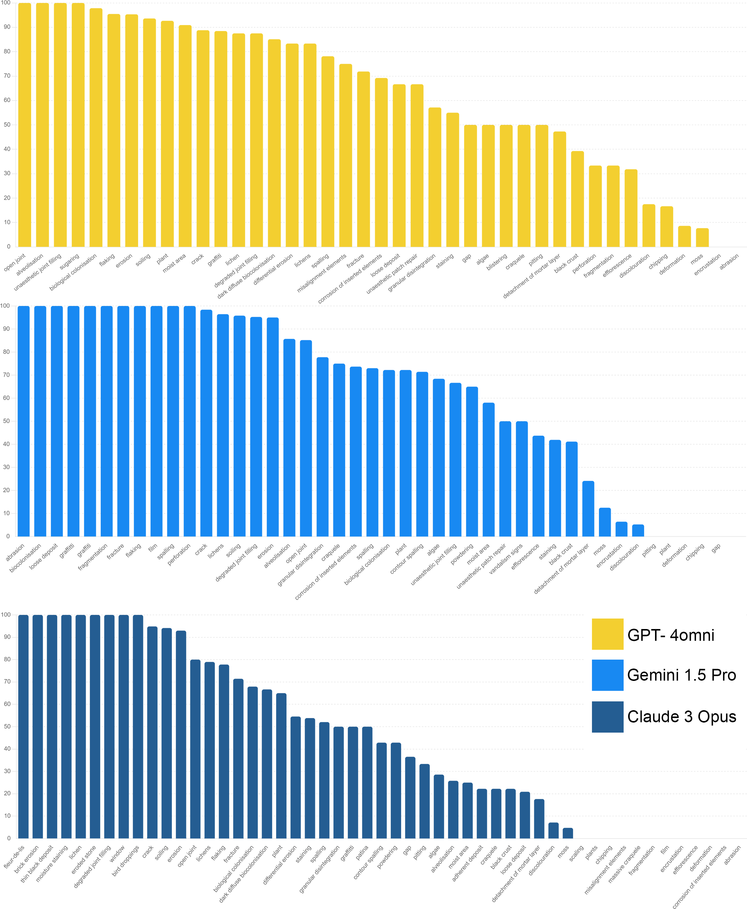

# 借助大型多模态模型，精准识别石材退化模式

发布时间：2024年06月05日

`Agent

这篇论文主要关注了大型多模态模型（如GPT-4omni、Claude 3 Opus和Gemini 1.5 Pro）在石质文化遗产保护中的应用能力评估。研究通过建立一套石质退化模式与异常的分类体系，并使用这些模型分析了大量的石质文化遗产图像，以评估它们在识别和分类这些模式的能力。这种应用场景涉及模型的实际操作和决策，类似于Agent的行为，因此将其归类为Agent。` `文化遗产保护` `石质材料`

> Identification of Stone Deterioration Patterns with Large Multimodal Models

# 摘要

> 保护石质文化遗产对于维护历史与文化地标至关重要。随着GPT-4omni、Claude 3 Opus和Gemini 1.5 Pro等大型多模态模型的兴起，明确这些模型的应用能力变得尤为关键。本研究系统地评估了这些模型在识别和分类石质文化遗产中异常与退化模式的能力，这对于实际的保护与修复工作极为重要。我们首先建立了一套石质退化模式与异常的分类体系，随后让这些模型分析了354张精选的石质文化遗产图像，并从精心挑选的标签中做出选择。结果因模式类型而异，揭示了这些模型在文化遗产保护领域中的强项与短板。

> The conservation of stone-based cultural heritage sites is a critical concern for preserving cultural and historical landmarks. With the advent of Large Multimodal Models, as GPT-4omni (OpenAI), Claude 3 Opus (Anthropic) and Gemini 1.5 Pro (Google), it is becoming increasingly important to define the operational capabilities of these models. In this work, we systematically evaluate the abilities of the main foundational multimodal models to recognise and classify anomalies and deterioration patterns of the stone elements that are useful in the practice of conservation and restoration of world heritage. After defining a taxonomy of the main stone deterioration patterns and anomalies, we asked the foundational models to identify a curated selection of 354 highly representative images of stone-built heritage, offering them a careful selection of labels to choose from. The result, which varies depending on the type of pattern, allowed us to identify the strengths and weaknesses of these models in the field of heritage conservation and restoration.

[Arxiv](https://arxiv.org/abs/2406.03207)