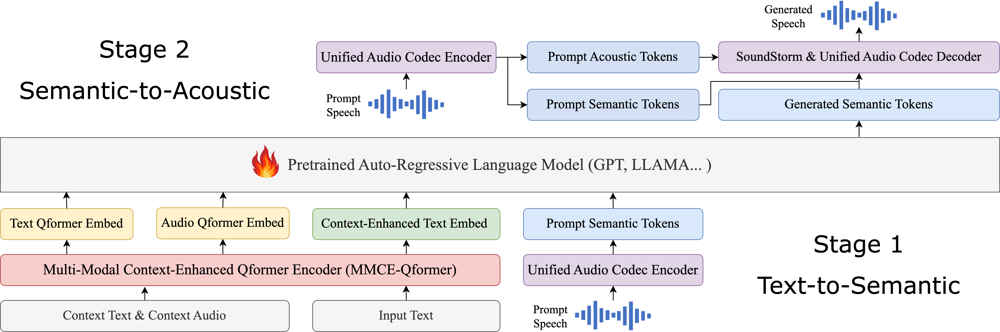
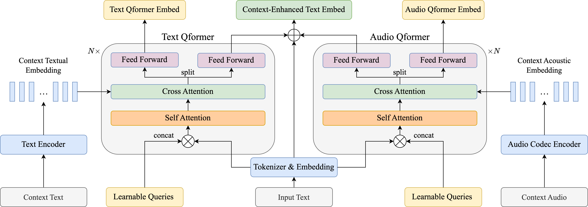

# 借助多模态上下文和大型语言模型的力量，我们提升了基于音频编解码器的零-shot文本到语音合成技术。

发布时间：2024年06月05日

`LLM应用

这篇论文主要探讨了大型语言模型（LLM）在文本转语音（TTS）技术中的应用，特别是在处理长篇上下文信息时的优化方法。论文中提到的多模态上下文增强Qformer（MMCE-Qformer）和利用预训练LLM的深度理解能力预测语义标记，都是将LLM技术应用于实际问题解决的实例。因此，这篇论文应归类于LLM应用。` `语音合成` `有声书`

> Improving Audio Codec-based Zero-Shot Text-to-Speech Synthesis with Multi-Modal Context and Large Language Model

# 摘要

> 大型语言模型与音频编解码器的最新进展，极大地推动了零-shot文本转语音技术的发展，使得仅凭3秒的陌生语音样本即可合成个性化语音。然而，这些技术局限于短语音提示，无法在有声书或对话场景中充分利用长篇上下文信息。为此，我们提出了一种基于创新音频编解码器的TTS模型，通过多重增强手段优化上下文适应性。借鉴Qformer的成功经验，我们开发了多模态上下文增强Qformer（MMCE-Qformer），以整合更多模态的上下文信息。同时，我们利用预训练LLM的深度理解能力预测语义标记，并借助SoundStorm生成声学标记，显著提升音频质量和说话者相似度。经过广泛的主客观评估，我们的方法在多种上下文TTS场景中均展现出超越基线的性能。

> Recent advances in large language models (LLMs) and development of audio codecs greatly propel the zero-shot TTS. They can synthesize personalized speech with only a 3-second speech of an unseen speaker as acoustic prompt. However, they only support short speech prompts and cannot leverage longer context information, as required in audiobook and conversational TTS scenarios. In this paper, we introduce a novel audio codec-based TTS model to adapt context features with multiple enhancements. Inspired by the success of Qformer, we propose a multi-modal context-enhanced Qformer (MMCE-Qformer) to utilize additional multi-modal context information. Besides, we adapt a pretrained LLM to leverage its understanding ability to predict semantic tokens, and use a SoundStorm to generate acoustic tokens thereby enhancing audio quality and speaker similarity. The extensive objective and subjective evaluations show that our proposed method outperforms baselines across various context TTS scenarios.

[Arxiv](https://arxiv.org/abs/2406.03706)