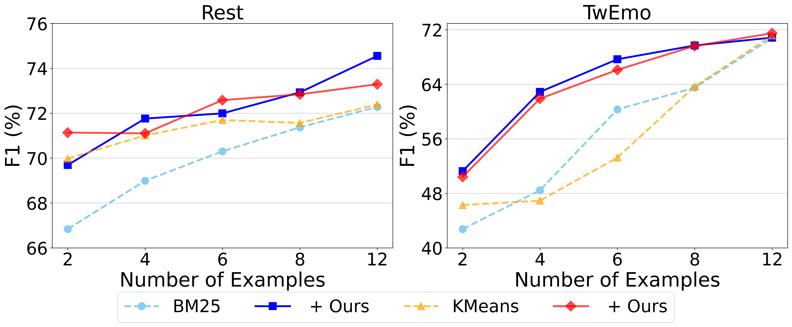

# 利用预测反馈优化情境学习，提升情感分析效果

发布时间：2024年06月05日

`LLM应用

这篇论文探讨了大型语言模型（LLMs）在情感分析领域的应用，特别是在通过情境学习（ICL）进行情感解读时的改进方法。研究引入了先前预测与反馈机制，以优化LLMs对微妙情感的捕捉能力。这种方法通过实验在九大数据集上进行了验证，并显示出比传统ICL方法更好的性能。因此，这篇论文属于LLM应用类别，因为它专注于LLMs在特定任务（情感分析）中的实际应用和改进。` `情感分析`

> Improving In-Context Learning with Prediction Feedback for Sentiment Analysis

# 摘要

> 大型语言模型（LLMs）在情感分析领域通过情境学习（ICL）已取得显著成效，但捕捉微妙情感仍是难题。借鉴人类通过反馈调整理解的能力，本研究引入先前预测与反馈机制，旨在改善LLMs的情感解读。该框架分三步走：首先获取LLMs的初步预测，其次根据预测准确性设计反馈，最后通过反馈驱动的提示优化情感理解。实验覆盖九大数据集，结果表明，相较于传统ICL方法，我们的框架平均F1分数提升了5.95%，表现更佳。

> Large language models (LLMs) have achieved promising results in sentiment analysis through the in-context learning (ICL) paradigm. However, their ability to distinguish subtle sentiments still remains a challenge. Inspired by the human ability to adjust understanding via feedback, this paper enhances ICL by incorporating prior predictions and feedback, aiming to rectify sentiment misinterpretation of LLMs. Specifically, the proposed framework consists of three steps: (1) acquiring prior predictions of LLMs, (2) devising predictive feedback based on correctness, and (3) leveraging a feedback-driven prompt to refine sentiment understanding. Experimental results across nine sentiment analysis datasets demonstrate the superiority of our framework over conventional ICL methods, with an average F1 improvement of 5.95%.

[Arxiv](https://arxiv.org/abs/2406.02911)