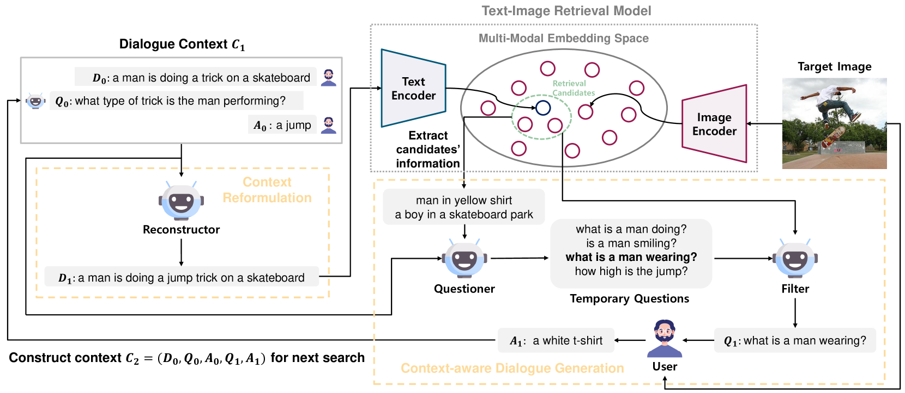
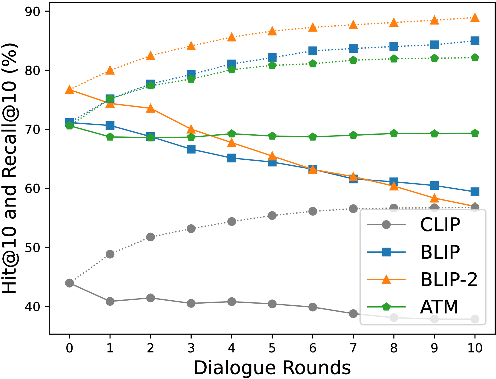
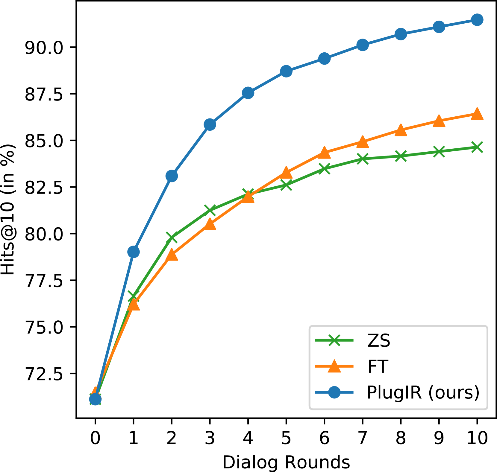
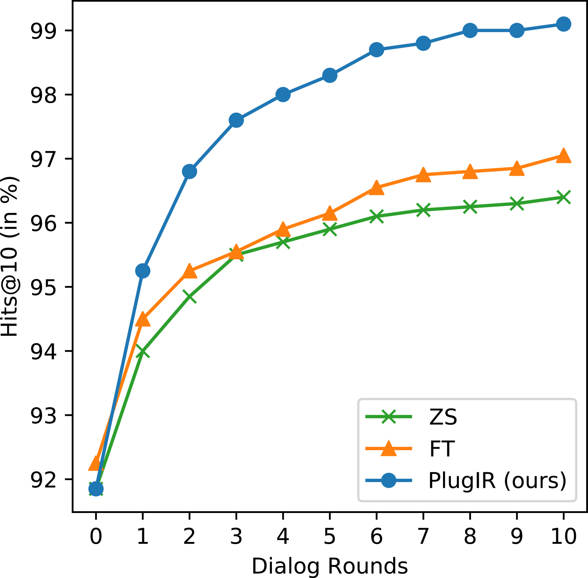
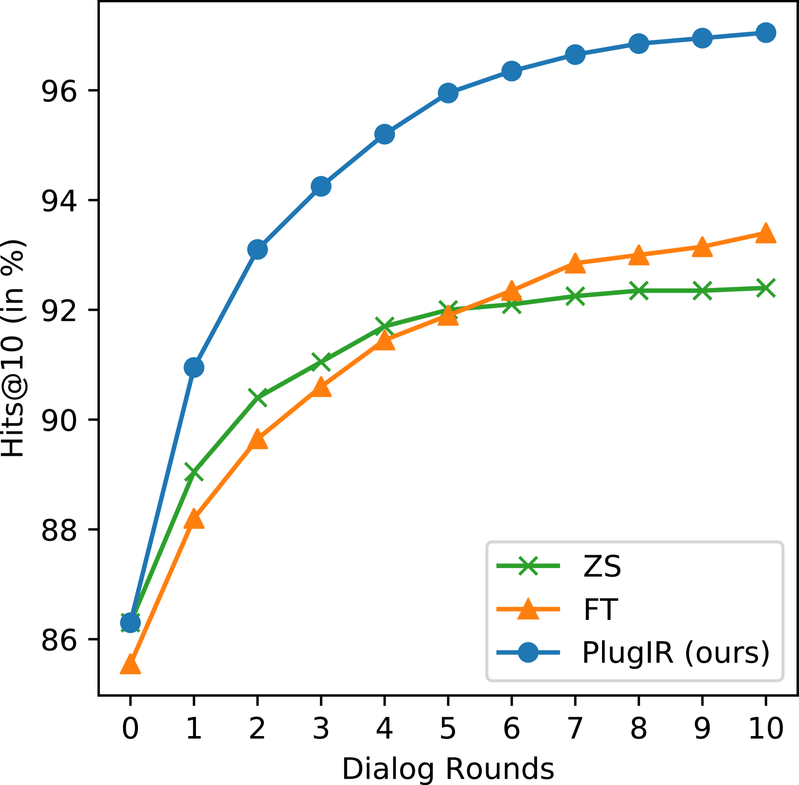
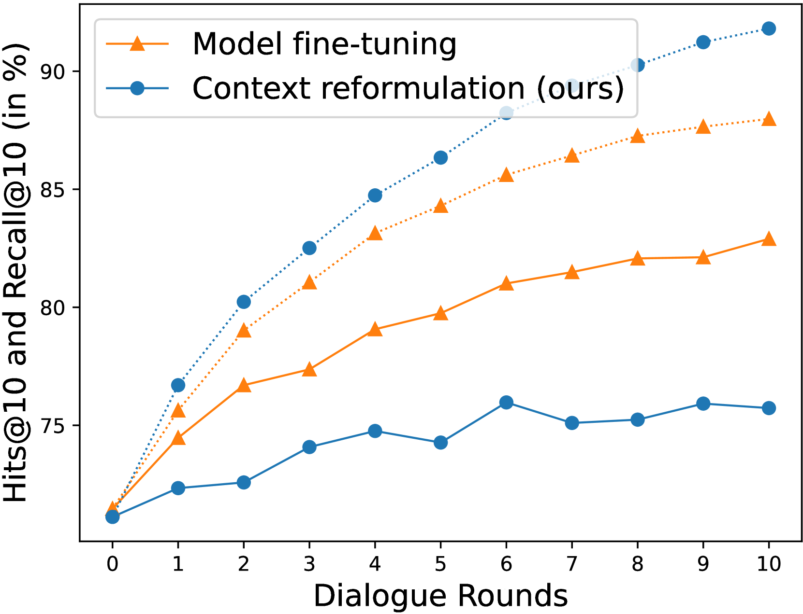
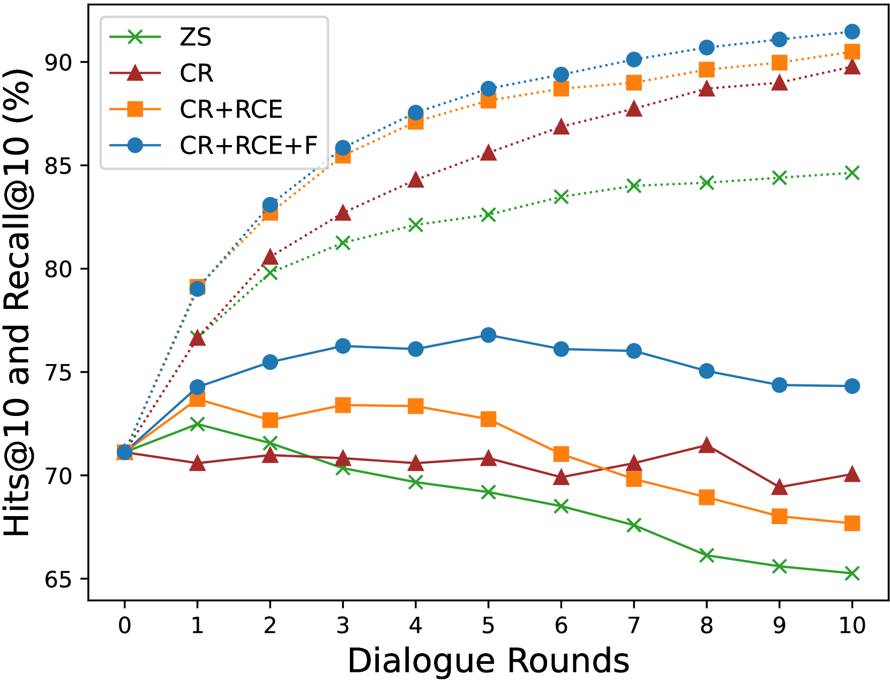
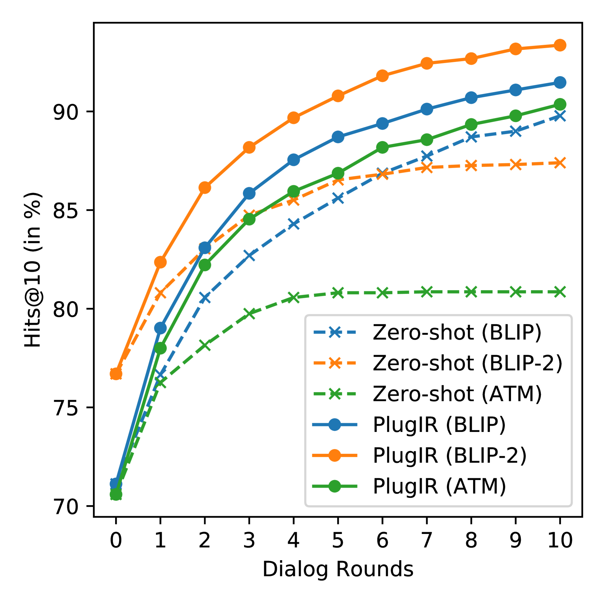
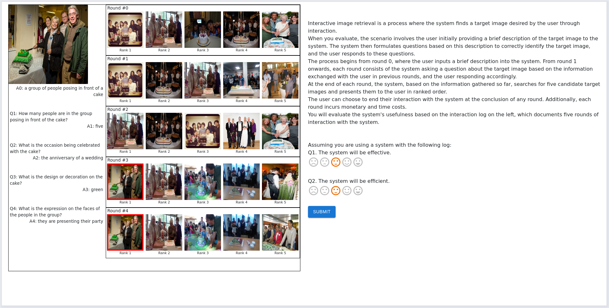
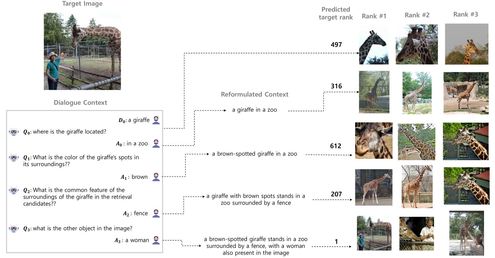

# 大型语言模型下的交互式文本至图像检索：即插即用新策略

发布时间：2024年06月05日

`LLM应用

这篇论文介绍了一种名为PlugIR的方法，该方法利用大型语言模型（LLMs）的能力来处理交互式文本到图像检索任务中的对话上下文查询问题。这种方法不需要对检索模型进行微调，可以应用于任何黑盒模型，并且通过构建一个LLM提问者来减少问题的噪声和冗余。此外，论文还引入了一种新的评估指标——最佳对数排名积分（BRI）。这些特点表明该论文主要关注于LLM的实际应用，特别是在图像检索领域的应用，因此将其分类为LLM应用。` `图像检索` `对话系统`

> Interactive Text-to-Image Retrieval with Large Language Models: A Plug-and-Play Approach

# 摘要

> 本文聚焦于交互式文本到图像检索任务中的对话上下文查询问题，提出了一种名为PlugIR的方法。该方法利用LLMs的指令遵循能力，通过重构对话上下文，免去了对检索模型进行微调的需求，使得任意黑盒模型均可应用。同时，PlugIR构建的LLM提问者能基于当前候选图像信息，提出关于目标图像属性的非冗余问题，有效减少了问题的噪声和冗余。此外，我们还引入了一种新的评估指标——最佳对数排名积分（BRI），以更全面地评价检索系统。在多个基准测试中，PlugIR均超越了零-shot和微调基线。构成PlugIR的两种策略既可联合使用，亦可独立应用于不同场景。相关代码已公开于https://github.com/Saehyung-Lee/PlugIR。

> In this paper, we primarily address the issue of dialogue-form context query within the interactive text-to-image retrieval task. Our methodology, PlugIR, actively utilizes the general instruction-following capability of LLMs in two ways. First, by reformulating the dialogue-form context, we eliminate the necessity of fine-tuning a retrieval model on existing visual dialogue data, thereby enabling the use of any arbitrary black-box model. Second, we construct the LLM questioner to generate non-redundant questions about the attributes of the target image, based on the information of retrieval candidate images in the current context. This approach mitigates the issues of noisiness and redundancy in the generated questions. Beyond our methodology, we propose a novel evaluation metric, Best log Rank Integral (BRI), for a comprehensive assessment of the interactive retrieval system. PlugIR demonstrates superior performance compared to both zero-shot and fine-tuned baselines in various benchmarks. Additionally, the two methodologies comprising PlugIR can be flexibly applied together or separately in various situations. Our codes are available at https://github.com/Saehyung-Lee/PlugIR.

[Arxiv](https://arxiv.org/abs/2406.03411)