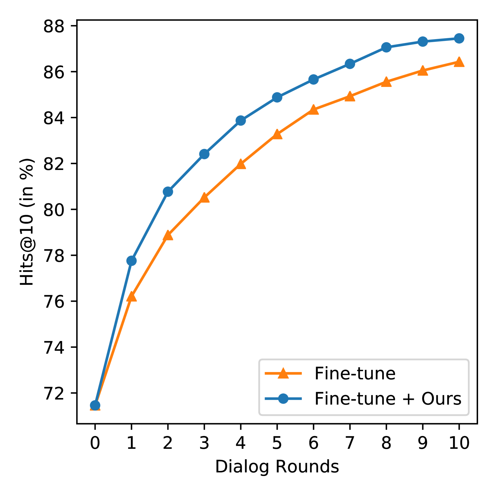

# 大型语言模型下的交互式文本转图像检索：即插即用新策略

发布时间：2024年06月05日

`Agent

理由：这篇论文介绍了一种名为PlugIR的新方法，该方法利用大型语言模型（LLMs）的能力来处理交互式文本到图像检索任务中的对话上下文查询问题。这种方法通过LLM提问者生成关于目标图像属性的问题，减少了问题的噪声和冗余，并提出了一个新的评估指标BRI。这种方法可以被视为一个智能Agent，因为它能够根据当前的检索候选图像信息生成问题，并有效地与用户进行交互以完成检索任务。因此，它更符合Agent的分类，而不是RAG、LLM应用或LLM理论。` `图像检索` `对话系统`

> Interactive Text-to-Image Retrieval with Large Language Models: A Plug-and-Play Approach

# 摘要

> 本文聚焦于交互式文本到图像检索任务中的对话上下文查询问题，提出了一种名为PlugIR的新方法。该方法巧妙地利用了大型语言模型（LLMs）的指令遵循能力，一方面通过重塑对话上下文，免去了对特定视觉对话数据微调模型的繁琐，使得任意黑盒模型皆可应用；另一方面，通过LLM提问者，基于当前检索候选图像的信息，精准生成关于目标图像属性的问题，有效减少了问题的噪声和冗余。此外，我们还创新性地提出了最佳对数排名积分（BRI）这一评估指标，以全面衡量交互检索系统的性能。PlugIR在多个测试中均超越了零-shot和微调基线，且其两大核心方法可灵活组合或独立使用。项目代码已公开于https://github.com/Saehyung-Lee/PlugIR。

> In this paper, we primarily address the issue of dialogue-form context query within the interactive text-to-image retrieval task. Our methodology, PlugIR, actively utilizes the general instruction-following capability of LLMs in two ways. First, by reformulating the dialogue-form context, we eliminate the necessity of fine-tuning a retrieval model on existing visual dialogue data, thereby enabling the use of any arbitrary black-box model. Second, we construct the LLM questioner to generate non-redundant questions about the attributes of the target image, based on the information of retrieval candidate images in the current context. This approach mitigates the issues of noisiness and redundancy in the generated questions. Beyond our methodology, we propose a novel evaluation metric, Best log Rank Integral (BRI), for a comprehensive assessment of the interactive retrieval system. PlugIR demonstrates superior performance compared to both zero-shot and fine-tuned baselines in various benchmarks. Additionally, the two methodologies comprising PlugIR can be flexibly applied together or separately in various situations. Our codes are available at https://github.com/Saehyung-Lee/PlugIR.

[Arxiv](https://arxiv.org/abs/2406.03411)